

<h1 style="text-align: center;"> Informe del Trabajo Final </h1>
<h3 style="text-align: center;"> Universidad Peruana de Ciencias Aplicadas </h3>

<h5 style="text-align: center">UNIVERSIDAD PERUANA DE CIENCIAS APLICADAS</h5>

<h5 style="text-align: center">CARRERA</h5>

Ingeniería de Software y Ciencias de la Computación

<h5 style="text-align: center">CICLO</h5>

2024-02

<h5 style="text-align: center">CURSO</h5>

Aplicaciones Web

<h5 style="text-align: center">SECCIÓN</h5>

SW51

<h5 style="text-align: center">DOCENTE</h5>

Juan Carlos Tinoco Licas

<h5 style="text-align: center">STARTUP</h5>

PeSoftware

<h5 style="text-align: center">PRODUCTO</h5>

SmartFlow

<h5 style="text-align: center">AGOSTO, 2024</h5>

 
 

## Team members:
| Nombre |Código|
|:-------:|:----------:|
|De La Cruz Moreno, Roy Hernan |U202218634|
|Góngora Castillejos, Williams Jesus |U20221C186|
|Guerrero Vasquez, Jhon Danny |U202116246|
|Silva Tirado, Sebastian Valentino |U20211G296|
|Taquir Calderon , Jhunior Giussepe |U20221C576|

 
 

## Registro de versiones del informe

<table style="border-collapse:collapse;border-spacing:0" class="tg"><thead>
<tr><th style="border-color:black;border-style:solid;border-width:1px;font-family:Arial, sans-serif;font-size:14px;font-weight:normal;overflow:hidden;padding:10px 5px;text-align:left;vertical-align:top;word-break:normal">Versión</th><th style="border-color:black;border-style:solid;border-width:1px;font-family:Arial, sans-serif;font-size:14px;font-weight:normal;overflow:hidden;padding:10px 5px;text-align:left;vertical-align:top;word-break:normal">Fecha</th><th style="border-color:black;border-style:solid;border-width:1px;font-family:Arial, sans-serif;font-size:14px;font-weight:normal;overflow:hidden;padding:10px 5px;text-align:left;vertical-align:top;word-break:normal">Autor</th>
<th style="border-color:black;border-style:solid;border-width:1px;font-family:Arial, sans-serif;font-size:14px;font-weight:normal;overflow:hidden;padding:10px 5px;text-align:left;vertical-align:top;word-break:normal">Descripción de modificación</th></tr>
</thead>
<tbody>
<tr><td style="border-color:black;border-style:solid;border-width:1px;font-family:Arial, sans-serif;font-size:14px;overflow:hidden;padding:10px 5px;text-align:left;vertical-align:top;word-break:normal">TB1</td><td style="border-color:black;border-style:solid;border-width:1px;font-family:Arial, sans-serif;font-size:14px;overflow:hidden;padding:10px 5px;text-align:left;vertical-align:top;word-break:normal">05/09/2024</td><td style="border-color:black;border-style:solid;border-width:1px;font-family:Arial, sans-serif;font-size:14px;overflow:hidden;padding:10px 5px;text-align:left;vertical-align:top;word-break:normal">Góngora Castillejos, Williams Jesus   De La Cruz Moreno, Roy Hernan  Guerrero Vasquez, Jhon Danny,  Taquiri Calderon, Jhunior Giussepe   Silva Tirado, Sebastian Valentino</td>
<td style="border-color:black;border-style:solid;border-width:1px;font-family:Arial, sans-serif;font-size:14px;overflow:hidden;padding:10px 5px;text-align:left;vertical-align:top;word-break:normal">Creación del documento de trabajo en formato markdown, capítulo I, capítulo II, capítulo III, capítulo IV y capítulo V</td></tr>
<tr><td style="border-color:black;border-style:solid;border-width:1px;font-family:Arial, sans-serif;font-size:14px;overflow:hidden;padding:10px 5px;text-align:left;vertical-align:top;word-break:normal">TP1</td><td style="border-color:black;border-style:solid;border-width:1px;font-family:Arial, sans-serif;font-size:14px;overflow:hidden;padding:10px 5px;text-align:left;vertical-align:top;word-break:normal">25/09/2024</td><td style="border-color:black;border-style:solid;border-width:1px;font-family:Arial, sans-serif;font-size:14px;overflow:hidden;padding:10px 5px;text-align:left;vertical-align:top;word-break:normal">Góngora Castillejos, Williams Jesus   De La Cruz Moreno, Roy Hernan  Guerrero Vasquez, Jhon Danny,  Taquiri Calderon, Jhunior Giussepe   Silva Tirado, Sebastian Valentino</td>
<td style="border-color:black;border-style:solid;border-width:1px;font-family:Arial, sans-serif;font-size:14px;overflow:hidden;padding:10px 5px;text-align:left;vertical-align:top;word-break:normal">Actualización del Landing Page y capítulo V.</td></tr>
<tr><td style="border-color:black;border-style:solid;border-width:1px;font-family:Arial, sans-serif;font-size:14px;overflow:hidden;padding:10px 5px;text-align:left;vertical-align:top;word-break:normal">TB2</td><td style="border-color:black;border-style:solid;border-width:1px;font-family:Arial, sans-serif;font-size:14px;overflow:hidden;padding:10px 5px;text-align:left;vertical-align:top;word-break:normal">31/10/2024</td><td style="border-color:black;border-style:solid;border-width:1px;font-family:Arial, sans-serif;font-size:14px;overflow:hidden;padding:10px 5px;text-align:left;vertical-align:top;word-break:normal">Góngora Castillejos, Williams Jesus   De La Cruz Moreno, Roy Hernan  Guerrero Vasquez, Jhon Danny,  Taquiri Calderon, Jhunior Giussepe   Silva Tirado, Sebastian Valentino</td>
<td style="border-color:black;border-style:solid;border-width:1px;font-family:Arial, sans-serif;font-size:14px;overflow:hidden;padding:10px 5px;text-align:left;vertical-align:top;word-break:normal">Actualización del Web App y capítulo V.</td></tr>
<tr><td style="border-color:black;border-style:solid;border-width:1px;font-family:Arial, sans-serif;font-size:14px;overflow:hidden;padding:10px 5px;text-align:left;vertical-align:top;word-break:normal">TF1</td><td style="border-color:black;border-style:solid;border-width:1px;font-family:Arial, sans-serif;font-size:14px;overflow:hidden;padding:10px 5px;text-align:left;vertical-align:top;word-break:normal">19/11/2024</td><td style="border-color:black;border-style:solid;border-width:1px;font-family:Arial, sans-serif;font-size:14px;overflow:hidden;padding:10px 5px;text-align:left;vertical-align:top;word-break:normal">Góngora Castillejos, Williams Jesus   De La Cruz Moreno, Roy Hernan  Guerrero Vasquez, Jhon Danny,  Taquiri Calderon, Jhunior Giussepe   Silva Tirado, Sebastian Valentino</td>
<td style="border-color:black;border-style:solid;border-width:1px;font-family:Arial, sans-serif;font-size:14px;overflow:hidden;padding:10px 5px;text-align:left;vertical-align:top;word-break:normal">Finalización del back end y proyecto.</td></tr>
</tbody></table>                                            

 
 

## Project Report Collaboration Insights

Enlace de la organización para el reporte del proyecto: https://github.com/SmartFlow-UPC 

**TB1**

Para el desarrollo del informe correspondiente a la entrega TB1, se estableció la implementación de secciones de la siguiente manera para cada integrante del equipo:

|Integrante|Tareas Asignadas|
|-|-|
|Roy De La Cruz Moreno|Diseño de mockups y wireframes,Lean UX Process, Capítulo V, Software Development Environment Configuration, Source Code Management, Style Guide & Conventions, General Style Guidelines, Product Backlog|
|Williams Gongora|Capitulo I, Antecedentes y problemática 5W y 2H, Segmentos Objetivos,, Needfinding, User Personas, User Task Matrix, User Journey Mapping, Empathy Mapping, Database Design, Database Diagram,User Stories, Landing Page, Bibliografía, Sprint Planning 1, Sprint Backlog 1|
|Giussepe Taquiri Calderon|Capitulo III, User Stories , Impact Mapping,  Product Backlog Domain-Driven Software Architecture, Product Implementation, Validation & Deployment.|
|Jhon Vasquez|Capitulo v, Development Evidence for Sprint Review, Testing Suite Evidence for Sprint Review, Execution Evidence for Sprint Review, Services Documentation Evidence for Sprint Review, Software Deployment Evidence for Sprint Review, Team Collaboration Insights during Sprint|
|Sebastian Silva|Competidores, Análisis competitivo, Estrategias y tácticas frente a competidores, Entrevistas, Diseño de entrevistas, Registro de entrevistas, Análisis de entrevistas, As-is Scenario Mapping, Ubiquitous Language, To-Be Scenario Mapping, Class Diagrams, Class Dictionary |

**TP1**

Para la actualización del informe a la entrega TP1, se repartió de manera equitativa de la siguiente manera para cada inegrante del equipo:

<table style="border-collapse:collapse;border-spacing:0" class="tg"><thead><tr><th style="border-color:inherit;border-style:solid;border-width:1px;font-family:Arial, sans-serif;font-size:14px;font-weight:normal;overflow:hidden;padding:10px 5px;text-align:left;vertical-align:top;word-break:normal">Integrante</th><th style="border-color:inherit;border-style:solid;border-width:1px;font-family:Arial, sans-serif;font-size:14px;font-weight:normal;overflow:hidden;padding:10px 5px;text-align:left;vertical-align:top;word-break:normal">Tareas Asignadas</th></tr></thead>
<tbody><tr><td style="border-color:inherit;border-style:solid;border-width:1px;font-family:Arial, sans-serif;font-size:14px;overflow:hidden;padding:10px 5px;text-align:left;vertical-align:top;word-break:normal">Roy De La Cruz Moreno</td><td style="border-color:inherit;border-style:solid;border-width:1px;font-family:Arial, sans-serif;font-size:14px;overflow:hidden;padding:10px 5px;text-align:left;vertical-align:top;word-break:normal">Sprint Planning 2 y Team Collaboration Insights during Sprint.</td></tr>
<tr><td style="border-color:inherit;border-style:solid;border-width:1px;font-family:Arial, sans-serif;font-size:14px;overflow:hidden;padding:10px 5px;text-align:left;vertical-align:top;word-break:normal">Williams Gongora</td><td style="border-color:inherit;border-style:solid;border-width:1px;font-family:Arial, sans-serif;font-size:14px;overflow:hidden;padding:10px 5px;text-align:left;vertical-align:top;word-break:normal">Sprint Backlog 2 y Services Documentation Evidence for Sprint Review.</td></tr><tr><td style="border-color:inherit;border-style:solid;border-width:1px;font-family:Arial, sans-serif;font-size:14px;overflow:hidden;padding:10px 5px;text-align:left;vertical-align:top;word-break:normal">Giussepe Taquiri Calderon</td><td style="border-color:inherit;border-style:solid;border-width:1px;font-family:Arial, sans-serif;font-size:14px;overflow:hidden;padding:10px 5px;text-align:left;vertical-align:top;word-break:normal">Development Evidence for Sprint Review.</td></tr>
<tr><td style="border-color:inherit;border-style:solid;border-width:1px;font-family:Arial, sans-serif;font-size:14px;overflow:hidden;padding:10px 5px;text-align:left;vertical-align:top;word-break:normal">Jhon Vasquez</td><td style="border-color:inherit;border-style:solid;border-width:1px;font-family:Arial, sans-serif;font-size:14px;overflow:hidden;padding:10px 5px;text-align:left;vertical-align:top;word-break:normal">Testing Suite Evidence for Sprint Review.</td></tr>
<tr><td style="border-color:inherit;border-style:solid;border-width:1px;font-family:Arial, sans-serif;font-size:14px;overflow:hidden;padding:10px 5px;text-align:left;vertical-align:top;word-break:normal">Sebastian Silva</td><td style="border-color:inherit;border-style:solid;border-width:1px;font-family:Arial, sans-serif;font-size:14px;overflow:hidden;padding:10px 5px;text-align:left;vertical-align:top;word-break:normal">Execution Evidence for Sprint Review y Software Deployment Evidence for Sprint Review.</td></tr></tbody></table>

**TB2**

Para la actualización del informe a la entrega TB2, se repartió de manera equitativa de la siguiente manera para cada inegrante del equipo:

<table style="border-collapse:collapse;border-spacing:0" class="tg"><thead><tr><th style="border-color:inherit;border-style:solid;border-width:1px;font-family:Arial, sans-serif;font-size:14px;font-weight:normal;overflow:hidden;padding:10px 5px;text-align:left;vertical-align:top;word-break:normal">Integrante</th><th style="border-color:inherit;border-style:solid;border-width:1px;font-family:Arial, sans-serif;font-size:14px;font-weight:normal;overflow:hidden;padding:10px 5px;text-align:left;vertical-align:top;word-break:normal">Tareas Asignadas</th></tr></thead>
<tbody><tr><td style="border-color:inherit;border-style:solid;border-width:1px;font-family:Arial, sans-serif;font-size:14px;overflow:hidden;padding:10px 5px;text-align:left;vertical-align:top;word-break:normal">Roy De La Cruz Moreno</td><td style="border-color:inherit;border-style:solid;border-width:1px;font-family:Arial, sans-serif;font-size:14px;overflow:hidden;padding:10px 5px;text-align:left;vertical-align:top;word-break:normal">Sprint Planning 3 - Development Evidence for Sprint Review - Team Collaboration Insights during Sprint.</td></tr>
<tr><td style="border-color:inherit;border-style:solid;border-width:1px;font-family:Arial, sans-serif;font-size:14px;overflow:hidden;padding:10px 5px;text-align:left;vertical-align:top;word-break:normal">Williams Gongora</td><td style="border-color:inherit;border-style:solid;border-width:1px;font-family:Arial, sans-serif;font-size:14px;overflow:hidden;padding:10px 5px;text-align:left;vertical-align:top;word-break:normal">Sprint Planning 3 - Testing Suite Evidence for Sprint Review - Diseño de Entrevistas</td></tr>
<tr><td style="border-color:inherit;border-style:solid;border-width:1px;font-family:Arial, sans-serif;font-size:14px;overflow:hidden;padding:10px 5px;text-align:left;vertical-align:top;word-break:normal">Giussepe Taquiri Calderon</td><td style="border-color:inherit;border-style:solid;border-width:1px;font-family:Arial, sans-serif;font-size:14px;overflow:hidden;padding:10px 5px;text-align:left;vertical-align:top;word-break:normal">Sprint Backlog 3 - Execution Evidence for Sprint Review - Registro de Entrevistas</td></tr>
<tr><td style="border-color:inherit;border-style:solid;border-width:1px;font-family:Arial, sans-serif;font-size:14px;overflow:hidden;padding:10px 5px;text-align:left;vertical-align:top;word-break:normal">Jhon Vasquez</td><td style="border-color:inherit;border-style:solid;border-width:1px;font-family:Arial, sans-serif;font-size:14px;overflow:hidden;padding:10px 5px;text-align:left;vertical-align:top;word-break:normal">Sprint Backlog 3 - Services Documentation Evidence for Sprint Review - Evaluaciones según heurísticas</td></tr>
<tr><td style="border-color:inherit;border-style:solid;border-width:1px;font-family:Arial, sans-serif;font-size:14px;overflow:hidden;padding:10px 5px;text-align:left;vertical-align:top;word-break:normal">Sebastian Silva</td><td style="border-color:inherit;border-style:solid;border-width:1px;font-family:Arial, sans-serif;font-size:14px;overflow:hidden;padding:10px 5px;text-align:left;vertical-align:top;word-break:normal">Development Evidence for Sprint Review - Software Deployment Evidence for Sprint Review. - Video About-the-Product.</td></tr></tbody></table>

**TF1**

Para la actualización y finalización del informe a la entrega TF1, se repartió de manera equitativa de la siguiente manera para cada inegrante del equipo:

<table style="border-collapse:collapse;border-spacing:0" class="tg"><thead><tr><th style="border-color:inherit;border-style:solid;border-width:1px;font-family:Arial, sans-serif;font-size:14px;font-weight:normal;overflow:hidden;padding:10px 5px;text-align:left;vertical-align:top;word-break:normal">Integrante</th><th style="border-color:inherit;border-style:solid;border-width:1px;font-family:Arial, sans-serif;font-size:14px;font-weight:normal;overflow:hidden;padding:10px 5px;text-align:left;vertical-align:top;word-break:normal">Tareas Asignadas</th></tr></thead>
<tbody><tr><td style="border-color:inherit;border-style:solid;border-width:1px;font-family:Arial, sans-serif;font-size:14px;overflow:hidden;padding:10px 5px;text-align:left;vertical-align:top;word-break:normal">Roy De La Cruz Moreno</td><td style="border-color:inherit;border-style:solid;border-width:1px;font-family:Arial, sans-serif;font-size:14px;overflow:hidden;padding:10px 5px;text-align:left;vertical-align:top;word-break:normal">Sprint Planning 4 - Testing Suite Evidence for Sprint Review - Diseño de Entrevistas</td></tr>
<tr><td style="border-color:inherit;border-style:solid;border-width:1px;font-family:Arial, sans-serif;font-size:14px;overflow:hidden;padding:10px 5px;text-align:left;vertical-align:top;word-break:normal">Williams Gongora</td><td style="border-color:inherit;border-style:solid;border-width:1px;font-family:Arial, sans-serif;font-size:14px;overflow:hidden;padding:10px 5px;text-align:left;vertical-align:top;word-break:normal">Development Evidence for Sprint Review - Software Deployment Evidence for Sprint Review.</td></tr>
<tr><td style="border-color:inherit;border-style:solid;border-width:1px;font-family:Arial, sans-serif;font-size:14px;overflow:hidden;padding:10px 5px;text-align:left;vertical-align:top;word-break:normal">Giussepe Taquiri Calderon</td><td style="border-color:inherit;border-style:solid;border-width:1px;font-family:Arial, sans-serif;font-size:14px;overflow:hidden;padding:10px 5px;text-align:left;vertical-align:top;word-break:normal">Sprint Backlog 4 - Services Documentation Evidence for Sprint Review - Evaluaciones según heurísticas</td></tr>
<tr><td style="border-color:inherit;border-style:solid;border-width:1px;font-family:Arial, sans-serif;font-size:14px;overflow:hidden;padding:10px 5px;text-align:left;vertical-align:top;word-break:normal">Jhon Vasquez</td><td style="border-color:inherit;border-style:solid;border-width:1px;font-family:Arial, sans-serif;font-size:14px;overflow:hidden;padding:10px 5px;text-align:left;vertical-align:top;word-break:normal">Sprint Backlog 4 - Execution Evidence for Sprint Review - Registro de Entrevistas</td></tr>
<tr><td style="border-color:inherit;border-style:solid;border-width:1px;font-family:Arial, sans-serif;font-size:14px;overflow:hidden;padding:10px 5px;text-align:left;vertical-align:top;word-break:normal">Sebastian Silva</td><td style="border-color:inherit;border-style:solid;border-width:1px;font-family:Arial, sans-serif;font-size:14px;overflow:hidden;padding:10px 5px;text-align:left;vertical-align:top;word-break:normal">Sprint Planning 4 - Development Evidence for Sprint Review - Team Collaboration Insights during Sprint.</td></tr></tbody></table>

El proceso de colaboración en el informe se realizó mediante commits constantes al repositorio de la organización.

## **Github Collaboration Insights**

Todas las ramas se crearon siguiendo la metodología GitFlow, que garantiza una organización estructurada y eficiente del código. GitFlow facilita la colaboración en proyectos al establecer un flujo de trabajo estandarizado para el desarrollo, con ramas específicas para nuevas funcionalidades, corrección de errores y preparación de lanzamientos, asegurando un control de versiones más ordenado y predecible.

GitHub también proporciona una visualización detallada del historial de las ramas principales, destacando los procesos de merge realizados. 

Los integrantes son:

* Williams Gongora (WiJeGo)
* Roy Hernan (Przemekuwu)
* Giussepe Taquiri(GiussepeTC)
* Jhon Vasquez (Feli386)
* Sebastian Silva (SebasSilvaT)

**main:** es la rama principal del proyecto y se actualiza con cada entregable.

**develop:**  es la rama principal para el desarrollo continuo del proyecto.

**feature**: contiene los cambios constantes realizados por los artefactos relacionados con el sprint 1 del informe.

Los siguientes gráficos representan analíticos de commits en el repositorio del informe. En los gráficos se incluye la cantidad de lineas de texto añadidas por cada integrante del equipo.

**TB1**

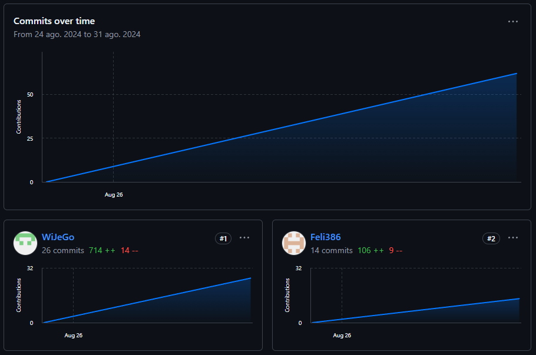
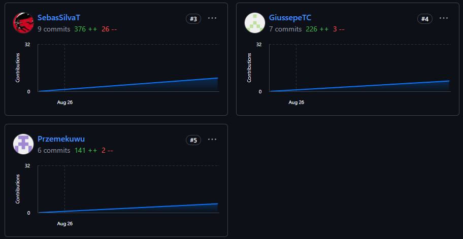

**TP1**

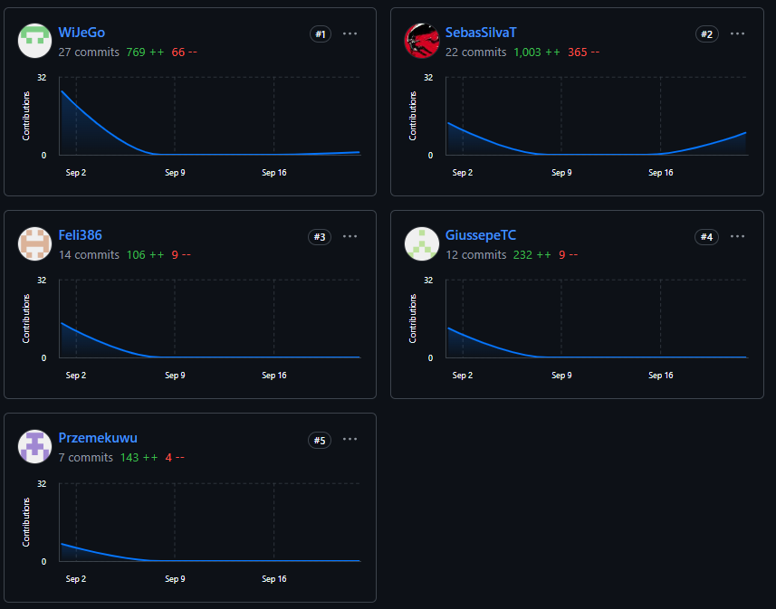

**TB2**

**TF1**

## Student Outcome
El curso contribuye al cumplimiento del Student Outcome ABET:  
**ABET – EAC - Student Outcome 5**

**Criterio:** La capacidad de funcionar efectivamente en un equipo cuyos miembros juntos proporcionan liderazgo, crean un entorno de colaboración e inclusivo, establecen objetivos, planifican tareas y cumplen objetivos. En el siguiente cuadro se describen las acciones realizadas y enunciados de conclusiones por parte del grupo, que permiten sustentar el haber alcanzado el logro del ABET – EAC - Student Outcome 5.

 

<table style="border-collapse:collapse;border-spacing:0" class="tg"><thead><tr><th style="border-color:black;border-style:solid;border-width:1px;font-family:Arial, sans-serif;font-size:14px;font-weight:normal;overflow:hidden;padding:10px 5px;text-align:left;vertical-align:top;word-break:normal">Criterio específico</th><th style="border-color:black;border-style:solid;border-width:1px;font-family:Arial, sans-serif;font-size:14px;font-weight:normal;overflow:hidden;padding:10px 5px;text-align:left;vertical-align:top;word-break:normal">Acciones realizadas</th><th style="border-color:black;border-style:solid;border-width:1px;font-family:Arial, sans-serif;font-size:14px;font-weight:normal;overflow:hidden;padding:10px 5px;text-align:left;vertical-align:top;word-break:normal">Conclusiones</th></tr></thead>
<tbody>
<tr><td style="border-color:black;border-style:solid;border-width:1px;font-family:Arial, sans-serif;font-size:14px;overflow:hidden;padding:10px 5px;text-align:left;vertical-align:top;word-break:normal">Trabaja en equipo para proporcionar liderazgo en forma conjunta</td>
<td style="border-color:black;border-style:solid;border-width:1px;font-family:Arial, sans-serif;font-size:14px;overflow:hidden;padding:10px 5px;text-align:left;vertical-align:top;word-break:normal">Williams Gongora:   TB1: En el primer entregable me encargue de toda la parte de recopilacion de informacion sobre la problematica, para establecer los fundamentos y limites que iba a seguir el sistema. Asimismo, logre establecer los aspectos tanto emocionales como fisicos que el usuario iba a establecer con nuestra solucion    Roy Hernan:   TB1:En el primer entregable me encargue de realizar todo lo relacionado con el Product Desing, definir la arquitectura, diseñar la UI de la landing page como de las aplicaciones web, creando wirerframes, mock-ups y prototipos. Trabajé de manera colaborativa con mi equipo, integrando sus ideas y garantizando que el diseño final reflejara las necesidades del usuario y del equipo.    Giussepe Taquiri:   TB1: En esta primera entrega, me encargué de desarrollar la arquitectura basada en dominios (Domain-Driven Software Architecture) y de definir las User Stories alineadas con los objetivos del proyecto. Trabajé en estrecha colaboración con el equipo para asegurar que todas las ideas se integraran eficazmente, utilizando Trello para gestionar las tareas y Structurizr para modelar la arquitectura.    Sebastian Silva:   TB1: En el primer entregable me encargué de recopilar los antecedentes y problemáticas enfocados a nuestro proyecto y así sustentarlo, entrevistas y lo que depende de ello y la unidad cinco.    Jhon Vasquez   TB1: En la primera parte me encargue de obtener el Landin Page para nuestro proyecto que despues se decidió usar una mejor plantilla para mejorar su presentación, también en tener las historias de usuario en Gerkin :   Williams Gongora:  TP1: Mostré un dominio significativo en sus presentaciones orales, empleando un lenguaje técnico cuando se dirigía a sus compañeros y simplificando conceptos para un público más general. Utilizó recursos multimedia para mejorar su exposición.  Roy Hernan:  TP1: Distinguí por su habilidad para conectar con la audiencia a través de un lenguaje claro y un enfoque estructurado. Adaptó su tono y profundidad de los temas según las necesidades del público, logrando un alto grado de interacción.  Giussepe Taquiri:  TP1: Mostré habilidades sólidas al adaptar su lenguaje y tono al tipo de audiencia durante las presentaciones grupales, empleando ejemplos claros y relevantes para cada contexto. Además, utilizó herramientas visuales efectivas para transmitir sus ideas.  Sebastian Silva:  TP1: Me preparé para organizar, dirigir y desarrollar parte del Web App instruyendo.  Jhon Vasquez  TP1: Destaqué por la claridad y precisión en sus exposiciones, logrando captar la atención de audiencias técnicas y no técnicas. Fue capaz de responder preguntas y clarificar dudas de manera adecuada durante las sesiones de feedback.  Williams Gongora:  TB2: En esta entrega, trabajamos en equipo para comprender y definir en profundidad las funcionalidades y características de nuestra aplicación, además de implementar mejoras en la aplicación web. A través de una colaboración activa y un liderazgo compartido, cada miembro del equipo contribuyó a optimizar el desarrollo y asegurar que se cumplieran los objetivos establecidos.  Roy Hernan:  TB2: En esta entrega donde se desarrollo el Sprint 3 colabore con las entrevistas de validacion donde se veia el pensamiento que tienen los usuarios sobre nuestra aplicacion   Giussepe Taquiri:  TB2: En esta entrega, se desarrolló el Sprint 3 del proyecto, enfocándose en los avances tanto del Frontend como del Backend. Además, se realizaron a cabo entrevistas de validación en las que se explicó el trabajo realizado en la aplicación. Estas entrevistas permitieron obtener una valiosa retroalimentación de nuestro segmento objetivo, lo cual será fundamental para seguir mejorando.   Sebastian Silva:  TB2: Me preparé en repartir y debatir puntos clave para el trabajo como las nuevas pestañas del Web Aplication y back-end.  Jhon Vasquez  TB2: Logré completar con las tareas previamente indicada.  Williams Gongora:  TF1:Colaboré en el desarrollo de SmartFlow, gestionando endpoints, realizando merge requests y documentando cambios en GitHub. Esto aseguró la integración fluida y la calidad del proyecto en equipo.   Roy Hernan:  TF1: Participe en el trabajo aportando ideas y entregando mis actividades  a tiempo   Giussepe Taquiri:  TF1: Coordiné pruebas de integración para verificar la funcionalidad de los endpoints en SmartFlow.   Sebastian Silva:  TF1:   Jhon Vasquez  TF1:Participé en el trabajo en equipo aportando ideas para fortalecer la equipo y asegurar un enfoque común en los objetivos del proyecto. </td>
<td style="border-color:black;border-style:solid;border-width:1px;font-family:Arial, sans-serif;font-size:14px;overflow:hidden;padding:10px 5px;text-align:left;vertical-align:top;word-break:normal">TB1: Se logró un excelente primer avance del trabajo, cumpliendo con todos los aspectos del proyecto, lo que nos permitió obtener un resultado de alta calidad. El documento generado será útil para nuestro desarrollo profesional futuro en la planificación, ejecución y lanzamiento de proyectos en producción.  TP1: Se consiguió un excelente avance en el segundo entregable, cumpliendo con todos los aspectos del proyecto al crear una web app conectada a una fake api, lo que nos permitió obtener un resultado de alta calidad. esta entrega será de gran utilidad para nuestro desarrollo profesional futuro en la planificación, ejecución y lanzamiento de aplicaciones en producción.  TB2: Se logró mejorar el Web Aplication con un gran avance y primera versión del back-end.  TF1: </td>
</tr>
<tr><td style="border-color:black;border-style:solid;border-width:1px;font-family:Arial, sans-serif;font-size:14px;overflow:hidden;padding:10px 5px;text-align:left;vertical-align:top;word-break:normal">Crea un entorno colaborativo e inclusivo, establece metas, planifica tareas y cumple objetivos.</td>
<td style="border-color:black;border-style:solid;border-width:1px;font-family:Arial, sans-serif;font-size:14px;overflow:hidden;padding:10px 5px;text-align:left;vertical-align:top;word-break:normal">Williams Gongora:   TB1: En la primera parte, me encargue de rapartir los puntos que se tenian que ir avanzando por cada uno de los integrantes. Por mi lado, empreze con todo el capitulo 1 y estableci el Needfinding de nuestra propuesta con el usuario. Por ultimo, estableci el Sprint Backlog para la utilizacion del Github    Roy Hernan:   TB1:En la primera etapa me encargue de integrar todas las ideas de mis compañeros y asi garantizar que el diseño final refleje las necesidades del usuario y del equipo, Además, me aseguré de cumplir con los plazos y los objetivos establecidos, lo que demuestra mi capacidad para funcionar eficazmente en un equipo    Giussepe Taquiri:   TB1: Gestioné la configuración del software, estableciendo el entorno de desarrollo y el control de versiones con GitHub, y definí guías de estilo para asegurar un código de calidad. Fomenté un entorno colaborativo e inclusivo, promoviendo la cooperación y la alineación de metas para cumplir objetivos de manera efectiva.    Sebastian Silva:   TB1: En la primera etapa, me encargué de recopilar los antecedentes y las problemáticas relevantes para nuestro proyecto, proporcionando así una base sólida para su sustento, también en la comunicación escrita por medio del informe.    Jhon Vasquez:   TB1: En el primer entragable me encargue de hacer las historias de usuarios usando Gerkin, tambíen del Landing Page de lo cuál se dió por usar una plantilla por mejor presentación. También me preocupé por el canva del informe.  Williams Gongora:   TP1: Redacté el plan de pruebas de la Web App y un informe general de los resultados de las pruebas. Utilizó un lenguaje preciso y técnico para el equipo de desarrollo, mientras que los reportes entregados a los stakeholders fueron más concisos y comprensibles.   Roy Hernan:  TP1: Fuí responsable de crear el informe final del Sprint #2 y redactar la documentación de la API, empleando un lenguaje técnico adecuado para los desarrolladores. También escribió resúmenes ejecutivos accesibles para los stakeholders no técnicos.   Giussepe Taquiri:  TP1: Me encargué de escribir las guías de usuario para la Web App, dirigiéndose a usuarios finales con instrucciones simples y precisas. Además, redactó tickets detallados para los desarrolladores con especificaciones técnicas en términos más especializados.   Sebastian Silva:  TP1: Elaboré de manera efectiva la comunicación del proyecto ya sea en el informe y aplicación, con anticipación y orden.   Jhon Vasquez  TP1: Redacté la documentación técnica de la Web App, utilizando un lenguaje claro y detallado para los desarrolladores, y un tono más accesible en los informes dirigidos a los stakeholders. Además, realizó reportes claros sobre los avances del proyecto en el Sprint #2.  Williams Gongora:  TB2: En esta entrega, fomentamos un entorno inclusivo y colaborativo donde establecimos metas, planificamos tareas y cumplimos objetivos. Cada miembro contribuyó al avance de la aplicación web mediante el trabajo en equipo y el compromiso compartido.  Roy Hernan:  TB2: En esta entrega todos cumplimos con las metras propuestas en un inicio fomentando un entorno de trabajo tranquilo y responsable   Giussepe Taquiri:  TB2: En esta entrega, me encargué de gestionar el Sprint 3 en Trello, organizando las tareas y asignando responsabilidades para facilitar el seguimiento del progreso. Aseguré que el equipo tuviera claridad sobre los objetivos y plazos, apoyando la coordinación y el cumplimiento de las metas propuestas.   Sebastian Silva:  TB2: Creé y actualicé el web aplication de nuestro proyecto y los contenidos para esta versión del informe, igual repartiendo con mis compañeros.  Jhon Vasquez  TB2: Colaboré en la elaboración de la presentación y seguimiento del trabajo.  Williams Gongora:  TF1: Fomenté un entorno inclusivo al organizar tareas clave en endpoints y ramas de GitHub, estableciendo metas claras y planificando entregas. Esto permitió cumplir objetivos técnicos de manera eficiente y en equipo.  Roy Hernan:  TF1: Me mantuve atento a las actualiaciones que hacia mi equipo y contribui con aporte a tiempo para facilitar correciciones futuras antes de la entrega   Giussepe Taquiri:  TF1: Realicé ajustes y documenté los cambios en GitHub para mantener la coherencia en el desarrollo del proyecto.   Sebastian Silva:  TF1:   Jhon Vasquez  TF1:Me mantuve al tanto del progreso del proyecto, asegurándome de estar disponible para apoyar al equipo y contribuir al ambiente de colaboración necesario para alcanzar los objetivos.</td>
<td style="border-color:black;border-style:solid;border-width:1px;font-family:Arial, sans-serif;font-size:14px;overflow:hidden;padding:10px 5px;text-align:left;vertical-align:top;word-break:normal">TB1: Como equipo, completamos este primer entregable creando una landing page que comunica de manera efectiva. Esto nos permitirá entregar un trabajo integral en el futuro, a pesar del reto que supusieron los plazos ajustados para la entrega del proyecto.  TP1: Como equipo, logramos completar el segundo entregable al desarrollar una web app que se conecta a una fake api, demostrando su funcionalidad básica. esto nos permite avanzar hacia una solución más completa en el futuro, a pesar del desafío que representaron los plazos ajustados para este proyecto.  TB2: Concluimos que logramos todas las competencias de este entregable en mejorar nuestro Web App y primera versión del back-end.  TF1: </td></tr>
</tbody></table>

  

## Contenido

1. [**Capítulo I: Introducción.**](#1)  
   1.1. [Startup Profile](#11)  
   &emsp;1.1.1. [Descripción de la Startup](#111)  
   &emsp;1.1.2. [Perfiles de integrantes del equipo](#112)  
   1.2. [Solution Profile](#12)  
   &emsp;1.2.1. [Antecedentes y problemática](#121)  
   &emsp;1.2.2. [Lean UX Process](#122)  
   &emsp;&emsp;1.2.2.1. [Lean UX Problem Statements](#1221)  
   &emsp;&emsp;1.2.2.2. [Lean UX Assumptions](#1222)  
   &emsp;&emsp;1.2.2.3. [Lean UX Hypothesis Statements](#1223)  
   &emsp;&emsp;1.2.2.4. [Lean UX Canvas](#1224)  
   1.3. [Segmentos objetivo](#13)  

2. [**Capítulo II: Requirements Elicitation & Analysis.**](#2)  
   2.1. [Competidores](#21)  
   &emsp;2.1.1. [Análisis competitivo](#211)  
   &emsp;2.1.2. [Estrategias y tácticas frente a competidores](#212)  
   2.2. [Entrevistas](#22)  
   &emsp;2.2.1. [Diseño de entrevistas](#221)  
   &emsp;2.2.2. [Registro de entrevistas](#222)  
   &emsp;2.2.3. [Análisis de entrevistas](#223)  
   2.3. [Needfinding](#23)  
   &emsp;2.3.1. [User Personas](#231)  
   &emsp;2.3.2. [User Task Matrix](#232)  
   &emsp;2.3.3. [User Journey Mapping](#233)  
   &emsp;2.3.4. [Empathy Mapping](#234)  
   &emsp;2.3.5. [As-is Scenario Mapping](#235)  
   2.4. [Ubiquitous Language](#24)  

3. [**Capítulo III: Requirements Specification.**](#3)  
   3.1. [To-Be Scenario Mapping](#31)  
   3.2. [User Stories](#32)  
   3.3. [Impact Mapping](#33)  
   3.4. [Product Backlog](#34)  

4. [**Capítulo IV: Product Design.**](#4)  
   4.1. [Style Guidelines](#41)  
   &emsp;4.1.1. [General Style Guidelines](#411)  
   &emsp;4.1.2. [Web Style Guidelines](#412)  
   4.2. [Information Architecture](#42)  
   &emsp;4.2.1. [Organization Systems](#421)  
   &emsp;4.2.2. [Labeling Systems](#422)  
   &emsp;4.2.3. [SEO Tags and Meta Tags](#423)  
   &emsp;4.2.4. [Searching Systems](#424)  
   &emsp;4.2.5. [Navigation Systems](#425)  
   4.3. [Landing Page UI Design](#43)  
   &emsp;4.3.1. [Landing Page Wireframe](#431)  
   &emsp;4.3.2. [Landing Page Mock-up](#432)  
   4.4. [Web Applications UX/UI Design](#44)  
   &emsp;4.4.1. [Web Applications Wireframes](#441)  
   &emsp;4.4.2. [Web Applications Wireflow Diagrams](#442)  
   &emsp;4.4.3. [Web Applications Mock-ups](#443)  
   &emsp;4.4.4. [Web Applications User Flow Diagrams](#444)  
   4.5. [Web Applications Prototyping](#45)  
   4.6. [Domain-Driven Software Architecture](#46)  
   &emsp;4.6.1. [Software Architecture Context Diagram](#461)  
   &emsp;4.6.2. [Software Architecture Container Diagrams](#462)  
   &emsp;4.6.3. [Software Architecture Components Diagrams](#463)  
   4.7. [Software Object-Oriented Design](#47)  
   &emsp;4.7.1. [Class Diagrams](#471)  
   &emsp;4.7.2. [Class Dictionary](#472)  
   4.8. [Database Design](#48)  
   &emsp;4.8.1. [Database Diagram](#481)  

5. [**Capítulo V: Product Implementation, Validation & Deployment.**](#5)  
   5.1. [Software Configuration Management](#51)  
   &emsp;5.1.1. [Software Development Environment Configuration](#511)  
   &emsp;5.1.2. [Source Code Management](#512)  
   &emsp;5.1.3. [Source Code Style Guide & Conventions](#513)  
   &emsp;5.1.4. [Software Deployment Configuration](#514)  
   5.2. [Landing Page, Services & Applications Implementation](#52)  
   &emsp;5.2.1. [Sprint 1](#521)  
   &emsp;&emsp;5.2.1.1. [Sprint Planning 1](#5211)  
   &emsp;&emsp;5.2.1.2. [Sprint Backlog 1](#5212)  
   &emsp;&emsp;5.2.1.3. [Development Evidence for Sprint Review](#5213)  
   &emsp;&emsp;5.2.1.4. [Testing Suite Evidence for Sprint Review](#5214)  
   &emsp;&emsp;5.2.1.5. [Execution Evidence for Sprint Review](#5215)  
   &emsp;&emsp;5.2.1.6. [Services Documentation Evidence for Sprint Review](#5216)  
   &emsp;&emsp;5.2.1.7. [Software Deployment Evidence for Sprint Review](#5217)  
   &emsp;&emsp;5.2.1.8. [Team Collaboration Insights during Sprint](#5218) 
   &emsp;5.2.2. [Sprint 2.](#5.2.2.) 
   &emsp;&emsp;5.2.2.1. [Sprint Planning 2.](#5.2.2.1.) 
   &emsp;&emsp;5.2.2.2. [Sprint Backlog 2.](#5.2.2.2.) 
   &emsp;&emsp;5.2.2.3. [Development Evidence for Sprint Review.](#5.2.2.3.) 
   &emsp;&emsp;5.2.2.4. [Testing Suite Evidence for Sprint Review.](#5.2.2.4.) 
   &emsp;&emsp;5.2.2.5. [Execution Evidence for Sprint Review.](#5.2.2.5.) 
   &emsp;&emsp;5.2.2.6. [Services Documentation Evidence for Sprint Review.](#5.2.2.6.) 
   &emsp;&emsp;5.2.2.7. [Software Deployment Evidence for Sprint Review.](#5.2.2.7.) 
   &emsp;&emsp;5.2.2.8. [Team Collaboration Insights during Sprint.](#5.2.2.8.) 
   &emsp;&emsp;5.2.3. [Sprint 3.](#5.2.3.) 
   &emsp;&emsp;5.2.3.1. [Sprint Planning 3.](#5.2.3.1.) 
   &emsp;&emsp;5.2.3.2. [Sprint Backlog 3.](#5.2.3.2.) 
   &emsp;&emsp;5.2.3.3. [Development Evidence for Sprint Review.](#5.2.3.3.) 
   &emsp;&emsp;5.2.3.4. [Testing Suite Evidence for Sprint Review.](#5.2.3.4.) 
   &emsp;&emsp;5.2.3.5. [Execution Evidence for Sprint Review.](#5.2.3.5.) 
   &emsp;&emsp;5.2.3.6. [Services Documentation Evidence for Sprint Review.](#5.2.3.6.) 
   &emsp;&emsp;5.2.3.7. [Software Deployment Evidence for Sprint Review.](#5.2.3.7.) 
   &emsp;&emsp;5.2.3.8. [Team Collaboration Insights during Sprint.](#5.2.3.8.) 
   &emsp;&emsp;5.2.4. [Sprint 4.](#5.2.4.) 
   &emsp;&emsp;5.2.4.1. [Sprint Planning 4.](#5.2.4.1.) 
   &emsp;&emsp;5.2.4.2. [Sprint Backlog 4.](#5.2.4.2.) 
   &emsp;&emsp;5.2.4.3. [Development Evidence for Sprint Review.](#5.2.4.3.) 
   &emsp;&emsp;5.2.4.4. [Testing Suite Evidence for Sprint Review.](#5.2.4.4.) 
   &emsp;&emsp;5.2.4.5. [Execution Evidence for Sprint Review.](#5.2.4.5.) 
   &emsp;&emsp;5.2.4.6. [Services Documentation Evidence for Sprint Review.](#5.2.4.6.) 
   &emsp;&emsp;5.2.4.7. [Software Deployment Evidence for Sprint Review.](#5.2.4.7.) 
   &emsp;&emsp;5.2.4.8. [Team Collaboration Insights during Sprint.](#5.2.4.8.) 
   
7. [**Conclusiones**](#conclusiones) 
8. [**Bibliografía**](#bibliografia)
9. [**Anexo**](#Anexo) 
&emsp;8.1. [Anexo N°1: Número de clientes finales por sectores](#anexo1)
   

# Capítulo I: Introducción

## 1.1. Startup Profile

Esta sección incluye la descripción del startup y los perfiles de los integrantes del equipo.

### 1.1.1. Descripción de la Startup

En nuestro Startup, nos dedicamos a crear soluciones que permiten el control y monitoreo en tiempo real del consumo de recursos como luz y agua mediante nuestra aplicación SmartFlow. Nos enfocamos en ofrecer herramientas tecnológicas accesibles para que tanto empresas como individuos optimicen sus recursos, reduzcan costos y promuevan la sostenibilidad en sus actividades diarias.

**Misión:** Brindar tecnologías avanzadas que permitan a empresas y personas monitorear y controlar sus recursos de manera eficiente, reduciendo costos y operando de forma sostenible.

**Visión:** Ser la plataforma líder a nivel global en la optimización del consumo de recursos, impulsando una gestión eficiente y sostenible en todos los sectores.

### 1.1.2. Perfiles de integrantes del equipo

|Foto|       
Integrante       |
| :---: | :- |
||**Góngora Castillejos, Williams Jesus (U20221C186)**    Me llamo Williams Jesús Góngora Castillejos y soy estudiante del quinto ciclo de la carrera de Ingeniería de Software. Me considero una persona inteligente en todo lo que conlleva a números y razonamiento intuitivo, además de ser creativo para generar soluciones como ingeniero. Cuento con conocimientos en SQL, C++ y Python. Dentro de mis habilidades interpersonales, soy amable, empático y trato de establecer confianza entre mis compañeros para realizar un mejor trabajo en equipo.|
||**De La Cruz Moreno, Roy Hernan (U202218634)**     Soy Roy De La Cruz Moreno, tengo 19 años. Estudió la carrera de Ingeniería de Software. Considero que soy una persona tranquila y atenta al escuchar las propuestas de los demás integrantes del equipo, ademas tengo conocimientos en SQL, NoSQL y C++.
||**Taquiri Calderon Jhunior Giussepe (U20221C676)**    Soy Jhunior Giussepe Taquiri Calderon, estudiante de quinto ciclo de Ingeniería de Software en la UPC. Apasionado por la tecnología y los videojuegos, siempre busco completar mis tareas y proyectos lo más pronto posible para prevenir contratiempos. Me considero una persona responsable y comprometida, con conocimientos en SQL, C++, Python y Java. Valoro la colaboración y el trabajo en equipo, asegurándome de que todos los miembros estén alineados y motivados.
||**Guerrero Vasquez, Jhon Danny**     Mi nombre es Jhon y soy estudiante de la carrera de Ingeniería de Software en la UPC. Elegí este campo de estudio porque la tecnología despierta en mí una poderosa capacidad de imaginación, permitiéndome materializar ideas abstractas en soluciones concretas. La universidad me proporciona las herramientas necesarias para crear innovaciones que puedan ser útiles para la sociedad. Aspiro a ser un miembro activo dentro del grupo, participando de manera comprometida en las tareas asignadas, y estaré siempre dispuesto a contribuir según el grado de complejidad que se presente. Me considero una persona abierta, dispuesta a escuchar y valorar propuestas y soluciones que surjan en el proceso.|
||**Silva Tirado, Sebastian Valentino (U20211G296)**  Soy estudiante del 6to ciclo de la carrera de Ingeniería de Software en UPC. Opté por estudiar esta carrera porque me gusta la idea de programar y crear algo que pueda llegar a funcionar y ser útil en el mundo. Por lo cual, la universidad me da la posibilidad de estudiar y ser un profesional exitoso. Deseo ser buen integrante para mi equipo y me comprometo en hacer el mejor trabajo posible, y poder superarme más que el ciclo anterior.|

## 1.2. Solution Profile

### 1.2.1. Antecedentes y problemática

* **What (Qué):**
SmartFlow se enfoca en desarrollar un sistema que permita monitorear y controlar en tiempo real el uso de recursos como electricidad y agua. Este sistema está diseñado tanto para particulares como para empresas, con el objetivo de optimizar la utilización de estos recursos, disminuir costos y fomentar la sostenibilidad.

* **Where (Dónde):**
La problemática se manifiesta principalmente en entornos industriales, como talleres y fábricas, donde las maquinarias consumen grandes cantidades de recursos como luz y agua. Además, SmartFlow es aplicable en hogares y pequeñas empresas que buscan una gestión más eficiente de sus recursos para reducir gastos.

* **When (Cuándo):**
La necesidad de un sistema como SmartFlow es continua, debido al creciente énfasis en aumentar la producción y la presión por disminuir los costos operativos en los últimos años(McKinsey Company, 2022). La demanda de soluciones para el monitoreo y control se ha intensificado a medida que empresas y usuarios buscan operar de manera más eficiente y sostenible(Squair, 2023).

* **Who (Quién):**
Los más afectados por esta situación son tanto los usuarios que carecen de herramientas efectivas para controlar su consumo de recursos en tiempo real, como las empresas que enfrentan desafíos para gestionar adecuadamente el uso de recursos y la producción en sus operaciones.

* **Why (Por qué):**
La principal razón de la necesidad de este proyecto radica en la falta de un sistema que sea eficiente y accesible para medir y gestionar el consumo de recursos en tiempo real. La mala gestión de estos recursos resulta en altos costos operativos y un uso ineficiente, afectando la competitividad y sostenibilidad tanto de empresas como de hogares.

* **How (Cómo):**
SmartFlow ofrece una solución que utiliza dispositivos IoT instalados en las entradas de electricidad y agua de las máquinas o sistemas de consumo. Estos dispositivos recogen datos en tiempo real, permitiendo a los usuarios monitorear, gestionar y optimizar su consumo mediante una aplicación web y móvil. Además, la plataforma emite alertas sobre irregularidades y permite supervisar el desempeño de cada máquina y operador en el contexto empresarial.

* **How Much (Cuánto):**
SmartFlow ofrece varios planes de precios para adaptarse a diferentes necesidades: el Plan Básico a $99/mes, el Plan Pro a $199/mes, y un Plan Empresarial personalizado. Estos planes varían en la cantidad de dispositivos monitoreados y en las funcionalidades disponibles, como informes y soporte técnico.

  Asimismo, la extensión del mercado ha sido confirmada por los datos del Anuario Estadístico de Electricidad 2022, elaborado por el Ministerio de Energía y Minas. Este informe proporciona una visión detallada sobre el consumo de electricidad en diversos sectores, destacando los sectores Comercial y Servicios, y Residencial, que son dos de los segmentos a los que dirigimos nuestra propuesta. (Revisar [Anexo N°1: Número de clientes finales por sectores](#anexo1))

### 1.2.2. Lean UX Process

#### 1.2.2.1. Lean UX Problem Statements

 

|Problem Statement|
|:----:|
|SmartFlow tiene como objetivo abordar la falta de visibilidad y control sobre el consumo de electricidad y agua en talleres industriales y hogares. Actualmente, los dueños de talleres enfrentan dificultades para monitorear en tiempo real el consumo de recursos en sus máquinas, lo que genera ineficiencias operativas y altos costos. Del mismo modo, los usuarios residenciales no tienen acceso a herramientas que les permitan controlar su consumo de manera efectiva, lo que resulta en facturas inesperadas y falta de control.|
| Hemos observado que existe una brecha en el mercado para una solución integrada y accesible que permita tanto a empresas como a hogares visualizar y optimizar el uso de estos recursos mediante tecnologías IoT, y recibir alertas en tiempo real cuando los consumos superen los límites establecidos.|
|La visión de SmartFlow es proporcionar una plataforma que permita la gestión eficiente de los recursos en tiempo real, mejorando la sostenibilidad y reduciendo costos. Inicialmente, el enfoque se centrará en pequeños y medianos talleres industriales, donde la necesidad de control del consumo de recursos es crucial. Posteriormente, el producto se expandirá al segmento residencial para ayudar a los usuarios domésticos a reducir sus costos y mejorar el control de sus consumos.  
**¿Podrá SmartFlow proporcionar una solución eficiente que permita a los usuarios monitorear y optimizar sus recursos en tiempo real, reduciendo costos y mejorando la sostenibilidad tanto en talleres como en hogares?**|

 

#### 1.2.2.2. Lean UX Assumptions

<h4>1.2.2.2.1. Assumptions Worksheet</h4>

1. **¿Quién es el usuario?**

Nuestro producto está dirigido a dueños y administradores de empresas con maquinaria eléctrica que necesitan optimizar el consumo de recursos, así como a personas en sus hogares que desean monitorear y controlar el uso de electricidad y agua en tiempo real para reducir costos y mejorar la eficiencia.

2. **¿Dónde encaja nuestro producto en su trabajo o vida?**
   
SmartFlow se integra en los procesos operativos de las empresas, ayudando a monitorear en tiempo real el consumo de electricidad y agua, y proporcionando herramientas para la gestión de la producción y la supervisión del personal. En el ámbito doméstico, SmartFlow permite a los usuarios obtener datos detallados sobre su consumo de recursos, ayudándolos a tomar decisiones informadas para reducir sus gastos.

3. **¿Qué problemas tiene nuestro producto? ¿Resolver?**
   
Nuestro producto resuelve la falta de integración entre la captura de datos de consumo y su visualización en tiempo real. Actualmente, las empresas no cuentan con herramientas que les permitan identificar picos de consumo o ineficiencias en sus operaciones, y los usuarios residenciales carecen de visibilidad sobre su consumo diario. SmartFlow proporciona una plataforma que combina la captura precisa de datos con análisis en tiempo real, alertas automáticas y herramientas de gestión operativa.

4. **¿Cuándo y cómo es nuestro producto utilizado?**
   
SmartFlow se usa de manera continua para monitorear el consumo de recursos tanto en entornos industriales como domésticos. Los usuarios acceden a través de interfaces web y móviles para revisar los datos en tiempo real, recibir alertas cuando se superan los umbrales predefinidos y ajustar su consumo según las necesidades de producción o hábitos de uso.

5. **¿Qué características son importantes?**

    * Monitoreo en tiempo real: Proporciona datos precisos y actualizados sobre el consumo de electricidad y agua.
    * Alertas personalizables: Notificaciones automáticas que alertan a los usuarios cuando se detectan consumos anómalos.
    * Control de producción: Herramientas para gestionar la producción y optimizar el uso de maquinaria en las empresas.
    * Gestión de turnos: Funcionalidad para asignar y supervisar los turnos de trabajo de los empleados, asociando su eficiencia al uso de los recursos.
    * Integración con IoT: Capacidad para conectarse con una variedad de dispositivos y sensores para una recopilación de datos precisa.
    * Interfaz intuitiva: Diseño accesible y fácil de usar en sus versiones web y móvil, que facilita la administración del consumo de recursos.

6. **¿Cómo debe verse nuestro producto y cómo comportarse?**
   
El producto debe tener una interfaz clara y amigable, con gráficos interactivos y actualizaciones en tiempo real sobre el uso de recursos. Debe comportarse de manera rápida y confiable, proporcionando notificaciones precisas sobre consumos anómalos y permitiendo ajustes en tiempo real.

 

|**Presentación de otros supuestos:**|**Presentación de otros supuestos:**|
|:--------------:|:------:|
|Creo que mis clientes necesitan una solución integral que les permita monitorear y controlar el consumo de recursos en tiempo real, así como gestionar la producción y el personal asociado a sus maquinarias de manera eficiente|Haremos dinero a través de suscripciones mensuales, que incluyen un Plan Básico a $99/mes, un Plan Pro a $199/mes, y un Plan Empresarial personalizado, adaptando las funcionalidades y soporte según las necesidades del cliente|
|Estas necesidades se pueden resolver con un sistema integrado que combine monitoreo en tiempo real, alertas personalizables, control de producción, gestión de turnos, y conectividad IoT para una recopilación precisa de datos|Mi competencia principal en el mercado será otras soluciones de monitoreo de consumo y producción que utilizan tecnologías IoT, así como sistemas de gestión energética existentes|
|Mis clientes iniciales serán dueños de talleres y pequeñas empresas que utilizan maquinaria eléctrica y buscan optimizar el consumo de recursos y mejorar la eficiencia en su producción|Los venceremos debido a nuestra integración avanzada con IoT, la capacidad de personalización de alertas y gestión de turnos, y una interfaz intuitiva que facilita el acceso y manejo de datos en tiempo real|
|El valor número uno que un cliente quiere de mi servicio es mejorar la eficiencia en el uso de recursos y la gestión operativa.|Mi mayor riesgo de producto es la falta de compatibilidad con una amplia variedad de dispositivos y sensores|
|El cliente también puede optar por personalizar alertas, integrar dispositivos adicionales para un monitoreo más amplio, y acceder a reportes detallados para una mejor toma de decisiones|Resolveremos esto a través de una exhaustiva fase de pruebas y certificación con diferentes tipos de dispositivos y sensores, así como el desarrollo de módulos de integración flexibles que permitan la adaptación a diversas tecnologías y estándares del mercado|
|Voy a adquirir la mayoría de mis clientes a través de campañas de marketing digital dirigidas, colaboraciones con asociaciones industriales y recomendaciones de clientes existentes|Asumimos que los clientes se suscribirán a los planes de SmartFlow debido a los beneficios de monitoreo y control que ofrecen nuestros planes de precios escalonados|

 

<h4>1.2.2.2.2. Assumptions Priority</h4>

El objetivo de clasificar los supuestos por prioridad es enfocarse en los de mayor riesgo o incertidumbre para probarlos primero:

* **Riesgo alto:**
Asumimos que los usuarios adoptarán SmartFlow principalmente por la funcionalidad de monitoreo en tiempo real y alertas automáticas. Si esta funcionalidad no es efectiva o no genera valor, el producto perdería atractivo.

* **Riesgo medio:**
Asumimos que los dispositivos IoT utilizados serán compatibles con los sistemas de los clientes y funcionarán sin problemas técnicos. Si los dispositivos no son compatibles o presentan problemas de integración, se verá afectada la escalabilidad.

* **Riesgo bajo:**
Asumimos que los usuarios apreciarán las herramientas de control de producción y gestión de turnos. Si bien esto añade valor, no es la principal razón para la adopción inicial del sistema.

<h4>1.2.2.2.3. Outcomes</h4>

Aquí detallamos los resultados que esperamos lograr con la implementación de SmartFlow:

1. **Empresarial (Talleres):**
Creemos que, al usar SmartFlow, las empresas podrán reducir su consumo de electricidad y agua en al menos un 15% en un periodo de 3 meses, optimizando la eficiencia de sus maquinarias y la gestión de turnos.

    * Métrica: Sabremos que hemos tenido éxito cuando veamos una reducción en los costos operativos de al menos un 15% en los talleres que usen el sistema durante 90 días.

2. **Residencial (Hogares):**
Creemos que los usuarios domésticos podrán reducir sus facturas de electricidad y agua en un 10% tras 6 meses de uso de SmartFlow, al obtener visibilidad y control sobre su consumo.

    * Métrica: Sabremos que hemos tenido éxito cuando veamos que los usuarios reportan una reducción de al menos un 10% en sus facturas tras el uso continuo del sistema durante 6 meses.

 

#### 1.2.2.3. Lean UX Hypothesis Statements

|Hypothesis Statement 1|
|:---|
|Creemos que ofrecer alertas en SmartFlow atraerá a los usuarios que desean controlar el consumo de recursos en tiempo real|
|Sabremos que esto es cierto...|
|Cuando el 60% de los usuarios mencionen la utilidad de las alertas durante los primero 6 meses|

|Hypothesis Statement 2|
|:---|
|Creemos que la capacidad de controlar la producción y los turnos asociados a cada máquina será crucial para las empresas que elijan SmartFlow|
|Sabremos que esto es cierto...|
|Cuando veamos que el 70% de las empresas reportan mejoras en la eficiencia operativa y utilizan regularmente estas características|

|Hypothesis Statement 3|
|:---|
|Creemos que una interfaz intuitiva tanto en la versión web como móvil aumentará la adopción de SmartFlow|
|Sabremos que esto es cierto...|
|Cuando veamos que las personas que usan la interfaz se sientan más satisfechas al saber que pueden acceder y gestionar fácilmente sus datos y configuraciones sin dificultades|

#### 1.2.2.4. Lean UX Canvas

*Imagen: Lean UX Canvas*

## 1.3. Segmentos objetivo

**Segmento Empresarial** 

Por el lado empresarial, se ha considerado como segmento objetivo a los dueños o administradores de empresas como talleres, que buscan controlar su producción y costos mediante la regulación de los recursos que sus maquinarias consumen. Según el Anuario Estadístico de Electricidad 2022, el sector industrial representa el 40% del consumo total de electricidad en el país. Además, el consumo de agua en este sector ha aumentado un 5% anual en los últimos cinco años.
  

| Caracteristicas  |Datos |
|:-------|:----------|
|Segmento objetivo|Empresarial|
|Edad |Entre 20 y 60 años|
|Ubicación|Perú|
|Sexo|Masculino o Femenino|
|Formación educativa |Educación secundaria o superior|
|Poder adquisitivo|Medio a Alto|

 

**Segmento Residencial** 

Del mismo modo, consideramos como segmento objetivo a personas naturales que desean regular y monitorear el consumo de sus recursos en sus hogares o zonas donde se implemente SmartFlow. El sector residencial representa el 20% del consumo total de electricidad, según el Anuario Estadístico de Electricidad 2022.

 

| Caracteristicas  |Datos |
|:-------|:----------|
|Segmento objetivo|Residencial|
|Edad |Entre 18 y 60 años|
|Ubicación|Perú|
|Sexo|Masculino o Femenino|
|Formación educativa |Educación secundaria o superior|
|Poder adquisitivo|Medio|

# Capítulo II: Requirements Elicitation & Analysis

## 2.1. Competidores

| Competidor| Descripción| Características| Logo
|------------------------|--------------------------------------------------------------------------------------------------------------------------------------------------------------|--------------------------------------------------------------------------------------------------------------------------|------|
| **1. Smart Meters**     | Un dispositivo que se conecta al panel eléctrico y ofrece un análisis detallado del consumo de energía en el hogar, identificando los dispositivos que consumen más energía. | Canal de distribución principal: Web Identifica y analiza el consumo eléctrico del hogar.                            ||
| **2. Prodsmart**        | Un software que ayuda a monitorear la producción en tiempo real, incluyendo el seguimiento de productos fabricados, el tiempo de producción, y la eficiencia general. | Canal de distribución principal: Web Enfocado más a la producción en tiempo real.                                     ||
| **3. Fishbowl Manufacturing** | Un sistema de gestión que incluye módulos para rastrear la producción, inventario y ventas en talleres y fábricas.                                                   | Canal de distribución principal: Web Enfocado en el conteo y eficiencia de la producción, inventario, y ventas.      ||

Nota. Fuente propia.

### 2.1.1. Análisis competitivo

<table class="tg"><thead>
  <tr>
    <th class="tg-0pky" colspan="6">Competitive Analysis Landscape</th>
  </tr></thead>
<tbody>
  <tr>
    <td class="tg-0pky" colspan="6">¿Por qué realizar este análisis? Lo llevamos a cabo con el objetivo de entender mejor a la competencia, lo que nos permitirá ajustar la estrategia de negocio y competir de manera más efectiva.</td>
  </tr>
  <tr>
    <td class="tg-0pky" colspan="6">¿Quiénes son los principales competidores de Smart Business en el mercado de la producción y regulación de consumo de agua y luz, y qué ofrecen en términos de características, precios, marketing y distribución?</td>
  </tr>
  <tr>
    <td class="tg-0pky" colspan="2"></td>
    <td class="tg-0lax">SmartFlow</td>
    <td class="tg-0pky">Smart Meters   </td>
    <td class="tg-0pky">Prodsmart    </td>
    <td class="tg-0pky">Fishbowl Manufacturing   </td>
  </tr>
  <tr>
    <td class="tg-0pky" rowspan="2">Perfil</td>
    <td class="tg-0pky">Overview</td>
    <td class="tg-0lax">&nbsp;&nbsp;&nbsp; SmartFlow ofrece&nbsp;&nbsp;&nbsp;soluciones tecnológicas para el control y monitoreo en tiempo real del&nbsp;&nbsp;&nbsp;consumo de recursos como luz y agua, ayudando a empresas e individuos a&nbsp;&nbsp;&nbsp;optimizar su consumo y promover la sostenibilidad.&nbsp;&nbsp;&nbsp;</td>
    <td class="tg-0pky">Dispositivos avanzados que miden el consumo de electricidad y agua en tiempo real, proporcionando datos detallados sobre el uso de recursos.</td>
    <td class="tg-0pky">Software de gestión de producción en tiempo real para fábricas y talleres, que ayuda a optimizar la eficiencia y la productividad.</td>
    <td class="tg-0pky">Sistema de gestión de inventario y fabricación que ofrece soluciones para la gestión de producción, inventario, y pedidos.</td>
  </tr>
  <tr>
    <td class="tg-0pky">Ventaja Competitiva ¿Qué valor ofrece a los clientes?</td>
    <td class="tg-0lax">&nbsp;&nbsp;&nbsp; El valor principal para&nbsp;&nbsp;&nbsp;los clientes es la accesibilidad de tecnologías avanzadas que permiten&nbsp;&nbsp;&nbsp;monitorear y reducir costos de recursos en tiempo real, además de fomentar&nbsp;&nbsp;&nbsp;prácticas sostenibles en el uso de luz y agua.&nbsp;&nbsp;&nbsp;</td>
    <td class="tg-0pky">Ofrecen una visibilidad detallada y en tiempo real del consumo de recursos, lo que permite a los clientes reducir costos y mejorar la eficiencia energética.</td>
    <td class="tg-0pky">Permite a los talleres y fábricas digitalizar su producción sin necesidad de hardware costoso, con un enfoque en la facilidad de uso y la accesibilidad.</td>
    <td class="tg-0pky">Integración completa de gestión de inventario con capacidades de fabricación, lo que permite a las empresas manejar todas las operaciones desde una sola plataforma.</td>
  </tr>
  <tr>
    <td class="tg-0pky" rowspan="2">Perfil de marketing</td>
    <td class="tg-0pky">Mercado objetivo</td>
    <td class="tg-0lax">&nbsp;&nbsp;&nbsp; Empresas y hogares&nbsp;&nbsp;&nbsp;interesados en la optimización de recursos, reducción de costos y&nbsp;&nbsp;&nbsp;sostenibilidad. Enfocado a sectores que buscan soluciones eficientes y&nbsp;&nbsp;&nbsp;tecnológicas en su gestión de consumo.&nbsp;&nbsp;&nbsp;</td>
    <td class="tg-0pky">Hogares, pequeñas y grandes empresas, industrias que buscan reducir costos de energía y agua.</td>
    <td class="tg-0pky">Pequeñas y medianas fábricas y talleres que buscan digitalizar y optimizar su producción.</td>
    <td class="tg-0pky">Pequeñas y medianas empresas de manufactura que necesitan una solución integrada para gestionar inventarios y procesos de producción.</td>
  </tr>
  <tr>
    <td class="tg-0pky">Estrategias de marketing</td>
    <td class="tg-0lax">&nbsp;&nbsp;&nbsp; Marketing digital a través&nbsp;&nbsp;&nbsp;de redes sociales y Google Ads. &nbsp;&nbsp;&nbsp; Alianzas con empresas que&nbsp;&nbsp;&nbsp;promuevan la sostenibilidad. &nbsp;&nbsp;&nbsp; Campañas enfocadas en la&nbsp;&nbsp;&nbsp;reducción de costos y responsabilidad ambiental.&nbsp;&nbsp;&nbsp;</td>
    <td class="tg-0pky">Enfocados en la sostenibilidad y la reducción de costos, con campañas que resaltan el ahorro de energía y agua.</td>
    <td class="tg-0pky">Marketing dirigido a fábricas y talleres con énfasis en la facilidad de digitalización y el aumento de la productividad.</td>
    <td class="tg-0pky">Se centra en la eficiencia y la capacidad de integración, destacando la versatilidad del software en la gestión de inventarios y producción.</td>
  </tr>
  <tr>
    <td class="tg-0pky" rowspan="3">Perfil de producto</td>
    <td class="tg-0pky">Productos o servicios</td>
    <td class="tg-0lax">&nbsp;&nbsp;&nbsp; Aplicación móvil y web que&nbsp;&nbsp;&nbsp;permite el monitoreo en tiempo real de recursos (agua, luz) con alertas&nbsp;&nbsp;&nbsp;personalizadas, estadísticas de consumo y recomendaciones de ahorro.&nbsp;&nbsp;&nbsp;</td>
    <td class="tg-0pky">Medidores inteligentes de electricidad y agua, aplicaciones de monitoreo, servicios de análisis de datos.</td>
    <td class="tg-0pky">Software para gestión de producción en tiempo real, con funciones como seguimiento de órdenes, reportes de productividad y gestión de inventario.</td>
    <td class="tg-0pky">Software de gestión de inventario, producción, órdenes de compra, y ventas, con módulos adicionales para integración con otros sistemas.</td>
  </tr>
  <tr>
    <td class="tg-0pky">Precios y costos</td>
    <td class="tg-0lax">&nbsp;&nbsp;&nbsp; Modelo de suscripción&nbsp;&nbsp;&nbsp;mensual o anual para empresas y usuarios individuales, con diferentes niveles&nbsp;&nbsp;&nbsp;de servicios según el tamaño del consumo o las necesidades de monitoreo.&nbsp;&nbsp;&nbsp;</td>
    <td class="tg-0pky">Los precios varían según el dispositivo y el nivel de análisis de datos, con costos iniciales de instalación y posibles tarifas de suscripción para servicios avanzados.</td>
    <td class="tg-0pky">Modelo de suscripción mensual basado en la cantidad de usuarios y las características del software, con costos accesibles para pequeñas y medianas empresas.</td>
    <td class="tg-0pky">Precios basados en licencias de software, con tarifas adicionales por módulos y soporte, generalmente más costoso debido a la integración de múltiples funciones. </td>
  </tr>
  <tr>
    <td class="tg-0pky">Canales de distribución (web y/o móvil)</td>
    <td class="tg-0lax">&nbsp;&nbsp;&nbsp; La plataforma está&nbsp;&nbsp;&nbsp;disponible tanto en web como en aplicaciones móviles, accesibles a través de&nbsp;&nbsp;&nbsp;dispositivos inteligentes.&nbsp;&nbsp;&nbsp;</td>
    <td class="tg-0pky">Aplicaciones móviles y web que permiten a los usuarios monitorear el consumo en tiempo real desde cualquier lugar.</td>
    <td class="tg-0pky">Plataforma basada en la nube accesible a través de dispositivos móviles y web, lo que facilita el acceso desde cualquier ubicación.</td>
    <td class="tg-0pky">Software instalado localmente o en la nube, con acceso a través de aplicaciones web y opciones limitadas para dispositivos móviles.</td>
  </tr>
  <tr>
    <td class="tg-0pky" rowspan="4">Análisis SWOT</td>
    <td class="tg-0pky">Fortalezas</td>
    <td class="tg-0lax">&nbsp;&nbsp;&nbsp; Tecnología avanzada y&nbsp;&nbsp;&nbsp;fácil de usar. &nbsp;&nbsp;&nbsp; Enfoque en sostenibilidad&nbsp;&nbsp;&nbsp;y eficiencia. &nbsp;&nbsp;&nbsp; Ahorro de costos para los&nbsp;&nbsp;&nbsp;usuarios.&nbsp;&nbsp;&nbsp;</td>
    <td class="tg-0pky">Precisión en la medición y ahorro de costos a través de la eficiencia energética.</td>
    <td class="tg-0pky">Facilidad de uso y accesibilidad, lo que permite a pequeñas y medianas empresas digitalizar su producción sin grandes inversiones.</td>
    <td class="tg-0pky">Integración total de gestión de inventario y producción en una sola plataforma.</td>
  </tr>
  <tr>
    <td class="tg-0pky">Debilidades</td>
    <td class="tg-0lax">&nbsp;&nbsp;&nbsp; Dependencia del acceso a&nbsp;&nbsp;&nbsp;internet para un monitoreo constante. &nbsp;&nbsp;&nbsp; Competencia en el mercado&nbsp;&nbsp;&nbsp;de gestión de recursos.&nbsp;&nbsp;&nbsp;</td>
    <td class="tg-0pky">Dependencia de la infraestructura existente y posibles altos costos iniciales de instalación.</td>
    <td class="tg-0pky">Funcionalidades limitadas para grandes fábricas con procesos muy complejos.</td>
    <td class="tg-0pky">Puede ser costoso para pequeñas empresas y su implementación puede requerir un tiempo significativo.</td>
  </tr>
  <tr>
    <td class="tg-0pky">Oportunidades</td>
    <td class="tg-0lax">&nbsp;&nbsp;&nbsp; Creciente interés global&nbsp;&nbsp;&nbsp;en la sostenibilidad y eficiencia energética. &nbsp;&nbsp;&nbsp; Expansión a nuevos&nbsp;&nbsp;&nbsp;mercados con normativas medioambientales más estrictas.&nbsp;&nbsp;&nbsp;</td>
    <td class="tg-0pky">Creciente demanda de soluciones sostenibles y eficientes en energía debido a preocupaciones ambientales.</td>
    <td class="tg-0pky">Expansión en mercados emergentes donde la digitalización de la manufactura aún está en sus primeras etapas.</td>
    <td class="tg-0pky">Expansión a sectores industriales más grandes y desarrollo de nuevas integraciones con tecnologías emergentes.</td>
  </tr>
  <tr>
    <td class="tg-0pky">Amenazas</td>
    <td class="tg-0lax">&nbsp;&nbsp;&nbsp; Avances tecnológicos de la competencia. &nbsp;&nbsp;&nbsp; Cambios regulatorios que&nbsp;&nbsp;&nbsp;afecten el mercado de gestión de recursos.&nbsp;&nbsp;&nbsp;</td>
    <td class="tg-0pky">Regulaciones gubernamentales y competencia de otros dispositivos de medición de energía. </td>
    <td class="tg-0pky">Competencia de soluciones más avanzadas y empresas que desarrollan software propietario.</td>
    <td class="tg-0pky">Competencia de software más especializado o empresas que prefieren soluciones desarrolladas internamente.</td>
  </tr>
</tbody></table>

Nota. Fuente propia.
### 2.1.2. Estrategias y tácticas frente a competidores

-	Desarrollar tecnología de sensores de consumo avanzado y notificaciones altamente personalizables para destacar entre la competencia.
-	Ofrecer dispositivos de regulación de consumo a precios atractivos para atraer a usuarios en busca de soluciones asequibles.
-	Colaborar con fabricantes de tuberías y electricidad, y minoristas para incluir "Smart Bussines" como característica estándar en agua y luz o como un complemento recomendado.
-	Implementar estrategias de marketing en plataformas de redes sociales, foros de producción y dueños o encargados para llegar a la audiencia objetivo.
-	Establecer un programa de recompensas que incentive a los usuarios a referir a otros, ofreciendo descuentos o beneficios adicionales.

## 2.2. Entrevistas

Una entrevista es un proceso de comunicación en el que una persona (entrevistador) realiza preguntas y otra persona (entrevistado) responde, con el objetivo de obtener información relevante sobre un tema específico. En este ámbito sería conocer la opinión y necesidades respecto a las preguntas que se le haría para llegar a comprender a nuestro público. 
Para Smart Business, es muy importante la información de cada entrevista que se realizará y de esa forma nuestra StartUp pueda lograr el éxito. Finalmente, realizaremos en total 3 entrevistas, 3 por el segmento a dueños de hogar que poseen consumo de agua y luz, y al segmento de dueños de taller y/o fábricas. Un integrante del grupo realizó las entrevistas de manera virtual por diversas plataformas.
### 2.2.1. Diseño de entrevistas

A fin de obtener información valiosa sobre las necesidades, deseos y desafíos de nuestro público objetivo, hemos planteado una serie de preguntas.

**Preguntas para el Segmento hogares #1**: Monitoreo de agua y luz .
1.	¿Qué tan consciente eres del consumo de agua y electricidad en tu hogar?
2.	¿Utilizas algún dispositivo o aplicación actualmente para monitorear tu consumo de energía o agua?
3.	¿Con qué frecuencia revisas tus facturas de agua y luz? ¿Qué información te parece más relevante en ellas?
4.	¿Qué medidas has tomado para reducir tu consumo de agua y electricidad en los últimos años?
5.	¿Qué tan fácil o difícil te resulta entender tu consumo energético o de agua a partir de las herramientas disponibles?
6.	¿Estarías dispuesto a invertir en un dispositivo que te ayude a reducir tus gastos en agua y electricidad? ¿Por qué?
7.	¿Qué características considerarías imprescindibles en un dispositivo para monitorear el consumo de agua y electricidad?
8.	¿Qué tipo de alertas o notificaciones te gustaría recibir respecto a tu consumo de agua y electricidad?
9.	¿Cómo prefieres acceder a la información sobre tu consumo (aplicación móvil, web, correos electrónicos)?
10.	¿Qué aspectos de tu consumo de agua y electricidad te generan mayor preocupación o interés?

 
**Preguntas para el Segmento negocios #2**: Monitoreo materiales, productividad.
1.	¿Cómo monitoreas actualmente la productividad en tu taller o fábrica?
2.	¿Utilizas algún software o herramienta específica para medir cuántos productos se fabrican y venden diaria, semanal o mensualmente?
3.	¿Qué desafíos enfrentas al intentar medir la productividad de tu equipo o maquinaria?
4.	¿Qué información consideras más crítica para mejorar la eficiencia en tu taller o fábrica?
5.	¿Cómo gestionas los datos de producción y ventas actualmente? ¿Hay algún aspecto que te gustaría mejorar?
6.	¿Estarías interesado en una solución que te proporcione datos en tiempo real sobre la productividad de tu taller o fábrica?
7.	¿Qué factores influyen en tu decisión de invertir en nuevas herramientas o tecnologías para tu negocio?
8.	¿Qué características o funcionalidades serían imprescindibles en una herramienta diseñada para monitorear la productividad de tu negocio?
9.	¿Cómo preferirías recibir informes sobre la productividad de tu taller o fábrica (por ejemplo, aplicaciones móviles, correos electrónicos, plataformas web)?

### 2.2.2. Registro de entrevistas

<table><thead>
  <tr>
    <th colspan="3">    Segmento objetivo hogares: Monitoreo de agua y luz .   </th>
  </tr></thead>
<tbody>
  <tr>
    <td colspan="3">    Entrevista 1:   </td>
  </tr>
  <tr>
    <td>&nbsp;&nbsp;&nbsp; Screenshot:&nbsp;&nbsp;&nbsp;</td>
    <td>    Datos personales del entrevistado   </td>
    <td>&nbsp;&nbsp;&nbsp; URL del&nbsp;&nbsp;&nbsp;video en OneDrive: &nbsp;&nbsp;&nbsp;</td>
  </tr>
  <tr>
<td>  </td>
    <td>&nbsp;&nbsp;&nbsp; Entrevistado N°1: Elmer Riva  &nbsp;&nbsp;&nbsp; Sexo: Masculino &nbsp;&nbsp;&nbsp; Edad: 20  &nbsp;&nbsp;&nbsp; Domicilio: Santa Anita.&nbsp;&nbsp;&nbsp;</td>
    <td>Link: <a href="https://upcedupe-my.sharepoint.com/:v:/g/personal/u20211g296_upc_edu_pe/EfgoJ7b-bclOi4HDrdycPuYBtt6lOeN2MSGVaRh7fdxoNw?e=kJyBKT&nav=eyJyZWZlcnJhbEluZm8iOnsicmVmZXJyYWxBcHAiOiJTdHJlYW1XZWJBcHAiLCJyZWZlcnJhbFZpZXciOiJTaGFyZURpYWxvZy1MaW5rIiwicmVmZXJyYWxBcHBQbGF0Zm9ybSI6IldlYiIsInJlZmVycmFsTW9kZSI6InZpZXcifX0%3D" target="_blank" rel="noopener noreferrer">Entrevista #1</a></td>
  </tr>
  <tr>
    <td colspan="3">&nbsp;&nbsp;&nbsp; Resumen&nbsp;&nbsp;&nbsp;de la entrevista:&nbsp;&nbsp;&nbsp;</td>
  </tr>
  <tr>
    <td colspan="3">El joven Elmer de vez en cuando se fija en ahorrar la luz el agua, cuando llega su  boleta no suele llegar muy alto el consumo, pero sí en meses festivos como  navidad, quisiera mejor ese consumo y ahorrar, hace pequeñas acciones  como cerrar el grifo de noche y desenchufar aparatos eléctricos.   </td>
  </tr>
  <tr>
    <td colspan="3">    Entrevista 2:    </td>
  </tr>
  <tr>
    <td>    Screenshot:   </td>
    <td>    Datos personales del entrevistado   </td>
    <td>    URL del   video en OneDrive:    </td>
  </tr>
  <tr>
    <td>  </td>
    <td>&nbsp;&nbsp;&nbsp; Entrevistado N°2: Marcia Rea &nbsp;&nbsp;&nbsp; Sexo: Femenino &nbsp;&nbsp;&nbsp; Edad: 20 &nbsp;&nbsp;&nbsp; Domicilio: San Martín de Porres.&nbsp;&nbsp;&nbsp;</td>
    <td>    Link: <a href="https://upcedupe-my.sharepoint.com/:v:/g/personal/u20211g296_upc_edu_pe/ESBuTXMrV5ZDmvxNIRu6JCcBfxgMVepeMCQ0xlXBaMWO3g?e=fn8an4&nav=eyJyZWZlcnJhbEluZm8iOnsicmVmZXJyYWxBcHAiOiJTdHJlYW1XZWJBcHAiLCJyZWZlcnJhbFZpZXciOiJTaGFyZURpYWxvZy1MaW5rIiwicmVmZXJyYWxBcHBQbGF0Zm9ybSI6IldlYiIsInJlZmVycmFsTW9kZSI6InZpZXcifX0%3D" target="_blank" rel="noopener noreferrer">Entrevista #2</a></td>
  </tr>
  <tr>
    <td colspan="3">    Resumen   de la entrevista:   </td>
  </tr>
  <tr>
    <td colspan="3">Marcia Rea es consciente de su consumo de energía y agua,   y trata de ahorrar  siempre que puede. Aunque sus facturas suelen ser   moderadas, nota un aumento  durante las festividades como Navidad. Para   mejorar su consumo, Marcia toma  pequeñas medidas como apagar las luces cuando   no las necesita y desenchufar  los electrodomésticos que no está utilizando.   </td>
  </tr>
  <tr>
    <td colspan="3">    Entrevista 3:    </td>
  </tr>
  <tr>
    <td>    Screenshot:   </td>
    <td>    Datos personales del entrevistado   </td>
    <td>    URL del   video en OneDrive:    </td>
  </tr>
  <tr>
    <td>  </td>
    <td>&nbsp;&nbsp;&nbsp; Entrevistado N°3: Camila Sánchez. &nbsp;&nbsp;&nbsp; Sexo: Femenino &nbsp;&nbsp;&nbsp; Edad: 19 &nbsp;&nbsp;&nbsp; Domicilio: Surco.&nbsp;&nbsp;&nbsp;</td>
    <td>    Link:    <a href="https://upcedupe-my.sharepoint.com/:v:/g/personal/u20211g296_upc_edu_pe/ERor2IHdwLhDsqJ0rjvowCsBpDfPqNe7CXGz4dQmkDfgbw?e=MUcOgZ&nav=eyJyZWZlcnJhbEluZm8iOnsicmVmZXJyYWxBcHAiOiJTdHJlYW1XZWJBcHAiLCJyZWZlcnJhbFZpZXciOiJTaGFyZURpYWxvZy1MaW5rIiwicmVmZXJyYWxBcHBQbGF0Zm9ybSI6IldlYiIsInJlZmVycmFsTW9kZSI6InZpZXcifX0%3D" target="_blank" rel="noopener noreferrer">Entrevista #3</a></td>
  </tr>
  <tr>
    <td colspan="3">    Resumen   de la entrevista:   </td>
  </tr>
  <tr>
    <td colspan="3">Camila presta atención al uso de luz y agua en su hogar,   intentando ahorrar  siempre que le es posible. Aunque sus facturas   generalmente no son altas,  observa un incremento durante las celebraciones   como la Navidad.  Para reducir su consumo, realiza pequeñas acciones como   cerrar los grifos  cuando no los necesita y desconectar los aparatos   eléctricos antes de dormir.   </td>
  </tr>
</tbody></table>

<table><thead>
  <tr>
    <th colspan="3">    Segmento objetivo negocios: Monitoreo materiales, productividad.   </th>
  </tr></thead>
<tbody>
  <tr>
    <td colspan="3">    Entrevista 1:   </td>
  </tr>
  <tr>
    <td>&nbsp;&nbsp;&nbsp; Screenshot:&nbsp;&nbsp;&nbsp;</td>
    <td>    Datos personales del entrevistado   </td>
    <td>&nbsp;&nbsp;&nbsp; URL del&nbsp;&nbsp;&nbsp;video en OneDrive: &nbsp;&nbsp;&nbsp;</td>
  </tr>
  <tr>
    <td>  </td>
    <td>&nbsp;&nbsp;&nbsp; Entrevistado N°1: Diego Bastidas &nbsp;&nbsp;&nbsp; Sexo: Masculino &nbsp;&nbsp;&nbsp; Edad: 22 &nbsp;&nbsp;&nbsp; Domicilio: Comas&nbsp;&nbsp;&nbsp;</td>
    <td>    Link: <a href="https://upcedupe-my.sharepoint.com/:v:/g/personal/u20211g296_upc_edu_pe/EdxZ3_6YQTBHiLLzCBCzNGkBQgGC8qWgt3L_pj8SX2HcfQ?e=cp9ew0&nav=eyJyZWZlcnJhbEluZm8iOnsicmVmZXJyYWxBcHAiOiJTdHJlYW1XZWJBcHAiLCJyZWZlcnJhbFZpZXciOiJTaGFyZURpYWxvZy1MaW5rIiwicmVmZXJyYWxBcHBQbGF0Zm9ybSI6IldlYiIsInJlZmVycmFsTW9kZSI6InZpZXcifX0%3D" target="_blank" rel="noopener noreferrer">Entrevista #1</a></td>
  </tr>
  <tr>
    <td colspan="3">&nbsp;&nbsp;&nbsp; Resumen&nbsp;&nbsp;&nbsp;de la entrevista:&nbsp;&nbsp;&nbsp;</td>
  </tr>
  <tr>
    <td colspan="3">El joven Diego por emprendimiento de su madre tiene conocimientos de la  logística y distribución del taller. Por ello sabe que es muy eficiente cuando  calculan fechas de entrega y están pendiente a la producción diaria, sin atrasos,  le gustaría poder promediar y hacer más eficiente el trabajo.</td>
  </tr>
  <tr>
    <td colspan="3">    Entrevista 2:    </td>
  </tr>
  <tr>
    <td>    Screenshot:   </td>
    <td>    Datos personales del entrevistado   </td>
    <td>    URL del   video en OneDrive:    </td>
  </tr>
  <tr>
    <td>  </td>
    <td>&nbsp;&nbsp;&nbsp; Entrevistado N°2: Estrella Del Pilar &nbsp;&nbsp;&nbsp; Sexo: Femenino &nbsp;&nbsp;&nbsp; Edad: 20 &nbsp;&nbsp;&nbsp; Domicilio: Rimac.&nbsp;&nbsp;&nbsp;</td>
    <td>    Link: <a href="https://upcedupe-my.sharepoint.com/:v:/g/personal/u20211g296_upc_edu_pe/EZLqZT5DUtRCuX9g1U2pZKoBdUzhjjrdYYATc1-lZhOOZw?e=Wytcf0&nav=eyJyZWZlcnJhbEluZm8iOnsicmVmZXJyYWxBcHAiOiJTdHJlYW1XZWJBcHAiLCJyZWZlcnJhbFZpZXciOiJTaGFyZURpYWxvZy1MaW5rIiwicmVmZXJyYWxBcHBQbGF0Zm9ybSI6IldlYiIsInJlZmVycmFsTW9kZSI6InZpZXcifX0%3D" target="_blank" rel="noopener noreferrer">Entrevista #2</a></td>
  </tr>
  <tr>
    <td colspan="3">    Resumen   de la entrevista:   </td>
  </tr>
  <tr>
    <td colspan="3">    Estrella, gracias al negocio familiar de su padre, tiene   experiencia en la logística y  distribución dentro del taller. Sabe que el   equipo es muy eficiente al calcular las  fechas de entrega y al monitorear la   producción diaria sin retrasos.  Le gustaría mejorar aún más el proceso   optimizando los tiempos y asegurando  una mayor eficiencia en el trabajo.   </td>
  </tr>
  <tr>
    <td colspan="3">    Entrevista 3:    </td>
  </tr>
  <tr>
    <td>    Screenshot:   </td>
    <td>&nbsp;&nbsp;&nbsp; Datos&nbsp;&nbsp;&nbsp;personales del entrevistado&nbsp;&nbsp;&nbsp;</td>
    <td>&nbsp;&nbsp;&nbsp; URL del&nbsp;&nbsp;&nbsp;video en OneDrive: &nbsp;&nbsp;&nbsp;</td>
  </tr>
  <tr>
    <td>  </td> </td>
    <td>&nbsp;&nbsp;&nbsp; Entrevistado N°3: Marcelo Ávalos. &nbsp;&nbsp;&nbsp; Sexo: Masculino &nbsp;&nbsp;&nbsp; Edad: 20 &nbsp;&nbsp;&nbsp; Domicilio: San Luis.&nbsp;&nbsp;&nbsp;</td>
    <td>    Link: <a href="https://upcedupe-my.sharepoint.com/:v:/g/personal/u20211g296_upc_edu_pe/EY8Cumm_Z5hHh3eJsxeHedMBvabRN4WS65oSLKV5lnycWw?e=soS8Ig&nav=eyJyZWZlcnJhbEluZm8iOnsicmVmZXJyYWxBcHAiOiJTdHJlYW1XZWJBcHAiLCJyZWZlcnJhbFZpZXciOiJTaGFyZURpYWxvZy1MaW5rIiwicmVmZXJyYWxBcHBQbGF0Zm9ybSI6IldlYiIsInJlZmVycmFsTW9kZSI6InZpZXcifX0%3D" target="_blank" rel="noopener noreferrer">Entrevista #3</a></td>
  </tr>
  <tr>
    <td colspan="3">    Resumen   de la entrevista:   </td>
  </tr>
  <tr>
    <td colspan="3">    Marcelo ha aprendido sobre logística y distribución a   través del emprendimiento  de su madre. Conoce bien la eficiencia del taller,   especialmente cuando se trata  de calcular las fechas de entrega y supervisar   la producción diaria sin demoras.  Le gustaría poder optimizar los procesos   para mejorar la eficiencia general del trabajo.   </td>
  </tr>
</tbody></table>

### 2.2.3. Análisis de entrevistas

**Segmento Objetivo 1**: Dueños de hogar que poseen consumo de agua y luz.	

•	El joven Elmer no suele mucho preocuparse por el consumo de agua y luz, sin embargo, si sabe que debe ahorrar poco a poco para que no venga elevado el costo mensual de ambos servicios, le gustaría la ayuda de una app.

•	Marcia suele ser consciente del consumo de agua y luz en su hogar, aunque no siempre toma medidas para reducirlo. A pesar de esto, sabe que debe empezar a ahorrar más para evitar facturas elevadas cada mes. Le gustaría contar con una aplicación que le facilite el control de estos consumos.

•	Camila no presta mucha atención al uso de agua y electricidad en su casa, pero es consciente de que debe empezar a ahorrar para evitar gastos excesivos. Le interesaría utilizar una aplicación que le ayude a gestionar mejor el consumo de estos servicios.

**Segmento Objetivo 2**: Dueños de talleres y/o fábricas

•	El joven Diego no suele usar muchos aplicativos para su gestión en el taller, más de apuntar en cuaderno, le gustaría poder organizarse mejor y mejore la producitvidad y ahorrar costo y tiempo.

•	Estrella no acostumbra utilizar muchas aplicaciones para la gestión de su trabajo, ya que suele llevar el control en un cuaderno. Sin embargo, le gustaría organizarse de manera más eficiente para mejorar la productividad, ahorrar costos y optimizar el tiempo.

•	Marcelo normalmente gestiona las actividades del taller de forma manual, usando un cuaderno para anotar los detalles. Aunque no usa muchas aplicaciones, le gustaría encontrar una manera de organizarse mejor, aumentar la productividad y reducir costos y tiempo.

## 2.3. Needfinding

### 2.3.1. User Personas

Para la realizacion de las fichas de User Personas se han considerado los 2 segmentos objetivos: Empresarial y Residencial. Se elaborarán las fichas con la información recopilada de las entrevistas sobre su perfil.

* **Segmento Empresarial**

*Imagen: User Persona Dueño Textil*

  

* **Segmento Residencial**

*Imagen: User Persona Contador*

 

### 2.3.2. User Task Matrix

| **Tarea** | **Segmento Empresarial**  (Frecuencia) | **Segmento Empresarial** (Importancia) | **Segmento Residencial** (Frecuencia) | **Segmento Residencial** (Importancia) |
|-----------|--------------------------------------|----------------------------------------|--------------------------------------|----------------------------------------|
| **Monitoreo en tiempo real del consumo de recursos** | Alta | Alta | Media | Alta |
| **Configuración y personalización de alertas** | Media | Alta | Baja | Media |
| **Control de la producción de cada máquina** | Alta | Alta | Muy Baja | Muy Baja |
| **Gestión de turnos asociados a cada máquina** | Alta | Alta | Muy Baja | Muy Baja |
| **Visualización y análisis de reportes de consumo** | Media | Alta | Media | Media |
| **Acceso y gestión a través de la aplicación móvil** | Media | Media | Alta | Alta |
| **Integración de nuevos dispositivos IoT** | Media | Alta | Baja | Media |
| **Recepción de notificaciones de consumo anómalo** | Media | Alta | Media | Alta |
| **Actualización de datos de usuarios y permisos** | Baja | Media | Baja | Baja |

A partir del User Task Matrix, resaltaremos las tareas de mayor trascendencia. Entre ellas está 'monitorear el consumo de recursos' ya que es crucial para detectar anomalias o fallas en el consumo de los recursos. Esta tarea es fundamental para que las empresas reduzcan costos operativos y los usuarios residenciales mantengan un control sobre sus gastos.
Asimismo, la tarea de 'realizar ajustes en tiempo real' es clave para optimizar el rendimiento de las máquinas y mantener el consumo de recursos dentro de los límites preestablecidos.

Por otro lado, las principales diferencias entre ambos segmentos radican en las necesidades de monitoreo y control. El segmento empresarial se enfoca en optimizar la producción y reducir costos, mientras que el segmento residencial prioriza el control de gastos en el hogar.

Finalmente, la principal coincidencia encontrada es que tanto los usuarios empresariales como residenciales valoran recibir alertas en tiempo real, lo que les permite tomar decisiones informadas sobre el consumo de recursos.

 

### 2.3.3. User Journey Mapping

Para el segmento Empresarial, se ha identificado como partida el sobreuso de la maquinaria eléctrica, lo que genera altos costos de producción. En el caso del segmento Residencial, el enfoque se centra en el sobreprecio de los recibos de agua y luz. En ambos casos, la solución radica en la necesidad de un sistema de monitoreo en tiempo real que permita controlar y optimizar el consumo de recursos. 

* **Segmento Empresarial**

*Imagen: Journey Map Pedro*

 

* **Segmento Residencial**

*Imagen: Journey Map Jesus*

### 2.3.4. Empathy Mapping

En esta sección, se crearon Empathy Maps para cada grupo objetivo, utilizando una plantilla de EXPressia. Esta herramienta incluye todos los componentes necesarios, junto con preguntas específicas que se respondieron en función de lo que se identificó en nuestro análisis del público objetivo.

* **Segmento Empresarial**

*Imagen: Empathy Map Pedro*

 

* **Segmento Residencial**

*Imagen: Empathy Map Jesus*

### 2.3.5. As-is Scenario Mapping

Segmento #1:

Segmento #2:

Enlace: https://lucid.app/lucidchart/d11b2911-6e98-41c0-871a-e96ff07b56f1/edit?viewport_loc=1001%2C501%2C1686%2C710%2C0_0&invitationId=inv_f3ba22ea-bb52-495b-885a-76616d79a2f9 

## 2.4. Ubiquitous Language

Lenguaje común que se utiliza entre todos los miembros de un equipo de desarrollo y los interesados del proyecto, para asegurar que todos entiendan y hablen el mismo idioma.

**Para el Segmento de Consumo de Agua y Electricidad**
1.	Medidor Inteligente: Un dispositivo que monitorea y registra el consumo de agua y electricidad en tiempo real.
2.	Consumo en Tiempo Real: Información actualizada al instante sobre el uso de agua y electricidad.
3.	Notificación de Consumo Alto: Alertas enviadas al usuario cuando el consumo de agua o electricidad excede un umbral predefinido.
4.	Patrones de Consumo: Análisis de cómo se distribuye el uso de agua y electricidad a lo largo del tiempo.
5.	Optimización de Recursos: Estrategias para reducir el uso de agua y electricidad sin sacrificar la comodidad o la productividad.
6.	Panel de Control: Interfaz visual donde los usuarios pueden ver y gestionar su consumo de recursos.
7.	Reporte de Eficiencia: Informe periódico que muestra cómo se está utilizando el agua y la electricidad, con recomendaciones para mejorar la eficiencia.
8.	Análisis de Ahorro: Cálculo de los ahorros potenciales que se pueden lograr al implementar medidas de reducción de consumo.
9.	Perfiles de Consumo: Diferentes escenarios de uso basados en hábitos diarios, horarios, y necesidades específicas del hogar.
10.	Configuración de Alertas: Personalización de las notificaciones que recibe el usuario sobre su consumo de recursos.
 

**Para el Segmento de Productividad en Talleres y Fábricas**
1.	Medidor de Productividad: Herramienta o software que calcula la cantidad de productos fabricados y vendidos en un período específico.
2.	Eficiencia Operativa: Medida de cómo de bien se están utilizando los recursos del taller o fábrica para maximizar la producción.
3.	Informe de Producción: Documento o reporte que detalla el número de productos fabricados, tiempos de producción, y eficiencia.
4.	Tasa de Producción: Velocidad a la que se fabrican productos en el taller o fábrica.
5.	Ciclo de Producción: El tiempo completo que toma desde el inicio de la fabricación hasta la finalización de un producto.
6.	Capacidad de Producción: La cantidad máxima de productos que se pueden fabricar en un taller o fábrica durante un período de tiempo determinado.
7.	Optimización de Procesos: Mejoras implementadas en los procesos de producción para aumentar la eficiencia y reducir costos.
8.	Registro de Ventas: Historial de todos los productos vendidos, incluyendo cantidad, fechas, y clientes.
9.	Control de Calidad: Procedimientos que aseguran que los productos fabricados cumplan con los estándares de calidad antes de ser vendidos.
10.	Panel de Productividad: Interfaz que muestra en tiempo real las métricas clave de producción y ventas del taller o fábrica.

# Capítulo III: Requirements Specification

## 3.1. To-Be Scenario Mapping

Segmento #1:

Segmento #2:

Enlace: https://lucid.app/lucidchart/d11b2911-6e98-41c0-871a-e96ff07b56f1/edit?viewport_loc=1001%2C501%2C1686%2C710%2C0_0&invitationId=inv_f3ba22ea-bb52-495b-885a-76616d79a2f9 

## 3.2. User Stories

| Epic / Story ID | Título | Descripción | Criterios de Aceptación | Relacionado con (Epic ID) |
|-----------------|--------|-------------|-------------------------|--------------------------|
| EP001 | Monitoreo de Consumo | Epic para el monitoreo general del consumo de recursos | | |
| US001 | Ver dashboard de consumo total | Como gerente de producción, quiero ver un dashboard con el consumo total de recursos | - Dado que el gerente de producción ha iniciado sesión - Cuando accede al dashboard principal - Entonces ve un resumen del consumo total de recursos - Y los datos se actualizan en tiempo real | EP001 |
| US002 | Monitorear consumo en tiempo real | Como operador de máquina, quiero ver el consumo en tiempo real de la máquina que estoy operando | - Dado que el operador está en su estación de trabajo - Cuando selecciona una máquina específica - Entonces ve el consumo actual de recursos de esa máquina - Y los datos se actualizan cada 5 segundos | EP001 |
| US003 | Visualizar gráficos comparativos | Como director financiero, quiero ver gráficos comparativos de consumo vs. producción | - Dado que el director financiero está en el dashboard - Cuando selecciona la opción de gráficos comparativos - Entonces ve gráficos que muestran la relación entre consumo y producción - Y puede ajustar el período de tiempo para la comparación | EP001 |
| US004 | Filtrar datos de consumo | Como analista, quiero poder filtrar los datos de consumo por fecha, máquina y tipo de recurso | - Dado que el analista está en la sección de análisis de datos - Cuando aplica filtros de fecha, máquina y tipo de recurso - Entonces los datos mostrados se actualizan según los filtros aplicados - Y puede guardar las configuraciones de filtro para futuros análisis | EP001 |
| US005 | Exportar datos de consumo | Como gerente de operaciones, quiero poder exportar los datos de consumo en diferentes formatos | - Dado que el gerente está viendo los datos de consumo - Cuando selecciona la opción de exportar - Entonces puede elegir entre formatos como CSV, Excel o PDF - Y el archivo se descarga con todos los datos visibles actualmente | EP001 |
| EP002 | Gestión de Costos | Epic para el análisis y gestión de costos relacionados con el consumo de recursos | | |
| US006 | Generar informe de costos | Como contador, quiero acceder a un informe detallado de costos por recurso | - Dado que el contador está en la sección de informes - Cuando selecciona "Informe de costos por recurso" - Entonces se genera un informe detallado - Y puede exportarlo en formato PDF o Excel | EP002 |
| US007 | Calcular costo por unidad producida | Como analista financiero, quiero calcular el costo de recursos por unidad producida | - Dado que el analista está en la sección de análisis de costos - Cuando ingresa los datos de producción y selecciona un período - Entonces el sistema calcula y muestra el costo por unidad - Y proporciona un desglose detallado de los costos | EP002 |
| US008 | Proyectar costos futuros | Como director financiero, quiero proyectar los costos futuros basados en tendencias actuales | - Dado que el director está en la sección de proyecciones - Cuando selecciona un período futuro y variables a considerar - Entonces el sistema genera una proyección de costos - Y muestra diferentes escenarios (optimista, pesimista, realista) | EP002 |
| US009 | Comparar costos entre períodos | Como gerente financiero, quiero comparar los costos entre diferentes períodos | - Dado que el gerente está en la sección de análisis comparativo - Cuando selecciona dos o más períodos para comparar - Entonces ve una comparación lado a lado de los costos - Y se resaltan las diferencias significativas | EP002 |
| US010 | Establecer alertas de costo | Como controller, quiero establecer alertas cuando los costos superen ciertos umbrales | - Dado que el controller está en la sección de configuración de alertas - Cuando define un umbral de costo para un recurso específico - Entonces el sistema registra la alerta - Y notifica cuando el costo supera el umbral establecido | EP002 |
| EP003 | Gestión de Alertas | Epic para la configuración y manejo de alertas del sistema | | |
| US011 | Recibir alertas de consumo excesivo | Como ingeniero de mantenimiento, quiero recibir alertas cuando el consumo de una máquina supere los límites establecidos | - Dado que se han configurado límites de consumo - Cuando una máquina supera el límite - Entonces el ingeniero recibe una notificación inmediata - Y la alerta incluye detalles de la máquina y el exceso de consumo | EP003 |
| US012 | Configurar umbrales de alerta | Como supervisor, quiero poder configurar los umbrales de alerta para diferentes máquinas y recursos | - Dado que el supervisor está en la sección de configuración de alertas - Cuando establece nuevos umbrales para una máquina específica - Entonces el sistema guarda la nueva configuración - Y aplica los nuevos umbrales para futuras alertas | EP003 |
| US013 | Gestionar notificaciones | Como usuario, quiero poder gestionar mis preferencias de notificación para las alertas | - Dado que el usuario está en su perfil - Cuando accede a la sección de preferencias de notificación - Entonces puede elegir cómo recibir las alertas (email, SMS, notificación en app) - Y puede establecer la frecuencia de las notificaciones | EP003 |
| US014 | Ver historial de alertas | Como gerente de mantenimiento, quiero ver un historial de todas las alertas generadas | - Dado que el gerente está en la sección de historial de alertas - Cuando aplica filtros de fecha y tipo de alerta - Entonces ve una lista de todas las alertas que coinciden con los criterios - Y puede acceder a los detalles de cada alerta | EP003 |
| US015 | Responder a alertas | Como técnico, quiero poder responder a las alertas y marcarlas como atendidas | - Dado que el técnico recibe una alerta - Cuando accede a los detalles de la alerta - Entonces puede agregar comentarios sobre las acciones tomadas - Y puede marcar la alerta como resuelta | EP003 |
| EP004 | Gestión de Turnos | Epic para el manejo y análisis de turnos de trabajo | | |
| US016 | Registrar turnos de trabajo | Como supervisor, quiero poder registrar los turnos de trabajo de cada empleado | - Dado que el supervisor está en la sección de gestión de turnos - Cuando ingresa los detalles del turno de un empleado - Entonces el sistema registra el turno - Y muestra una confirmación del registro exitoso | EP004 |
| US017 | Ver resumen de consumo por turno | Como gerente de producción, quiero ver un resumen del consumo de recursos por turno y por empleado | - Dado que el gerente está en la sección de análisis de turnos - Cuando selecciona un período específico - Entonces ve un resumen detallado del consumo por turno y empleado - Y puede filtrar los resultados por empleado o máquina | EP004 |
| US018 | Visualizar consumo personal | Como operario, quiero poder ver mi propio consumo de recursos durante mi turno | - Dado que el operario ha iniciado sesión - Cuando accede a su perfil personal - Entonces ve un resumen de su consumo de recursos durante su último turno - Y puede compararlo con el promedio del equipo | EP004 |
| US019 | Comparar eficiencia entre turnos | Como analista de recursos humanos, quiero comparar el consumo de recursos entre diferentes turnos y empleados | - Dado que el analista está en la sección de análisis comparativo - Cuando selecciona múltiples turnos o empleados - Entonces ve una comparación lado a lado de la eficiencia y consumo - Y puede ordenar los resultados por diferentes métricas | EP004 |
| US020 | Planificar turnos basados en eficiencia | Como jefe de producción, quiero planificar los turnos basándome en la eficiencia histórica | - Dado que el jefe está en la sección de planificación de turnos - Cuando selecciona un período futuro para planificar - Entonces el sistema sugiere asignaciones de turno basadas en la eficiencia histórica - Y permite ajustes manuales a la planificación sugerida | EP004 |
| EP005 | Landing Page | Epic para la implementación y optimización del Landing Page del proyecto. | | |
| US021 | Implementación seccion de contacto con el ususario | Como visitante interesado, quiero poder llenar un formulario de contacto para recibir más información sobre el producto. | - Dado que el visitante ha decidido obtener más información - Cuando accede al formulario de contacto - Entonces puede llenar y enviar el formulario sin problemas - Y recibe una confirmación de que la solicitud fue recibida | EP005 |
| US022 |Ver testimonios de clientes | Como visitante, quiero ver testimonios de otros clientes para evaluar la efectividad del producto antes de tomar una decisión. | - Dado que el visitante está explorando la landing page - Cuando llega a la sección de testimonios - Entonces puede leer testimonios verificados con imágenes de clientes - Y  se siente motivado a seguir explorando o contactar | EP005 |
| US023 | Ver características y beneficios del producto | Como usuario potencial, quiero poder visualizar tanto las características como los beneficios de la plataforma en una sola página, para comprender de qué manera las funcionalidades pueden mejorar mi negocio y reducir costos. | - Dado que soy un usuario no autenticado - Cuando accedo a la página de descripción del sistema - Entonces puedo ver una lista clara de las características del sistema junto con los beneficios detallados de cada una, incluyendo cómo mejoran la productividad o el control de recursos, para tomar una decisión informada. | EP005 |
| US024 | Ver diferentes planes de precios | Como usuario, quiero ver una comparación clara de los diferentes planes de precios disponibles para seleccionar el que mejor se ajuste a mis necesidades | - Dado que el usuario está en la sección de "Planes" - Cuando selecciona esta sección - Entonces se muestran los distintos planes con una comparación de sus características y costos. | EP005 |
| US025 | Animaciones Interactivas para una Navegación Fluida y Atractiva | Como usuario que navega en el sitio web de SmartFlow, quiero experimentar animaciones fluidas e interactivas, para que la navegación sea atractiva visualmente y fácil de usar, mejorando así mi experiencia al explorar las características y beneficios del producto| - Dado que el usuario está navegando en el sitio web de SmartFlow - Cuando interactúa con diferentes secciones de la página - Entonces las animaciones deben ser fluidas y responder de manera adecuada a las acciones del usuario| EP005 |
| US026 | Acceder al dashboard después de iniciar sesión | Como usuario autenticado, quiero acceder a mi dashboard personalizado después de iniciar sesión para ver y gestionar mis datos de manera centralizada. | - Dado que el usuario ha iniciado sesión correctamente - Cuando completa el proceso de autenticación - Entonces es redirigido automáticamente a su dashboard con acceso a la vista personalizada de sus datos| EP005 |
| EP006 | Optimización de Recursos | Epic para la optimización del uso de recursos basada en datos de consumo | | |
| US027 | Sugerir configuraciones óptimas | Como ingeniero de procesos, quiero recibir sugerencias de configuraciones óptimas para las máquinas basadas en datos de consumo | - Dado que el ingeniero está analizando el rendimiento de una máquina - Cuando solicita sugerencias de optimización - Entonces el sistema proporciona configuraciones recomendadas - Y muestra el impacto estimado en el consumo y la producción | EP006 |
| US028 | Simular escenarios de consumo | Como gerente de operaciones, quiero simular diferentes escenarios de producción y ver su impacto en el consumo de recursos | - Dado que el gerente está en la herramienta de simulación - Cuando ingresa diferentes parámetros de producción - Entonces el sistema simula el consumo de recursos esperado - Y muestra una comparación con el consumo actual | EP006 |
| US029 | Generar informes de eficiencia | Como director de operaciones, quiero generar informes de eficiencia en el uso de recursos | - Dado que el director está en la sección de informes - Cuando selecciona "Informe de Eficiencia de Recursos" - Entonces el sistema genera un informe detallado - Y incluye comparativas con benchmarks de la industria | EP006 |
| US030 | Establecer metas de optimización | Como gerente de sostenibilidad, quiero establecer metas de optimización de consumo de recursos | - Dado que el gerente está en la sección de metas y KPIs - Cuando establece nuevas metas de consumo para diferentes recursos - Entonces el sistema registra estas metas - Y proporciona seguimiento en tiempo real del progreso hacia estas metas | EP006 |
| EP007 | Integración y Conectividad | Epic para la integración del sistema con otros sistemas y dispositivos | | |
| US031 | Integrar con ERP | Como gerente de IT, quiero integrar el sistema de monitoreo de recursos con nuestro ERP | - Dado que el gerente está en la sección de integraciones - Cuando configura la conexión con el ERP - Entonces el sistema establece una conexión segura - Y comienza a sincronizar datos relevantes entre los sistemas | EP007 |
| US032 | Conectar nuevos dispositivos IoT | Como técnico de mantenimiento, quiero poder conectar nuevos dispositivos IoT al sistema de monitoreo | - Dado que el técnico tiene un nuevo dispositivo IoT - Cuando accede a la sección de gestión de dispositivos - Entonces puede agregar el nuevo dispositivo al sistema - Y el sistema comienza a recibir y procesar datos del nuevo dispositivo | EP007 |
| US033 | Exportar datos a BI | Como analista de datos, quiero poder exportar datos de consumo a nuestra herramienta de BI | - Dado que el analista está en la sección de exportación de datos - Cuando selecciona exportar a la herramienta de BI - Entonces el sistema prepara y envía los datos seleccionados - Y confirma que la exportación se ha realizado con éxito | EP007 |
| US034 | Acceder a API para desarrolladores | Como desarrollador externo, quiero acceder a una API para integrar datos de consumo en aplicaciones de terceros | - Dado que el desarrollador tiene credenciales de API válidas - Cuando realiza una solicitud a un endpoint de la API - Entonces recibe los datos solicitados en formato JSON - Y puede utilizar estos datos en su aplicación externa | EP007 |
| US035 | Sincronizar con sistema CMMS | Como jefe de mantenimiento, quiero sincronizar los datos de consumo y alertas con nuestro sistema CMMS | - Dado que el jefe está en la sección de integraciones - Cuando configura la sincronización con el CMMS - Entonces el sistema comienza a enviar alertas y datos de consumo al CMMS - Y las órdenes de trabajo en el CMMS se actualizan automáticamente con datos de consumo relevantes | EP007 |

## 3.3. Impact Mapping

 Impact Mapping Empresarial

*Imagen:  Impact Mapping Empresarial*
 Impact Mapping  Residencial:

*Imagen:  Impact Mapping Residencial*

## 3.4. Product Backlog

| #  | User Story Id | Título                                 | Descripción                                                                                                                                   | Story Points |
|----|---------------|----------------------------------------|-----------------------------------------------------------------------------------------------------------------------------------------------|--------------|
| 1  | US001         | Ver dashboard de consumo total         | Como gerente de producción, quiero ver un dashboard con el consumo total de recursos.                                                         | 5            |
| 2  | US002         | Monitorear consumo en tiempo real      | Como operador de máquina, quiero ver el consumo en tiempo real de la máquina que estoy operando.                                               | 5            |
| 3  | US003         | Visualizar gráficos comparativos       | Como director financiero, quiero ver gráficos comparativos de consumo vs. producción.                                                           | 5            |
| 4  | US004         | Filtrar datos de consumo               | Como analista, quiero filtrar los datos de consumo por fecha, máquina y tipo de recurso.                                                        | 5            |
| 5  | US005         | Exportar datos de consumo              | Como gerente de operaciones, quiero exportar los datos de consumo en diferentes formatos.                                                        | 5            |
| 6  | US006         | Generar informe de costos              | Como contador, quiero acceder a un informe detallado de costos por recurso.                                                                     | 5            |
| 7  | US007         | Calcular costo por unidad producida    | Como analista financiero, quiero calcular el costo de recursos por unidad producida.                                                            | 5            |
| 8  | US008         | Proyectar costos futuros               | Como director financiero, quiero proyectar los costos futuros basados en tendencias actuales.                                                   | 8            |
| 9  | US009         | Comparar costos entre períodos         | Como gerente financiero, quiero comparar los costos entre diferentes períodos.                                                                  | 5            |
| 10 | US010         | Establecer alertas de costo            | Como controller, quiero establecer alertas cuando los costos superen ciertos umbrales.                                                           | 5            |
| 11 | US011         | Recibir alertas de consumo excesivo    | Como ingeniero de mantenimiento, quiero recibir alertas cuando el consumo de una máquina supere los límites establecidos.                        | 3            |
| 12 | US012         | Configurar umbrales de alerta          | Como supervisor, quiero configurar los umbrales de alerta para diferentes máquinas y recursos.                                                  | 3            |
| 13 | US013         | Gestionar notificaciones               | Como usuario, quiero gestionar mis preferencias de notificación para las alertas.                                                               | 2            |
| 14 | US014         | Ver historial de alertas               | Como gerente de mantenimiento, quiero ver un historial de todas las alertas generadas.                                                           | 5            |
| 15 | US015         | Responder a alertas                    | Como técnico, quiero poder responder a las alertas y marcarlas como atendidas.                                                                  | 3            |
| 16 | US016         | Registrar turnos de trabajo            | Como supervisor, quiero registrar los turnos de trabajo de cada empleado.                                                                       | 3            |
| 17 | US017         | Ver resumen de consumo por turno       | Como gerente de producción, quiero ver un resumen del consumo de recursos por turno y empleado.                                                  | 5            |
| 18 | US018         | Visualizar consumo personal            | Como operario, quiero ver mi propio consumo de recursos durante mi turno.                                                                      | 3            |
| 19 | US019         | Comparar eficiencia entre turnos       | Como analista de recursos humanos, quiero comparar el consumo de recursos entre diferentes turnos y empleados.                                   | 5            |
| 20 | US020         | Planificar turnos basados en eficiencia | Como jefe de producción, quiero planificar los turnos basándome en la eficiencia histórica.                                                      | 8            |
| 21 | US021         | Implementación y optimización del Landing Page del proyecto | Como visitante interesado, quiero llenar un formulario de contacto para recibir más información sobre el producto.                                 | 2            |
| 22 | US022         | Ver testimonios de clientes            | Como visitante, quiero ver testimonios de otros clientes para evaluar la efectividad del producto.                                               | 2            |
| 23 | US023         | Ver características y beneficios del producto | Como usuario potencial, quiero visualizar las características y beneficios del producto en una sola página.                                         | 2            |
| 24 | US024         | Ver diferentes planes de precios       | Como usuario, quiero ver una comparación clara de los diferentes planes de precios disponibles.                                                 | 2            |
| 25 | US025         | Animaciones Interactivas para una Navegación Fluida y Atractiva | Como usuario, quiero experimentar animaciones fluidas e interactivas para mejorar mi experiencia en la navegación.                                 | 3            |
| 26 | US026         | Acceder al dashboard después de iniciar sesión | Como usuario autenticado, quiero acceder a mi dashboard personalizado después de iniciar sesión.                                                   | 3            |
| 27 | US027         | Sugerir configuraciones óptimas        | Como ingeniero de procesos, quiero recibir sugerencias de configuraciones óptimas para las máquinas basadas en datos de consumo.                   | 5            |
| 28 | US028         | Simular escenarios de consumo          | Como gerente de operaciones, quiero simular diferentes escenarios de producción y ver su impacto en el consumo de recursos.                       | 8            |
| 29 | US029         | Generar informes de eficiencia         | Como director de operaciones, quiero generar informes de eficiencia en el uso de recursos.                                                        | 5            |
| 30 | US030         | Establecer metas de optimización       | Como gerente de sostenibilidad, quiero establecer metas de optimización de consumo de recursos.                                                   | 5            |
| 31 | US031         | Integrar con ERP                       | Como gerente de IT, quiero integrar el sistema de monitoreo de recursos con nuestro ERP.                                                          | 8            |
| 32 | US032         | Conectar nuevos dispositivos IoT       | Como técnico de mantenimiento, quiero conectar nuevos dispositivos IoT al sistema de monitoreo.                                                    | 5            |
| 33 | US033         | Exportar datos a BI                    | Como analista de datos, quiero exportar datos de consumo a nuestra herramienta de BI.                                                             | 3            |
| 34 | US034         | Acceder a API para desarrolladores     | Como desarrollador externo, quiero acceder a una API para integrar datos de consumo en aplicaciones de terceros.                                  | 5            |
| 35 | US035         | Sincronizar con sistema CMMS           | Como jefe de mantenimiento, quiero sincronizar los datos de consumo y alertas con nuestro sistema CMMS.                                           | 8            |

*Imagen:  Product Backlog*

# Capítulo IV: Product Design

## 4.1. Style Guidelines

### 4.1.1. General Style Guidelines

•	Colores: Se usará una paleta que refuerce la identidad del sitio. Considera colores que transmitan profesionalismo y tecnología utilizando tonos de azul y gris con acentos en naranja o verde

•	Tipografía: Se usarán fuentes legibles, como Roboto o Lato para texto y subtítulos. Para los títulos, una fuente más impactante como Oswald. Asegúrate de que el contraste con el fondo sea suficiente para buena legibilidad.

•	Espaciado: Se utiliza suficiente espacio en blanco para evitar la sobrecarga visual.

•	Botones: Los botones se caracterizan con colores sólidos y un tamaño adecuado. Añadiremos efectos de hover que cambien ligeramente el color o el tamaño.

•	Imágenes: Se usan imagenes en alta resolución que representen el contenido y mensaje de la página. 

•	Simplicidad: Un diseño simple crea una experiencia de usuario intuitiva y evita el uso excesivo de elementos que puedan hacer perder el foco de atención al usuario

### 4.1.2. Web Style Guidelines

•	Diseño Responsivo: Nos aseguraremos que la página se vea bien en diferentes dispositivos (escritorio, tabletas, móviles). Utilizando diversas técnicas de CSS

•	Navegación Clara: La estructura de navegación debe ser simple y accesible. Los menús deben estar claramente etiquetados, y los enlaces importantes deben estar visibles sin necesidad de hacer scroll.

•	Consistencia Visual: Mantendremos una coherencia en los estilos de botones, formularios y links en toda la página. Usaremos el mismo esquema de colores y tipografías en todo el sitio.

•	Performance: Optimizaremos los recursos (imágenes, scripts) para tiempos de carga rápidos.

## 4.2. Information Architecture

### 4.2.1. Organization Systems

Utilizaremos diferentes tamaños de fuente y colores para establecer una clara jerarquía de información. Los títulos deben ser fácilmente diferenciables de los subtítulos y del cuerpo del texto. Haremos una estructuración de contenido para dividirlo en secciones lógicas utilizando encabezados para garantizar la información.

### 4.2.2. Labeling Systems

|Solicitar Demo |Es un botón donde los usuarios podrán contactarnos para solicitar una demostración personalizada |
|----|---------------|
|Características |Es un botón que lleva a los usuarios a visualizar las características principales de nuestra aplicación |
|Beneficios |Es un botón que lleva a los usuarios a visualizar los beneficios de nuestra aplicación |
|Testimonios |Es un botón que lleva a los usuarios a visualizar los testimonios de las personas que utilizan nuestra aplicación |
|Planes |Es un botón que lleva a los usuarios a visualizar los planes disponibles de la aplicación |
|Iniciar sesión |Es un botón para iniciar sesión en la cuenta de usuario |
|Resumen |Es un botón que lleva al usuario a visualizar el resumen de todo  |
|Cosumo |Es un botón que lleva al usuario a visualizar un análisis mas detallado del consumo de recursos |
|Costos |Es un botón que lleva al usuario a visualizar un análisis mas detallado de los costos y tendencias |

### 4.2.3. SEO Tags and Meta Tags

Los SEO tags y Meta tags son importantes porque juegan un papel fundamental en la optimización de motores de búsqueda (SEO) y en la mejora de la visibilidad y el ranking de una página web en los resultados de búsqueda:

Landing Page: 

Title: SmartFlow

Description: Monitorea y optimiza el consumo eléctrico y de agua de tu hogar y maquinaria.

Keywords: Consumo eléctrico, Agua, Energía, Hogar, Maquinaria, Optimización, Ahorro, Sostenibilidad, Monitorización, Eficiencia, Medio ambiente.

### 4.2.4. Searching Systems

Barra de Búsqueda Global:

- Ubicación: En el encabezado o en el menú de navegación principal, visible en todas las páginas.
- Funcionalidad: La barra de búsqueda debe permitir a los usuarios buscar contenido por palabras clave, ya sea en proyectos, publicaciones del blog, equipo, o cualquier otra sección del sitio.
- Autocompletado: Incluir sugerencias de búsqueda en tiempo real mientras los usuarios escriben, facilitando la navegación hacia los resultados más relevantes.
- Filtros de Búsqueda: Implementar opciones de filtro que permitan a los usuarios acotar los resultados por categorías como "Proyectos", "Blog", "Equipo", etc.
- Paginación de Resultados: Mostrar los resultados de búsqueda paginados para mejorar la usabilidad y la velocidad de carga.
### 4.2.5. Navigation Systems

-	Menus de Navegacion Principal:
En la parte superior de la página ubicado para un acceso rápido ‘Caracteristicas’, ‘Beneficios’, ‘Testimonios’, ‘Planes’ y el botón de ‘Iniciar Sesion’.
-	Beadcrumbs:
Los usuarios deben saber en donde están y retroceder fácilmente a paginas anteriores. Ejemplo: Inicio > Proyectos > Proyecto Específico.
-	Footer Navigation
En el footer deben estar los términos y condiciones, política de privacidad, redes sociales de la página y la información de contacto para fácil acceso.

## 4.3. Landing Page UI Design

### 4.3.1. Landing Page Wireframe

### 4.3.2. Landing Page Mock-up

## 4.4. Web Applications UX/UI Design

### 4.4.1. Web Applications Wireframes

### 4.4.2. Web Applications Wireflow Diagrams

### 4.4.3. Web Applications Mock-ups

### 4.4.4. Web Applications User Flow Diagrams

 

## 4.5. Web Applications Prototyping.

Para desarrollar los prototipos de la interfaz de usuario tanto para Desktop como para Mobile Web Browser, se tomaron en cuenta varios criterios esenciales:

1. **Claridad y Facilidad de Uso**: El objetivo principal fue asegurar que la navegación en la aplicación fuera simple e intuitiva, permitiendo a los usuarios comprender fácilmente las funcionalidades, tales como el registro de actividades y la generación de reportes estadísticos.

2. **Diseño Adaptativo**: Se hizo hincapié en que la aplicación fuera compatible con una amplia variedad de tamaños de pantalla, garantizando que los usuarios puedan utilizarla sin restricciones, sin importar el dispositivo desde el que accedan.

3. **Prioridad en la Información Clave**: El diseño se centró en mostrar únicamente la información más relevante para los usuarios del público objetivo, evitando la saturación visual y manteniendo una interfaz ordenada.

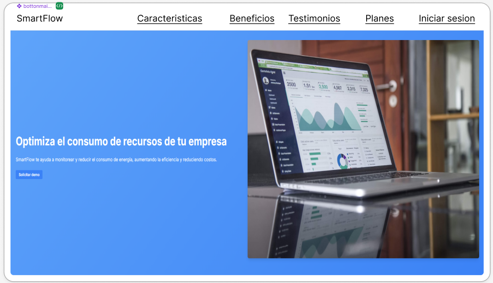  
Link para el flujo: https://www.figma.com/design/8mXQy6OqvddLIzoc5O7Q17/Untitled?node-id=0-1&t=vHvU8eHRh77h9R7x-1  

## 4.6. Domain-Driven Software Architecture

### 4.6.1. Software Architecture Context Diagram

*Imagen:  Context Diagram*
### 4.6.2. Software Architecture Container Diagrams

*Imagen:  Container Diagram*
### 4.6.3. Software Architecture Components Diagrams

*Imagen: Components  Diagram*
 
## 4.7. Software Object-Oriented Design

### 4.7.1. Class Diagrams

*Imagen: Diagrama de clases*
### 4.7.2. Class Dictionary

El diagrama de clases que has compartido muestra la estructura y las relaciones entre varias clases en tu proyecto. A continuación, las clases según el diagrama:

<table><tr><th rowspan="2" valign="top">Usuario</th><th valign="top">
- usuarioID: int: Identificador único del usuario.

- nombre: String: Nombre del usuario.

- email: String: Dirección de correo electrónico del usuario.

- contraseña: String: Contraseña del usuario.

- tipoUsuario: String: Tipo de usuario (Admin, Técnico, Cliente).

</th></tr>
<tr><td valign="top">
- ingresarUsuario(): void: Método para ingresar el nombre del usuario.

- ingresarEmail(): void: Método para ingresar el correo electrónico del usuario.

- ingresarContraseña(): string: Método para ingresar la contraseña del usuario.

</td></tr>
<tr><td rowspan="2" valign="top">Medidor</td><td valign="top">
- medidorID: int: Identificador único del medidor.

- tipoMedidor: String: Tipo de medidor (Agua, Electricidad).

- ubicación: String: Ubicación del medidor.

- estado: String: Estado del medidor (Activo, Inactivo).
</td></tr>
<tr><td valign="top">
- ingresarMedidorID(): void: Método para ingresar el identificador del medidor.

- ingresarUbicación(): void: Método para ingresar la ubicación del medidor.
</td></tr>
<tr><td rowspan="2" valign="top">Consumo</td><td valign="top">
- consumoID: int: Identificador único del registro de consumo.

- medidorID: int: Identificador del medidor asociado.

- fecha: Date: Fecha del registro de consumo.

- cantidad: float: Cantidad de consumo registrado (en m³ para agua o kWh para electricidad).
</td></tr>
<tr><td valign="top">- ingresarCantidad(): void: Método para ingresar la cantidad consumida.</td></tr>
<tr><td rowspan="2" valign="top">Taller</td><td valign="top">
- fabricaID: int: Identificador único de la fábrica o taller.

- nombre: String: Nombre de la fábrica o taller.

- ubicación: String: Ubicación de la fábrica o taller.

- tipo: String: Tipo (Fábrica, Taller).

- capacidadProducción: int: Capacidad de producción de la fábrica o taller.
</td></tr>
<tr><td valign="top">
- nombre(): void: Método para establecer el nombre de la fábrica o taller.

- ubicación(): void: Método para establecer la ubicación de la fábrica o taller.
</td></tr>
<tr><td rowspan="2" valign="top">Produccion</td><td valign="top">
- producciónID: int: Identificador único del registro de producción.

- fabricaID: int: Identificador de la fábrica o taller asociado.

- productoID: int: Identificador del producto producido.

- fecha: Date: Fecha del registro de producción.

- cantidadProducida: int: Cantidad de productos producidos.
</td></tr>
<tr><td valign="top">- cantidadProducida(): void: Método para establecer la cantidad producida.</td></tr>
<tr><td rowspan="2" valign="top">Producto</td><td valign="top">
- productoID: int: Identificador único del producto.

- nombre: String: Nombre del producto.

- tipo: String: Tipo de producto.

- costoProducción: float: Costo de producción del producto.
</td></tr>
<tr><td valign="top">- nombre(): void: Método para establecer el nombre del producto.</td></tr>
<tr><td rowspan="2" valign="top">Reporte</td><td valign="top">
- reporteID: int: Identificador único del reporte.

- usuarioID: int: Identificador del usuario que genera el reporte.

- tipoReporte: String: Tipo de reporte (Consumo, Producción).

- fechaGeneración: Date: Fecha de generación del reporte.
</td></tr>
<tr><td valign="top"></td></tr>
<tr><td rowspan="2" valign="top">Configuración (Singleton)</td><td valign="top">
- getBaseDatosURL(): Retorna la URL de la base de datos.

- getApiKey(): Retorna la clave API.

- getIntervaloLecturaMedidores(): Retorna el intervalo de lectura de los medidores.

- getUnidadMedidaConsumo(): Retorna la unidad de medida de consumo.

- getFormatoReporte(): Retorna el formato del reporte.
</td></tr>
<tr><td valign="top">
- setBaseDatosURL(String): Establece la URL de la base de datos.

- setApiKey(String): Establece la clave API.

- setIntervaloLecturaMedidores(int): Establece el intervalo de lectura de los medidores.

- setUnidadMedidaConsumo(String): Establece la unidad de medida de consumo.

- setFormatoReporte(String): Establece el formato del reporte.
</td></tr>
</table>

## 4.8. Database Design

### 4.8.1. Database Diagram

*Imagen: Diagrama de la Base de Datos*

# Capítulo V: Product Implementation, Validation & Deployment

## 5.1. Software Configuration Management
Esta sección establece las decisiones y convenciones que garantizarán la consistencia, calidad y estabilidad del software durante todo su ciclo de vida. Las prácticas incluyen la gestión del código fuente, la configuración del entorno de desarrollo, el control de versiones y el despliegue del software. Estas decisiones permitirán que el equipo de desarrollo colabore eficazmente y que los productos se mantengan escalables y fáciles de mantener.

### 5.1.1. Software Development Environment Configuration

El equipo emplea diversas herramientas para colaborar durante todas las fases del ciclo de vida del producto digital: desde la planificación de tareas hasta el desarrollo, pruebas y despliegue.

**Herramientas utilizadas:**

**WhatsApp:** Aplicación de mensajería instantánea, disponible para Android e iOS. Es parte de Meta y cuenta con una versión web. [https://www.whatsapp.com/].

**Google Meet:** Aplicación de videollamadas que permite la creación de salas y está disponible para Android. [https://meet.google.com/].

#### Project Management

**Trello:** Se utilizará para gestionar el Product Backlog, planificar los sprints y organizar las tareas. Trello permite a los miembros del equipo visualizar el progreso, gestionar prioridades y facilitar la colaboración mediante tableros y listas.  
*Beneficio:* Facilita la visibilidad del estado de cada tarea, mejora la planificación y permite una mayor agilidad en la ejecución de los sprints.

#### Requirements Management

- **Miro:** Ayudará a administrar ideas, gestionar User Stories y planificar requisitos. Es una herramienta visual colaborativa que permite crear diagramas y mapas conceptuales.  
  *Beneficio:* Mejora la claridad y alineación entre los stakeholders, permite la rápida iteración y evaluación de ideas, y ayuda a consolidar los requisitos del producto.

#### Product UX/UI Design

- **UXPressia:** Herramienta utilizada para crear Journey Maps, Impact Maps, User Persona y Empathy Maps.  
  *Beneficio:* Facilita la investigación de usuarios y el diseño centrado en el cliente, asegurando que se aborden las necesidades y expectativas del usuario final en cada etapa del proyecto.
- **Figma:** Se emplea para la creación y diseño de la interfaz de usuario (UI) de la página de aterrizaje (Landing Page).  
  *Beneficio:* Figma permite una colaboración fluida entre diseñadores y desarrolladores, con actualizaciones en tiempo real. Facilita la creación de prototipos y el diseño UI responsivo.

#### Software Development

- **WebStorm:** Un IDE especializado en el desarrollo de aplicaciones web con tecnologías como JavaScript, HTML, CSS y Vue.js.  
  *Beneficio:* WebStorm ofrece características avanzadas como el autocompletado de código, depuración en tiempo real e integración con herramientas de control de versiones como Git, mejorando la productividad del equipo de frontend.
- **Rider:** IDE para desarrollo en C# y tecnologías de .NET.  
  *Beneficio:* Rider es una herramienta completa para el desarrollo backend, con soporte robusto para C#, integraciones avanzadas con bases de datos y Docker, y herramientas de refactorización para escribir código más limpio y eficiente.
- **Vue.js:** Framework de JavaScript que se utilizará para la construcción de interfaces de usuario interactivas y responsivas, especialmente en aplicaciones de una sola página (SPA).  
  *Beneficio:* Vue.js permite una estructura modular y escalable para la creación de componentes reutilizables, lo que reduce la complejidad del código, mejora el rendimiento de la aplicación y facilita el mantenimiento.
- **GitHub:** Plataforma para la gestión del código fuente, donde se integrará el código a través del control de versiones. Permite la colaboración en equipo y un flujo de trabajo ordenado mediante pull requests, revisiones de código, y la implementación de integraciones continuas.  
  *Beneficio:* GitHub asegura la trazabilidad de los cambios en el código, ofrece control sobre versiones estables y facilita la colaboración entre desarrolladores.

#### Software Testing

- **HackMD:** Herramienta colaborativa para documentar y gestionar los procesos de pruebas y calidad de software.  
  *Beneficio:* Proporciona una plataforma para la creación de documentación técnica y pruebas en equipo, asegurando que las pruebas de software estén documentadas de forma clara y accesible.

### 5.1.2. Source Code Management
<a name="512"><\a>

El equipo opta por usar GitHub como el repositorio principal para el desarrollo de proyectos. GitHub, que emplea el sistema de control de versiones Git, facilita la colaboración entre los diferentes miembros del equipo y permite que varios trabajen simultáneamente.

El repositorio del proyecto contará con dos ramas principales para gestionar e implementar versiones. La rama "main" será la principal donde se reflejarán los cambios finales, mientras que la rama "gh-pages" se usará para la implementación a través de GitHub Pages, lo que permitirá que la página web esté accesible y pública.

En la rama "main" se organizarán las carpetas que contendrán los estilos CSS, las páginas HTML, la validación en JavaScript, y el desarrollo de la landing page. También se creará un repositorio adicional para los criterios de aceptación, incluyendo los Epics y los archivos ".feature" para su análisis.

Los cambios realizados se podrán visualizar en la aplicación web a través de WebStorm, y los proyectos colaborativos estarán reflejados en los repositorios de GitHub como fuente principal de desarrollo.

Enlace al repositorio Gihub: https://github.com/SmartFlow-UPC  
Enlace al landing page: https://smartflow-upc.github.io/smartflow.github.io/

### 5.1.3. Source Code Style Guide & Conventions.
<a name="513"><\a>

El equipo adoptará guías de estilo y convenciones para asegurar que el código sea limpio, legible y mantenible. Estas convenciones abarcan diversos lenguajes y tecnologías, cada una con recomendaciones específicas para mantener la calidad y coherencia en el código.

#### HTML/CSS

- **Guía de estilo:** Se basará en la Google HTML/CSS Style Guide. Esta guía proporciona directrices sobre la estructura y formato del HTML y CSS, incluyendo la indentación, el uso de comentarios y la organización del código para mejorar la legibilidad y el mantenimiento.
- **Nomenclatura:** Se utilizará la metodología BEM (Block Element Modifier). BEM es una metodología que ayuda a crear una estructura modular y reutilizable en CSS, facilitando la comprensión y mantenimiento del código. Consiste en una convención de nombres para clases que mejora la claridad y la organización del CSS.

#### JavaScript

- **Framework:** Vue.js será utilizado para desarrollar componentes reutilizables y gestionar la interfaz de usuario. Vue.js es un framework progresivo de JavaScript para construir interfaces de usuario interactivas. Más información y documentación en Vue.js.
- **Guía de estilo:** Se seguirá la Google JavaScript Style Guide y la Vue.js Style Guide. La guía de estilo de Google ofrece reglas detalladas para escribir código JavaScript claro y consistente, mientras que la guía de estilo de Vue.js proporciona recomendaciones específicas para el desarrollo con este framework, asegurando la coherencia en la estructura y formato del código.

#### C#

- **Guía de estilo:** Se adoptarán las Microsoft C# Coding Conventions. Estas convenciones están diseñadas para mejorar la legibilidad y la consistencia en el código C#, cubriendo aspectos como el formato del código, la nomenclatura y las prácticas recomendadas para escribir código limpio y mantenible en aplicaciones backend.

#### Gherkin

- **Guía de estilo:** Se aplicarán las Gherkin Conventions for Readable Specifications. Gherkin es un lenguaje de especificación utilizado para escribir pruebas automatizadas de comportamiento (BDD). Esta guía proporciona recomendaciones para escribir características y escenarios de manera clara y comprensible, facilitando la colaboración entre desarrolladores y no desarrolladores.

### 5.1.4. Software Deployment Configuration

La configuración del despliegue garantizará que las aplicaciones se ejecuten de manera eficiente y sin errores en los entornos de producción. Se implementarán las siguientes prácticas y herramientas para asegurar un proceso de despliegue ágil, fiable y automatizado:

- **Landing Page:** 
  - **Plataforma de Despliegue:** La página de aterrizaje será desplegada en **GitHub**, aprovechando su integración directa con el control de versiones de GitHub. Esto permite que el contenido sea publicado y actualizado automáticamente en el dominio asociado.
  - **Flujo de Trabajo CI/CD:** Se implementará un flujo de trabajo de **Integración y Despliegue Continuos (CI/CD)**. Cada vez que se realice un `push` en la rama principal (`main` o `master`), GitHub Actions se encargará de construir y desplegar la página automáticamente. Esta integración continua asegura que los cambios en el código se reflejen de inmediato en el entorno de producción sin intervención manual.
   

**Integrantes del equipo:**

| **Correo Electrónico**          | **Nombre Completo**              |
|---------------------------------|----------------------------------|
| U202116246@upc.edu.pe           | Guerrero Vasquez, Jhon Danny      |
| u20221c576@upc.edu.pe           | Taquiri Calderón, Jhunior Giussepe |
| u202218634@upc.edu.pe           | De La Cruz Moreno, Roy Hernan     |
| U20221C186@upc.edu.pe           | Gongora Castillejos, Williams Jesus |
| U20211G296@upc.edu.pe           | Silva Tirado, Sebastian Valentino |

## 5.2. Landing Page, Services & Applications Implementation

### 5.2.1. Sprint 1

#### 5.2.1.1. Sprint Planning 1

El primer sprint se planificó durante una reunión en Meet. Para ello, se creó una tabla para documentar la información discutida.

|Sprint #                          |Sprint 1|
|----                              |-----|
|**Sprint Planning Background**        ||
|Date                              |2024-09-05|
|Time                              |05:00 PM|
|Location                          |Virtual (Google Meet)|
|Prepared by                       |Gongora Castillejos, Williams Jesus|
|Attendees (to planning meeting)   |Gongora Castillejos, Williams Jesus  Taquir Calderon , Jhunior Giussepe  De La Cruz Moreno, Roy Hernan  Silva Tirado, Sebastian Valentino   Guerrero Vasquez, Jhon Dann|
|Sprint n - 1 Review Summary       |No hubo sprint anterior|
|Sprint n - 1 Retrospective Summary|No hubo sprint anterior|
|**Sprint Goal & User Stories**        ||
|Sprint 1 Goal                     |Realizar el Landing Page|
|Sprint 1 Velocity                 |20|
|Sum of Story Points               |20|

#### 5.2.1.2. Sprint Backlog 1

El propósito de este primer sprint es la implementación de una Landing Page estática. Además, se utilizó una tabla en Trello para gestionar los Work-Items de manera eficiente.

<table border="1" cellpadding="4" cellspacing="0">
  <tr>
    <th colspan="1">Sprint #</th>
    <th colspan="8">Sprint n</th>
  </tr>
  <tr>
    <th colspan="2">User Story</th>
    <th colspan="6">Work-Item / Task</th>
    </th>
  </tr>
  <tr>
    <th>Id</th>
    <th>Title</th>
    <th>Id</th>
    <th>Title</th>
    <th>Description</th>
    <th>Estimation (Hours)</th>
    <th>Assigned To</th>
    <th>Status (To-do / In-Process / To-Review / Done)</th>
  </tr>
  <!-- US021 -->
  <tr>
    <td>US021</td>
    <td>Implementación y optimización del Landing Page del proyecto</td>
    <td>TS01</td>
    <td> Implementación del formulario de contacto</td>
    <td>Implementar un formulario de contacto funcional con validación de campos obligatorios y un mensaje de confirmación de envío</td>
    <td>2 horas</td>
    <td>Williams Gongora</td>
    <td>Done</td>
  </tr>
  <!-- US022 -->
  <tr>
    <td>US022</td>
    <td>Ver testimonios de clientes</td>
    <td>TS02</td>
    <td>Implementación de la sección de testimonios</td>
    <td>Implementar una sección en la landing page que muestre testimonios verificados con imágenes de clientes, organizada visualmente</td>
    <td>2 horas</td>
    <td>Jhunior Taquir</td>
    <td>Done</td>
  </tr>
  <!-- US023 -->
  <tr>
    <td rowspan="2">US023</td>
    <td rowspan="2">Ver características y beneficios del producto</td>
    <td>TS03</td>
    <td>Implementación de la lista de características del producto</td>
    <td>Se implementa la sección sobre las principales características del producto, utilizando imagenes y descripciones detalladas para cada una.</td>
    <td>2 horas</td>
    <td>Roy De La Cruz</td>
    <td>Done</td>
  </tr>
  
  <tr>
    <!-- Segunda tarea de la misma User Story -->
    <td>TS04</td>
    <td>Implementación de la lista de beneficios del producto</td>
    <td>Se implementa una sección sobre los principales beneficios de nuestro producto.</td>
    <td>2 horas</td>
    <td>Sebastian Silva</td>
    <td>Done</td>
  </tr>
  
  <!-- US024 -->
  <tr>
    <td>US024</td>
    <td>Ver diferentes planes de precios</td>
    <td>TS05</td>
    <td>Ver diferentes planes de precios</td>
    <td>Implementación de la tabla comparativa de planes de precios
Description: Implementar una tabla que compare los diferentes planes de precios, con detalles de las características y costos de cada uno</td>
    <td>2 horas</td>
    <td>Jhon Guerrero</td>
    <td>Done</td>
  </tr>
  <!-- US025 -->
  <tr>
    <td>US025</td>
    <td>Animaciones Interactivas para una Navegación Fluida y Atractiva</td>
    <td>TS06</td>
    <td>Animaciones Interactivas para una Navegación Fluida y Atractiva</td>
    <td>Implementación de animaciones interactivas
Description: Implementar animaciones fluidas y responsivas en diferentes secciones de la página para mejorar la experiencia del usuario</td>
    <td>2 horas</td>
    <td>Wiliams Gongora</td>
    <td>Done</td>
  </tr>
  <!-- US026 -->
  <tr>
    <td>US026</td>
    <td>Acceder al dashboard después de iniciar sesión</td>
    <td>TS07</td>
    <td>Acceder al dashboard después de iniciar sesión</td>
    <td>Implementación de redirección al dashboard
Description: Programar la redirección automática del usuario al dashboard personalizado tras iniciar sesión exitosamente</td>
    <td>2 horas</td>
    <td>Wiliams Gongora</td>
    <td>Done</td>
  </tr>
</table>

#### 5.2.1.3. Development Evidence for Sprint Review

Se realizaron los avances con los commits correspondiente en el repositorio de la siguiente forma.

Repositorio Landing Page: https://github.com/SmartFlow-UPC/smartflow.github.io.git

|Repository|Branch|Commit Id|Commit Message|Commited on (Date)|
|--|--|--|--|--|
|SmartFlow-UPC/smartflow.github.io|feature|b46f1c8|feat: Agregamos la estructura de la pagina|05/09/2024|
|SmartFlow-UPC/smartflow.github.io|feature|bb782f4|feat: footer, header y formulario de contacto agregado|05/09/2024|
|SmartFlow-UPC/smartflow.github.io|develop|301f66f|Merge pull request #1 from SmartFlow-UPC/feature|05/09/2024|
|SmartFlow-UPC/smartflow.github.io|feature|89fd1db|feat: seccion testimonios agregada|05/09/2024|
|SmartFlow-UPC/smartflow.github.io|feature|7ed540e|feat: seccion principal creada|05/09/2024|
|SmartFlow-UPC/smartflow.github.io|develop|5b42be5|Merge pull request #2 from SmartFlow-UPC/feature|05/09/2024|
|SmartFlow-UPC/smartflow.github.io|feature|df3dee1|feat: Seccion caracteristicas agregada|05/09/2024|
|SmartFlow-UPC/smartflow.github.io|feature|44984f1|feat: seccion beneficios agregada|05/09/2024|
|SmartFlow-UPC/smartflow.github.io|develop|e86c5ce|Merge pull request #3 from SmartFlow-UPC/feature|05/09/2024|
|SmartFlow-UPC/smartflow.github.io|feature|758d79f|feat: seccion de suscripciones agregada|05/09/2024|
|SmartFlow-UPC/smartflow.github.io|feature|17c5b55|feat: Implementamos el diseño y las animaciones|05/09/2024|
|SmartFlow-UPC/smartflow.github.io|develop|5595c88|Merge pull request #4 from SmartFlow-UPC/feature|05/09/2024|
|SmartFlow-UPC/smartflow.github.io|feature|d6b7268|feat: Dashboard y Incio de Sesion agregado|05/09/2024|
|SmartFlow-UPC/smartflow.github.io|develop|d6ef831|Merge pull request #5 from SmartFlow-UPC/feature|05/09/2024|
|SmartFlow-UPC/smartflow.github.io|main|3990238|Merge pull request #6 from SmartFlow-UPC/develop|05/09/2024|

#### 5.2.1.4. Testing Suite Evidence for Sprint Review

Se llevaron a cabo las pruebas de aceptación para las historias de usuario implementadas, empleando el lenguaje Gherkin en archivos feature. Estas pruebas fueron documentadas y almacenadas en el repositorio.

Repositorio de Pruebas de Aceptación:

|Repository|Branch|Commit Id|Commit Message|Commited on (Date)|
|--|--|--|--|--|
|SmartFlow-UPC/Acceptance-Test|main|e2cf52b|feat: added feature file for US21|05/09/2024|
|SmartFlow-UPC/Acceptance-Test|main|87193ca|feat: added feature file for US22|05/09/2024|
|SmartFlow-UPC/Acceptance-Test|main|4383634|feat: added feature file for US23 TS03|05/09/2024|
|SmartFlow-UPC/Acceptance-Test|main|e37fe96|feat: added feature file for US23 TS04|05/09/2024|
|SmartFlow-UPC/Acceptance-Test|main|444dc46|feat: added feature file for US24|05/09/2024|
|SmartFlow-UPC/Acceptance-Test|main|f3484b9|feat: added feature file for US25|05/09/2024|
|SmartFlow-UPC/Acceptance-Test|main|4ce40a5|feat: added feature file for US26|05/09/2024|

#### 5.2.1.5. Execution Evidence for Sprint Review

En esta parte se presentará el progreso alcanzado durante el primer sprint, enfocado en la implementación de la Landing Page estática. Para ilustrar este avance, se ha creado el siguiente video, que incluye una explicación y capturas que evidencian el desarrollo de la página web.

URL del video: [Video Landing Page](https://drive.google.com/file/d/1x7sWsRh-ie01PDHmFpaDi13PdFOh3OCm/view?usp=sharing)

* Implementamos la seccion principal

* Implementación del formulario de contacto

* Implementación de la sección de testimonios

* Implementación de la lista de características del producto

* Implementación de la lista de beneficios del producto

* Ver diferentes planes de precios

* Implementamos el inicio de sesion

* Acceder al dashboard después de iniciar sesión

  
#### 5.2.1.6. Services Documentation Evidence for Sprint Review

Durante este primer sprint, nos enfocamos únicamente en la creación de la Landing Page estática, por lo que no se trabajó con servicios web. Como resultado, en esta ocasión no se elaboró la documentación correspondiente al uso de servicios web.

#### 5.2.1.7. Software Deployment Evidence for Sprint Review

Al finalizar el trabajo con todas las historias de usuario, realizamos el despliegue de la Landing Page utilizando GitHub Pages.

URL de despliegue de la Landing Page: https://smartflow-upc.github.io/smartflow.github.io/

* Para realizar el despliegue, accedimos a la configuración del repositorio y navegamos a la sección de Pages. Posteriormente, seleccionamos la rama main desde la cual se llevará a cabo el deployment.

* Finalmente, solo queda esperar a que GitHub genere la página y proporcione el enlace correspondiente.

#### 5.2.1.8. Team Collaboration Insights during Sprint

La asignación de tareas para la implementación se dividió por secciones, donde cada miembro del equipo fue responsable de desarrollar una parte de la landing page:

* Taquir Calderon , Jhunior Giussepe: Implementación de la sección de testimonios , footer
* De La Cruz Moreno, Roy Hernan: Implementación de la lista de características del producto, inicio sesion
* Silva Tirado, Sebastian Valentino: Implementación de la lista de beneficios del producto, header
* Guerrero Vasquez, Jhon Danny: Implementación de la sección de diferentes planes de precios, seccion principal
* Gongora Castillejos, Williams Jesus: Animaciones Interactivas, Acceso al dashboard después de iniciar sesión, Implementacion del formulario contacto, Subir a Github con commits en cada rama

<h4> 5.2.2. Sprint #2.</h4>

<h5> 5.2.2.1.Sprint Planning 2.</h5>

<table class="tg"><thead>
  <tr>
    <th class="tg-0pky">Sprint #</th>
    <th class="tg-0pky">Date</th>
    <th class="tg-0pky">Time</th>
    <th class="tg-0pky">Location</th>
    <th class="tg-0pky">Prepared By</th>
    <th class="tg-0pky">Attendees</th>
  </tr></thead>
<tbody>
  <tr>
    <td class="tg-0pky">2</td>
    <td class="tg-0pky">22/09/2024</td>
    <td class="tg-0pky">12:00 p.m.</td>
    <td class="tg-0pky">Coordinación por WhatsApp</td>
    <td class="tg-0pky">Sbeastian Silva</td>
    <td class="tg-0pky"> Gongora Castillejos, Williams Jesus
Taquir Calderon , Jhunior Giussepe
De La Cruz Moreno, Roy Hernan
Silva Tirado, Sebastian Valentino
Guerrero Vasquez, Jhon Dann
 </td>
  </tr>
  <tr>
    <td class="tg-0pky" colspan="4">Sprint 2 Goal</td>
    <td class="tg-mq6t">Sprint 2 Velocity    </td>
    <td class="tg-mq6t">Sum of Story Points   </td>
  </tr>
  <tr>
    <td class="tg-0pky" colspan="4"> Actualizar el landing page y mostrando el API Fake siendo funcional y llamativa.</td>
    <td class="tg-0pky">25</td>
    <td class="tg-0pky">25</td>
  </tr>
</tbody>
</table>

<h5> 5.2.2.2.Sprint Backlog 2.</h5>

En el segundo sprint backlog, como equipo continuamos trabajando en la landing page, actualizándola a una versión con Frontend Web Applications integrada con un API falso. Para garantizar una distribución equitativa de las tareas, utilizamos el sprint board, dividiendo las user stories y asignándolas a los miembros del equipo.

 
Link del Trello: https://trello.com/invite/b/66f5e3b9e4dc493068873700/ATTI790174ece6c0c7ef9eb0c46841410a29AC28762B/sprint-backlog-2-aplicaciones-web 

<table style="border-collapse:collapse;border-spacing:0" class="tg"><thead><tr><th style="border-color:inherit;border-style:solid;border-width:1px;font-family:Arial, sans-serif;font-size:14px;font-weight:normal;overflow:hidden;padding:10px 5px;text-align:left;vertical-align:top;word-break:normal">    # Sprint   </th><th style="border-color:inherit;border-style:solid;border-width:1px;font-family:Arial, sans-serif;font-size:14px;font-weight:normal;overflow:hidden;padding:10px 5px;text-align:left;vertical-align:top;word-break:normal" colspan="7">Sprint 2</th></tr></thead><tbody><tr><td style="border-color:inherit;border-style:solid;border-width:1px;font-family:Arial, sans-serif;font-size:14px;overflow:hidden;padding:10px 5px;text-align:left;vertical-align:top;word-break:normal" colspan="2">    User Story   </td><td style="border-color:inherit;border-style:solid;border-width:1px;font-family:Arial, sans-serif;font-size:14px;overflow:hidden;padding:10px 5px;text-align:left;vertical-align:top;word-break:normal" colspan="6">Work Item/Task</td></tr>
<tr><td style="border-color:inherit;border-style:solid;border-width:1px;font-family:Arial, sans-serif;font-size:14px;overflow:hidden;padding:10px 5px;text-align:left;vertical-align:top;word-break:normal">    Id   </td><td style="border-color:inherit;border-style:solid;border-width:1px;font-family:Arial, sans-serif;font-size:14px;overflow:hidden;padding:10px 5px;text-align:left;vertical-align:top;word-break:normal">    Title   </td><td style="border-color:inherit;border-style:solid;border-width:1px;font-family:Arial, sans-serif;font-size:14px;overflow:hidden;padding:10px 5px;text-align:left;vertical-align:top;word-break:normal">    Id   </td><td style="border-color:inherit;border-style:solid;border-width:1px;font-family:Arial, sans-serif;font-size:14px;overflow:hidden;padding:10px 5px;text-align:left;vertical-align:top;word-break:normal">    Title   </td>
<td style="border-color:inherit;border-style:solid;border-width:1px;font-family:Arial, sans-serif;font-size:14px;overflow:hidden;padding:10px 5px;text-align:left;vertical-align:top;word-break:normal">    Descripción   </td><td style="border-color:inherit;border-style:solid;border-width:1px;font-family:Arial, sans-serif;font-size:14px;overflow:hidden;padding:10px 5px;text-align:left;vertical-align:top;word-break:normal">    Estimación (Hours)   </td><td style="border-color:inherit;border-style:solid;border-width:1px;font-family:Arial, sans-serif;font-size:14px;overflow:hidden;padding:10px 5px;text-align:left;vertical-align:top;word-break:normal">    Assigned to   </td><td style="border-color:inherit;border-style:solid;border-width:1px;font-family:Arial, sans-serif;font-size:14px;overflow:hidden;padding:10px 5px;text-align:left;vertical-align:top;word-break:normal">    Status (In   -process / To - review / Done)   </td></tr>
<tr><td style="border-color:inherit;border-style:solid;border-width:1px;font-family:Arial, sans-serif;font-size:14px;overflow:hidden;padding:10px 5px;text-align:left;vertical-align:top;word-break:normal">US001</td><td style="border-color:inherit;border-style:solid;border-width:1px;font-family:Arial, sans-serif;font-size:14px;overflow:hidden;padding:10px 5px;text-align:left;vertical-align:top;word-break:normal">Ver dashboard de consumo total</td><td style="border-color:inherit;border-style:solid;border-width:1px;font-family:Arial, sans-serif;font-size:14px;overflow:hidden;padding:10px 5px;text-align:left;vertical-align:top;word-break:normal">    UT07 </td><td style="border-color:inherit;border-style:solid;border-width:1px;font-family:Arial, sans-serif;font-size:14px;overflow:hidden;padding:10px 5px;text-align:left;vertical-align:top;word-break:normal">Dashboard</td>
<td style="border-color:inherit;border-style:solid;border-width:1px;font-family:Arial, sans-serif;font-size:14px;overflow:hidden;padding:10px 5px;text-align:left;vertical-align:top;word-break:normal">Como gerente de producción, quiero ver un dashboard con el consumo total de recursos </td><td style="border-color:inherit;border-style:solid;border-width:1px;font-family:Arial, sans-serif;font-size:14px;overflow:hidden;padding:10px 5px;text-align:left;vertical-align:top;word-break:normal">4</td><td style="border-color:inherit;border-style:solid;border-width:1px;font-family:Arial, sans-serif;font-size:14px;overflow:hidden;padding:10px 5px;text-align:left;vertical-align:top;word-break:normal">Williams Gongora </td><td style="border-color:inherit;border-style:solid;border-width:1px;font-family:Arial, sans-serif;font-size:14px;overflow:hidden;padding:10px 5px;text-align:left;vertical-align:top;word-break:normal">    Done   </td></tr>
<tr><td style="border-color:inherit;border-style:solid;border-width:1px;font-family:Arial, sans-serif;font-size:14px;overflow:hidden;padding:10px 5px;text-align:left;vertical-align:top;word-break:normal">US005</td><td style="border-color:inherit;border-style:solid;border-width:1px;font-family:Arial, sans-serif;font-size:14px;overflow:hidden;padding:10px 5px;text-align:left;vertical-align:top;word-break:normal">Exportar datos de consumo </td><td style="border-color:inherit;border-style:solid;border-width:1px;font-family:Arial, sans-serif;font-size:14px;overflow:hidden;padding:10px 5px;text-align:left;vertical-align:top;word-break:normal">    UT08</td><td style="border-color:inherit;border-style:solid;border-width:1px;font-family:Arial, sans-serif;font-size:14px;overflow:hidden;padding:10px 5px;text-align:left;vertical-align:top;word-break:normal">Exportar</td>
<td style="border-color:inherit;border-style:solid;border-width:1px;font-family:Arial, sans-serif;font-size:14px;overflow:hidden;padding:10px 5px;text-align:left;vertical-align:top;word-break:normal">Como gerente de operaciones, quiero poder exportar los datos de consumo en diferentes formatos </td><td style="border-color:inherit;border-style:solid;border-width:1px;font-family:Arial, sans-serif;font-size:14px;overflow:hidden;padding:10px 5px;text-align:left;vertical-align:top;word-break:normal">5</td><td style="border-color:inherit;border-style:solid;border-width:1px;font-family:Arial, sans-serif;font-size:14px;overflow:hidden;padding:10px 5px;text-align:left;vertical-align:top;word-break:normal">Giussepe Taquir </td><td style="border-color:inherit;border-style:solid;border-width:1px;font-family:Arial, sans-serif;font-size:14px;overflow:hidden;padding:10px 5px;text-align:left;vertical-align:top;word-break:normal">    Done   </td></tr>
<tr><td style="border-color:inherit;border-style:solid;border-width:1px;font-family:Arial, sans-serif;font-size:14px;overflow:hidden;padding:10px 5px;text-align:left;vertical-align:top;word-break:normal">US006</td><td style="border-color:inherit;border-style:solid;border-width:1px;font-family:Arial, sans-serif;font-size:14px;overflow:hidden;padding:10px 5px;text-align:left;vertical-align:top;word-break:normal">Generar informe de costos</td><td style="border-color:inherit;border-style:solid;border-width:1px;font-family:Arial, sans-serif;font-size:14px;overflow:hidden;padding:10px 5px;text-align:left;vertical-align:top;word-break:normal">    UT09</td><td style="border-color:inherit;border-style:solid;border-width:1px;font-family:Arial, sans-serif;font-size:14px;overflow:hidden;padding:10px 5px;text-align:left;vertical-align:top;word-break:normal">Costos</td>
<td style="border-color:inherit;border-style:solid;border-width:1px;font-family:Arial, sans-serif;font-size:14px;overflow:hidden;padding:10px 5px;text-align:left;vertical-align:top;word-break:normal">Como contador, quiero acceder a un informe detallado de costos por recurso </td><td style="border-color:inherit;border-style:solid;border-width:1px;font-family:Arial, sans-serif;font-size:14px;overflow:hidden;padding:10px 5px;text-align:left;vertical-align:top;word-break:normal">5</td><td style="border-color:inherit;border-style:solid;border-width:1px;font-family:Arial, sans-serif;font-size:14px;overflow:hidden;padding:10px 5px;text-align:left;vertical-align:top;word-break:normal">Roy De La Cruz </td><td style="border-color:inherit;border-style:solid;border-width:1px;font-family:Arial, sans-serif;font-size:14px;overflow:hidden;padding:10px 5px;text-align:left;vertical-align:top;word-break:normal">    Done   </td></tr>
<tr><td style="border-color:inherit;border-style:solid;border-width:1px;font-family:Arial, sans-serif;font-size:14px;overflow:hidden;padding:10px 5px;text-align:left;vertical-align:top;word-break:normal">US014</td><td style="border-color:inherit;border-style:solid;border-width:1px;font-family:Arial, sans-serif;font-size:14px;overflow:hidden;padding:10px 5px;text-align:left;vertical-align:top;word-break:normal">Ver historial de alertas </td><td style="border-color:inherit;border-style:solid;border-width:1px;font-family:Arial, sans-serif;font-size:14px;overflow:hidden;padding:10px 5px;text-align:left;vertical-align:top;word-break:normal">    UT10</td><td style="border-color:inherit;border-style:solid;border-width:1px;font-family:Arial, sans-serif;font-size:14px;overflow:hidden;padding:10px 5px;text-align:left;vertical-align:top;word-break:normal">Historial</td>
<td style="border-color:inherit;border-style:solid;border-width:1px;font-family:Arial, sans-serif;font-size:14px;overflow:hidden;padding:10px 5px;text-align:left;vertical-align:top;word-break:normal">Como gerente de mantenimiento, quiero ver un historial de todas las alertas generadas </td><td style="border-color:inherit;border-style:solid;border-width:1px;font-family:Arial, sans-serif;font-size:14px;overflow:hidden;padding:10px 5px;text-align:left;vertical-align:top;word-break:normal">4</td><td style="border-color:inherit;border-style:solid;border-width:1px;font-family:Arial, sans-serif;font-size:14px;overflow:hidden;padding:10px 5px;text-align:left;vertical-align:top;word-break:normal">    Sebastian Silva       </td><td style="border-color:inherit;border-style:solid;border-width:1px;font-family:Arial, sans-serif;font-size:14px;overflow:hidden;padding:10px 5px;text-align:left;vertical-align:top;word-break:normal">    Done   </td></tr>
<tr><td style="border-color:inherit;border-style:solid;border-width:1px;font-family:Arial, sans-serif;font-size:14px;overflow:hidden;padding:10px 5px;text-align:left;vertical-align:top;word-break:normal">US018</td><td style="border-color:inherit;border-style:solid;border-width:1px;font-family:Arial, sans-serif;font-size:14px;overflow:hidden;padding:10px 5px;text-align:left;vertical-align:top;word-break:normal">Visualizar consumo personal </td><td style="border-color:inherit;border-style:solid;border-width:1px;font-family:Arial, sans-serif;font-size:14px;overflow:hidden;padding:10px 5px;text-align:left;vertical-align:top;word-break:normal">    UT11</td><td style="border-color:inherit;border-style:solid;border-width:1px;font-family:Arial, sans-serif;font-size:14px;overflow:hidden;padding:10px 5px;text-align:left;vertical-align:top;word-break:normal">Consumo personal</td>
<td style="border-color:inherit;border-style:solid;border-width:1px;font-family:Arial, sans-serif;font-size:14px;overflow:hidden;padding:10px 5px;text-align:left;vertical-align:top;word-break:normal">Como operario, quiero poder ver mi propio consumo de recursos durante mi turno </td><td style="border-color:inherit;border-style:solid;border-width:1px;font-family:Arial, sans-serif;font-size:14px;overflow:hidden;padding:10px 5px;text-align:left;vertical-align:top;word-break:normal">5</td><td style="border-color:inherit;border-style:solid;border-width:1px;font-family:Arial, sans-serif;font-size:14px;overflow:hidden;padding:10px 5px;text-align:left;vertical-align:top;word-break:normal">Jhon Guerrero</td><td style="border-color:inherit;border-style:solid;border-width:1px;font-family:Arial, sans-serif;font-size:14px;overflow:hidden;padding:10px 5px;text-align:left;vertical-align:top;word-break:normal">    Done   </td></tr>
</tbody></table>

<h5> 5.2.2.3.Development Evidence for Sprint Review.</h5>

<table><thead>
  <tr>
    <th>    Repository   </th>
    <th>    Branch   </th>
    <th>    Commit ID   </th>
    <th>    Commit     Message   </th>
    <th>    Committed on   (Date)   </th>
  </tr></thead>
<tbody>
  <tr>
    <td rowspan="7"><a href="https://github.com/SmartFlow-UPC/SmartFlow-App-Web">https://github.com/SmartFlow-UPC/SmartFlow-App-Web</a></td>
    <td>    SmartFlow-UPC / SmartFlow-App-Web</td>
    <td>main</td>
    <td>    feat: Primer commit</td>
    <td>    25/09/2024   </td>
  </tr>
  <tr>
    <td>    SmartFlow-UPC / SmartFlow-App-Web</td>
    <td>feature-login</td>
    <td>    feat: Push Login</td>
    <td>    27/09/2024   </td>
  </tr>
  <tr>
    <td>    SmartFlow-UPC / SmartFlow-App-Web</td>
    <td>feature-registro</td>
    <td>    feat: Push registros</td>
    <td>    27/09/2024   </td>
  </tr>
  <tr>
    <td>    SmartFlow-UPC / SmartFlow-App-Web</td>
    <td>feature-produccion</td>
    <td>    feat: commitproducction</td>
    <td>    27/09/2024   </td>
  </tr>
  <tr>
    <td>    SmartFlow-UPC / SmartFlow-App-Web</td>
    <td>feature_fix</td>
    <td>    feat: Commit Felipe about</td>
    <td>    27/09/2024   </td>
  </tr>
  <tr>
    <td>    SmartFlow-UPC / SmartFlow-App-Web</td>
    <td>feature-alarmas</td>
    <td>    feat: commit final Alarmas, add Contact, add Plans of subscriptions</td>
    <td>    27/09/2024   </td>
  </tr>
  <tr>
    <td>    SmartFlow-UPC / SmartFlow-App-Web</td>
    <td>main</td>
    <td>    Merge pull request #3 from SmartFlow-UPC/feature-alarmas</td>
    <td>    27/09/2024   </td>
  </tr>
</tbody></table>

 

<h5> 5.2.2.4.Testing Suite Evidence for Sprint Review.</h5>

   
<table style="border-collapse:collapse;border-spacing:0" class="tg"><thead>
<tr><th style="border-color:black;border-style:solid;border-width:1px;font-family:Arial, sans-serif;font-size:14px;font-weight:normal;overflow:hidden;padding:10px 5px;text-align:left;vertical-align:top;word-break:normal">    Repository   </th><th style="border-color:black;border-style:solid;border-width:1px;font-family:Arial, sans-serif;font-size:14px;font-weight:normal;overflow:hidden;padding:10px 5px;text-align:left;vertical-align:top;word-break:normal">    Branch   </th><th style="border-color:black;border-style:solid;border-width:1px;font-family:Arial, sans-serif;font-size:14px;font-weight:normal;overflow:hidden;padding:10px 5px;text-align:left;vertical-align:top;word-break:normal">    Commit ID   </th><th style="border-color:black;border-style:solid;border-width:1px;font-family:Arial, sans-serif;font-size:14px;font-weight:normal;overflow:hidden;padding:10px 5px;text-align:left;vertical-align:top;word-break:normal">    Commit     Message   </th>
<th style="border-color:black;border-style:solid;border-width:1px;font-family:Arial, sans-serif;font-size:14px;font-weight:normal;overflow:hidden;padding:10px 5px;text-align:left;vertical-align:top;word-break:normal">    Commit     Message Body   </th><th style="border-color:black;border-style:solid;border-width:1px;font-family:Arial, sans-serif;font-size:14px;font-weight:normal;overflow:hidden;padding:10px 5px;text-align:left;vertical-align:top;word-break:normal">    Committed on (Date)   </th></tr>
</thead>
<tbody>
<tr><td style="border-color:black;border-style:solid;border-width:1px;font-family:Arial, sans-serif;font-size:14px;overflow:hidden;padding:10px 5px;text-align:left;vertical-align:top;word-break:normal">    <a href="https://github.com/SmartFlow-UPC/SmartFlow-App-Web">https://github.com/SmartFlow-UPC/SmartFlow-App-Web</a>         </td><td style="border-color:black;border-style:solid;border-width:1px;font-family:Arial, sans-serif;font-size:14px;overflow:hidden;padding:10px 5px;text-align:left;vertical-align:top;word-break:normal">    SmartFlow-UPC / SmartFlow-App-Web</td><td style="border-color:black;border-style:solid;border-width:1px;font-family:Arial, sans-serif;font-size:14px;overflow:hidden;padding:10px 5px;text-align:left;vertical-align:top;word-break:normal">ce2f349</td>
<td style="border-color:black;border-style:solid;border-width:1px;font-family:Arial, sans-serif;font-size:14px;overflow:hidden;padding:10px 5px;text-align:left;vertical-align:top;word-break:normal">Create de first repositrory</td><td style="border-color:black;border-style:solid;border-width:1px;font-family:Arial, sans-serif;font-size:14px;overflow:hidden;padding:10px 5px;text-align:left;vertical-align:top;word-break:normal">Primer commit </td><td style="border-color:black;border-style:solid;border-width:1px;font-family:Arial, sans-serif;font-size:14px;overflow:hidden;padding:10px 5px;text-align:left;vertical-align:top;word-break:normal">    25/09/2024   </td></tr>
</tbody></table>

<h5> 5.2.2.5.Execution Evidence for Sprint Review.</h5>

Durante el sprint 2, se logró completar el desarrollo de la implementación de la landing page, que incluye diversas secciones en las que el usuario puede acceder a información relevante sobre el producto y la startup. Paralelamente, se avanzó parcialmente en el desarrollo de la aplicación web, permitiendo a los usuarios interactuar con algunas de sus funcionalidades. A continuación, se presentan algunas evidencias.

* US001
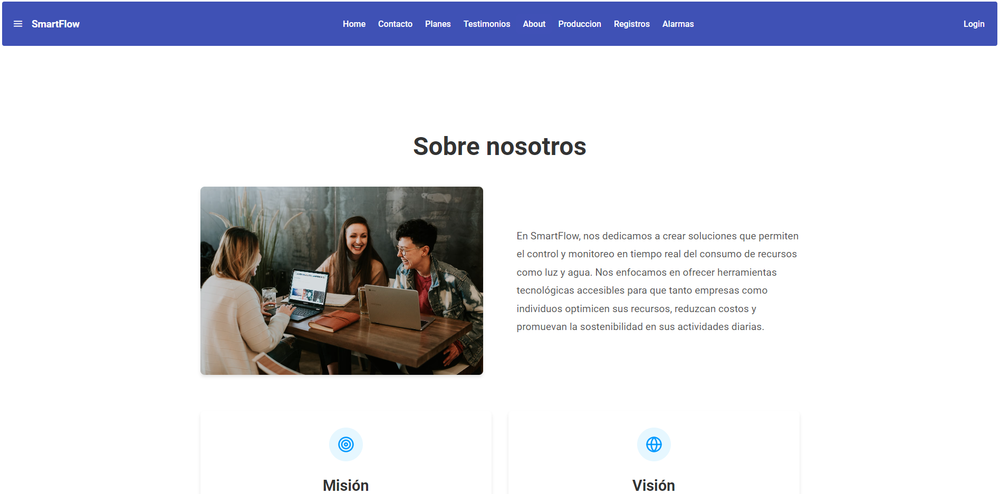 
* US005
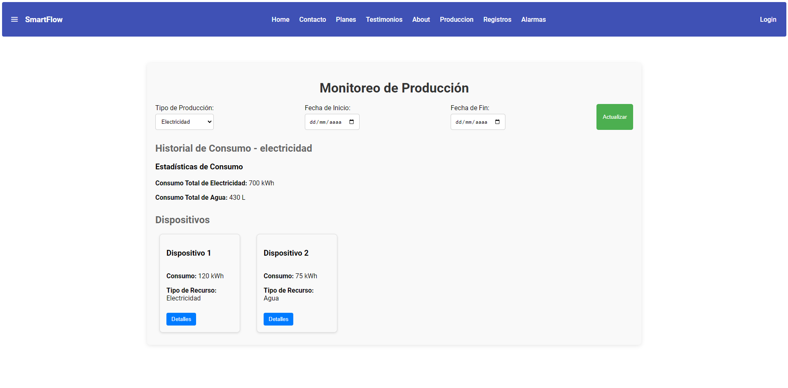 
* US006
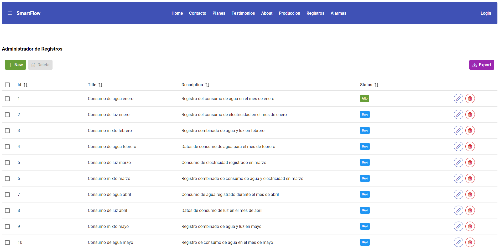 
* US014
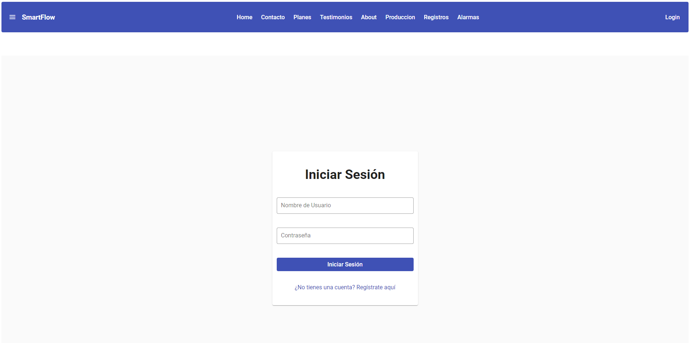 

<h5> 5.2.2.6.Services Documentation Evidence for Sprint Review.</h5>

En el sprint 2, se planificó enfocarse exclusivamente en la landing page y el front-end. Para evitar limitaciones al probar las funcionalidades sin un back-end disponible.Al principio, se trabajó con un servidor JSON de manera local, y posteriormente se implementó My Json Server, que ahora está integrado en la aplicación web de Front-End desplegada. A continuación, se proporciona el enlace para acceder a <a href="https://my-json-server.typicode.com/" target="_blank" rel="noopener noreferrer">My Json Server</a>.

<table style="border-collapse:collapse;border-spacing:0" class="tg"><thead><tr><th style="border-color:inherit;border-style:solid;border-width:1px;font-family:Arial, sans-serif;font-size:14px;font-weight:normal;overflow:hidden;padding:10px 5px;text-align:left;vertical-align:top;word-break:normal" colspan="2">Endpoint </th><th style="border-color:inherit;border-style:solid;border-width:1px;font-family:Arial, sans-serif;font-size:14px;font-weight:normal;overflow:hidden;padding:10px 5px;text-align:left;vertical-align:top;word-break:normal" colspan="4">Details</th></tr></thead>
<tbody><tr><td style="border-color:inherit;border-style:solid;border-width:1px;font-family:Arial, sans-serif;font-size:14px;overflow:hidden;padding:10px 5px;text-align:left;vertical-align:top;word-break:normal" colspan="2">/users</td><td style="border-color:inherit;border-style:solid;border-width:1px;font-family:Arial, sans-serif;font-size:14px;overflow:hidden;padding:10px 5px;text-align:left;vertical-align:top;word-break:normal" colspan="4">Fetches a list of all users in the system</td></tr><tr><td style="border-color:inherit;border-style:solid;border-width:1px;font-family:Arial, sans-serif;font-size:14px;overflow:hidden;padding:10px 5px;text-align:left;vertical-align:top;word-break:normal" colspan="2">/registro</td><td style="border-color:inherit;border-style:solid;border-width:1px;font-family:Arial, sans-serif;font-size:14px;overflow:hidden;padding:10px 5px;text-align:left;vertical-align:top;word-break:normal" colspan="4">Fetches a list of all register in the system</td></tr>
<tr><td style="border-color:inherit;border-style:solid;border-width:1px;font-family:Arial, sans-serif;font-size:14px;overflow:hidden;padding:10px 5px;text-align:left;vertical-align:top;word-break:normal" colspan="2">/production</td><td style="border-color:inherit;border-style:solid;border-width:1px;font-family:Arial, sans-serif;font-size:14px;overflow:hidden;padding:10px 5px;text-align:left;vertical-align:top;word-break:normal" colspan="4">Fetches a list of all production in the system</td></tr><tr><td style="border-color:inherit;border-style:solid;border-width:1px;font-family:Arial, sans-serif;font-size:14px;overflow:hidden;padding:10px 5px;text-align:left;vertical-align:top;word-break:normal" colspan="2">/register</td><td style="border-color:inherit;border-style:solid;border-width:1px;font-family:Arial, sans-serif;font-size:14px;overflow:hidden;padding:10px 5px;text-align:left;vertical-align:top;word-break:normal" colspan="4">Fetches a list of all register in the system</td></tr>
<tr><td style="border-color:inherit;border-style:solid;border-width:1px;font-family:Arial, sans-serif;font-size:14px;overflow:hidden;padding:10px 5px;text-align:left;vertical-align:top;word-break:normal">Repository</td><td style="border-color:inherit;border-style:solid;border-width:1px;font-family:Arial, sans-serif;font-size:14px;overflow:hidden;padding:10px 5px;text-align:left;vertical-align:top;word-break:normal">Branch</td><td style="border-color:inherit;border-style:solid;border-width:1px;font-family:Arial, sans-serif;font-size:14px;overflow:hidden;padding:10px 5px;text-align:left;vertical-align:top;word-break:normal">Commit Id</td><td style="border-color:inherit;border-style:solid;border-width:1px;font-family:Arial, sans-serif;font-size:14px;overflow:hidden;padding:10px 5px;text-align:left;vertical-align:top;word-break:normal">Commit message</td>
<td style="border-color:inherit;border-style:solid;border-width:1px;font-family:Arial, sans-serif;font-size:14px;overflow:hidden;padding:10px 5px;text-align:left;vertical-align:top;word-break:normal">Commit message body</td><td style="border-color:inherit;border-style:solid;border-width:1px;font-family:Arial, sans-serif;font-size:14px;overflow:hidden;padding:10px 5px;text-align:left;vertical-align:top;word-break:normal">Committed on (Date)</td></tr>
<tr><td style="border-color:inherit;border-style:solid;border-width:1px;font-family:Arial, sans-serif;font-size:14px;overflow:hidden;padding:10px 5px;text-align:left;vertical-align:top;word-break:normal" rowspan="3"><a href="https://github.com/TFOpenSource/Landing_Page" target="_blank" rel="noopener noreferrer">https://github.com/SmartFlow-UPC/SmartFlow-App-Web</a></td><td style="border-color:inherit;border-style:solid;border-width:1px;font-family:Arial, sans-serif;font-size:14px;overflow:hidden;padding:10px 5px;text-align:left;vertical-align:top;word-break:normal">feature</td><td style="border-color:inherit;border-style:solid;border-width:1px;font-family:Arial, sans-serif;font-size:14px;overflow:hidden;padding:10px 5px;text-align:left;vertical-align:top;word-break:normal">f50f5f6</td>
<td style="border-color:inherit;border-style:solid;border-width:1px;font-family:Arial, sans-serif;font-size:14px;overflow:hidden;padding:10px 5px;text-align:left;vertical-align:top;word-break:normal">Add files via upload</td><td style="border-color:inherit;border-style:solid;border-width:1px;font-family:Arial, sans-serif;font-size:14px;overflow:hidden;padding:10px 5px;text-align:left;vertical-align:top;word-break:normal">Uploaded initial project files with API documentation</td><td style="border-color:inherit;border-style:solid;border-width:1px;font-family:Arial, sans-serif;font-size:14px;overflow:hidden;padding:10px 5px;text-align:left;vertical-align:top;word-break:normal">26/09/2024</td></tr>
<tr><td style="border-color:inherit;border-style:solid;border-width:1px;font-family:Arial, sans-serif;font-size:14px;overflow:hidden;padding:10px 5px;text-align:left;vertical-align:top;word-break:normal">feature</td><td style="border-color:inherit;border-style:solid;border-width:1px;font-family:Arial, sans-serif;font-size:14px;overflow:hidden;padding:10px 5px;text-align:left;vertical-align:top;word-break:normal">cc4497a</td><td style="border-color:inherit;border-style:solid;border-width:1px;font-family:Arial, sans-serif;font-size:14px;overflow:hidden;padding:10px 5px;text-align:left;vertical-align:top;word-break:normal">Update index.html</td><td style="border-color:inherit;border-style:solid;border-width:1px;font-family:Arial, sans-serif;font-size:14px;overflow:hidden;padding:10px 5px;text-align:left;vertical-align:top;word-break:normal">Included endpoint details in the documentation</td>
<td style="border-color:inherit;border-style:solid;border-width:1px;font-family:Arial, sans-serif;font-size:14px;overflow:hidden;padding:10px 5px;text-align:left;vertical-align:top;word-break:normal">26/09/2024</td></tr>
<tr><td style="border-color:inherit;border-style:solid;border-width:1px;font-family:Arial, sans-serif;font-size:14px;overflow:hidden;padding:10px 5px;text-align:left;vertical-align:top;word-break:normal">feature</td><td style="border-color:inherit;border-style:solid;border-width:1px;font-family:Arial, sans-serif;font-size:14px;overflow:hidden;padding:10px 5px;text-align:left;vertical-align:top;word-break:normal">fb220f7</td><td style="border-color:inherit;border-style:solid;border-width:1px;font-family:Arial, sans-serif;font-size:14px;overflow:hidden;padding:10px 5px;text-align:left;vertical-align:top;word-break:normal">Custom Files</td><td style="border-color:inherit;border-style:solid;border-width:1px;font-family:Arial, sans-serif;font-size:14px;overflow:hidden;padding:10px 5px;text-align:left;vertical-align:top;word-break:normal">Added documentation for simulated API usage</td>
<td style="border-color:inherit;border-style:solid;border-width:1px;font-family:Arial, sans-serif;font-size:14px;overflow:hidden;padding:10px 5px;text-align:left;vertical-align:top;word-break:normal">26/09/2024</td></tr>
</tbody></table>

<h5> 5.2.2.7.Software Deployment Evidence for Sprint Review.</h5>

En la entrega del segundo sprint, se implementó la landing page completamente funcional, cumpliendo con las user stories asociadas a este entregable. Asimismo, se lanzó una versión parcial de la aplicación web.

Capturas de pantalla landing page:

Web Application:

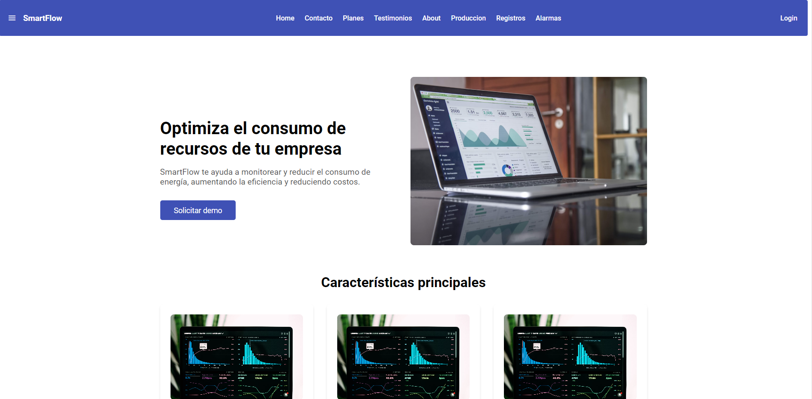 

 

 

 

 

<h5> 5.2.2.8.Team Collaboration Insights during Sprint.</h5>

<table style="border-collapse:collapse;border-spacing:0" class="tg"><thead><tr><th style="border-color:inherit;border-style:solid;border-width:1px;font-family:Arial, sans-serif;font-size:14px;font-weight:normal;overflow:hidden;padding:10px 5px;text-align:left;vertical-align:top;word-break:normal">Alumno</th><th style="border-color:inherit;border-style:solid;border-width:1px;font-family:Arial, sans-serif;font-size:14px;font-weight:normal;overflow:hidden;padding:10px 5px;text-align:left;vertical-align:top;word-break:normal">Actividad</th></tr></thead>
<tbody><tr><td style="border-color:inherit;border-style:solid;border-width:1px;font-family:Arial, sans-serif;font-size:14px;overflow:hidden;padding:10px 5px;text-align:left;vertical-align:top;word-break:normal">Góngora Castillejos, Williams Jesus</td><td style="border-color:inherit;border-style:solid;border-width:1px;font-family:Arial, sans-serif;font-size:14px;overflow:hidden;padding:10px 5px;text-align:left;vertical-align:top;word-break:normal">Implementación, Sprint 2, Execution Evidence for Sprint Review</td></tr>
<tr><td style="border-color:inherit;border-style:solid;border-width:1px;font-family:Arial, sans-serif;font-size:14px;overflow:hidden;padding:10px 5px;text-align:left;vertical-align:top;word-break:normal">Taquir Calderon , Jhunior Giussepe</td><td style="border-color:inherit;border-style:solid;border-width:1px;font-family:Arial, sans-serif;font-size:14px;overflow:hidden;padding:10px 5px;text-align:left;vertical-align:top;word-break:normal">Implementación, Sprint Planning 2, Services Documentation Evidence for Sprint Review</td></tr>
<tr><td style="border-color:inherit;border-style:solid;border-width:1px;font-family:Arial, sans-serif;font-size:14px;overflow:hidden;padding:10px 5px;text-align:left;vertical-align:top;word-break:normal">De La Cruz Moreno, Roy Hernan</td><td style="border-color:inherit;border-style:solid;border-width:1px;font-family:Arial, sans-serif;font-size:14px;overflow:hidden;padding:10px 5px;text-align:left;vertical-align:top;word-break:normal">Implementación, Sprint Backlog 2, Software Deployment Evidence for Sprint Review</td></tr>
<tr><td style="border-color:inherit;border-style:solid;border-width:1px;font-family:Arial, sans-serif;font-size:14px;overflow:hidden;padding:10px 5px;text-align:left;vertical-align:top;word-break:normal">Guerrero Vasquez, Jhon Danny</td><td style="border-color:inherit;border-style:solid;border-width:1px;font-family:Arial, sans-serif;font-size:14px;overflow:hidden;padding:10px 5px;text-align:left;vertical-align:top;word-break:normal">Implementación, Development Evidence for Sprint Review, Team Collaboration Insights during Sprint</td></tr>
<tr><td style="border-color:inherit;border-style:solid;border-width:1px;font-family:Arial, sans-serif;font-size:14px;overflow:hidden;padding:10px 5px;text-align:left;vertical-align:top;word-break:normal">Silva Tirado, Sebastian Valentino</td><td style="border-color:inherit;border-style:solid;border-width:1px;font-family:Arial, sans-serif;font-size:14px;overflow:hidden;padding:10px 5px;text-align:left;vertical-align:top;word-break:normal">Implementación, Testing Suite Evidence for Sprint Review, Team Collaboration Insights during Sprint</td></tr></tbody></table>

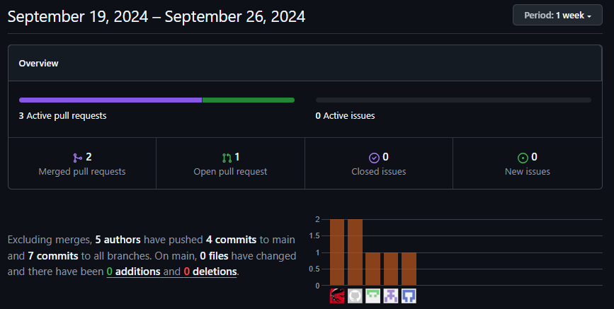 

<h4> 5.2.3. Sprint #3.</h4>

<h5> 5.2.3.1. Sprint Planning 3.</h5>

<table style="border-collapse:collapse;border-spacing:0" class="tg"><thead>
<tr><th style="border-color:black;border-style:solid;border-width:1px;font-family:Arial, sans-serif;font-size:14px;font-weight:normal;overflow:hidden;padding:10px 5px;text-align:left;vertical-align:top;word-break:normal">Sprint #</th><th style="border-color:black;border-style:solid;border-width:1px;font-family:Arial, sans-serif;font-size:14px;font-weight:normal;overflow:hidden;padding:10px 5px;text-align:left;vertical-align:top;word-break:normal">Date</th><th style="border-color:black;border-style:solid;border-width:1px;font-family:Arial, sans-serif;font-size:14px;font-weight:normal;overflow:hidden;padding:10px 5px;text-align:left;vertical-align:top;word-break:normal">Time</th>
<th style="border-color:black;border-style:solid;border-width:1px;font-family:Arial, sans-serif;font-size:14px;font-weight:normal;overflow:hidden;padding:10px 5px;text-align:left;vertical-align:top;word-break:normal">Location</th><th style="border-color:black;border-style:solid;border-width:1px;font-family:Arial, sans-serif;font-size:14px;font-weight:normal;overflow:hidden;padding:10px 5px;text-align:left;vertical-align:top;word-break:normal">Prepared By</th><th style="border-color:black;border-style:solid;border-width:1px;font-family:Arial, sans-serif;font-size:14px;font-weight:normal;overflow:hidden;padding:10px 5px;text-align:left;vertical-align:top;word-break:normal">Attendees</th></tr>
</thead>
<tbody>
<tr><td style="border-color:black;border-style:solid;border-width:1px;font-family:Arial, sans-serif;font-size:14px;overflow:hidden;padding:10px 5px;text-align:left;vertical-align:top;word-break:normal">3</td><td style="border-color:black;border-style:solid;border-width:1px;font-family:Arial, sans-serif;font-size:14px;overflow:hidden;padding:10px 5px;text-align:left;vertical-align:top;word-break:normal">22/10/2024</td><td style="border-color:black;border-style:solid;border-width:1px;font-family:Arial, sans-serif;font-size:14px;overflow:hidden;padding:10px 5px;text-align:left;vertical-align:top;word-break:normal">12:00 p.m.</td><td style="border-color:black;border-style:solid;border-width:1px;font-family:Arial, sans-serif;font-size:14px;overflow:hidden;padding:10px 5px;text-align:left;vertical-align:top;word-break:normal">Coordinación por WhatsApp</td>
<td style="border-color:black;border-style:solid;border-width:1px;font-family:Arial, sans-serif;font-size:14px;overflow:hidden;padding:10px 5px;text-align:left;vertical-align:top;word-break:normal">Sebastian Silva</td><td style="border-color:black;border-style:solid;border-width:1px;font-family:Arial, sans-serif;font-size:14px;overflow:hidden;padding:10px 5px;text-align:left;vertical-align:top;word-break:normal">Gongora Castillejos, Williams Jesus Taquir Calderon , Jhunior Giussepe De La Cruz Moreno, Roy Hernan Silva Tirado, Sebastian Valentino Guerrero Vasquez, Jhon Dann</td></tr>
<tr><td style="border-color:black;border-style:solid;border-width:1px;font-family:Arial, sans-serif;font-size:14px;overflow:hidden;padding:10px 5px;text-align:left;vertical-align:top;word-break:normal" colspan="4">Sprint 3 Goal</td><td style="border-color:black;border-style:solid;border-width:1px;font-family:Arial, sans-serif;font-size:14px;overflow:hidden;padding:10px 5px;text-align:left;vertical-align:top;word-break:normal">Sprint 3 Velocity    </td><td style="border-color:black;border-style:solid;border-width:1px;font-family:Arial, sans-serif;font-size:14px;overflow:hidden;padding:10px 5px;text-align:left;vertical-align:top;word-break:normal">Sum of Story Points   </td></tr>
<tr><td style="border-color:black;border-style:solid;border-width:1px;font-family:Arial, sans-serif;font-size:14px;overflow:hidden;padding:10px 5px;text-align:left;vertical-align:top;word-break:normal" colspan="4">Actualizar el Web App y creación del back-end.</td><td style="border-color:black;border-style:solid;border-width:1px;font-family:Arial, sans-serif;font-size:14px;overflow:hidden;padding:10px 5px;text-align:left;vertical-align:top;word-break:normal">26</td><td style="border-color:black;border-style:solid;border-width:1px;font-family:Arial, sans-serif;font-size:14px;overflow:hidden;padding:10px 5px;text-align:left;vertical-align:top;word-break:normal">26</td></tr></tbody></table>

<h5> 5.2.3.2.Sprint Backlog 3.</h5>

En el tercer sprint backlog, el equipo siguió avanzando en la actualización de las aplicaciones web frontend, integradas con el backend y la base de datos. Para asegurar una distribución equilibrada de las tareas, empleamos el sprint board, dividiendo las user stories y asignándolas a los integrantes del equipo.

Link del Trello: 
https://trello.com/invite/b/66d73edb5618b3cd0f39f482/ATTI2dec547061f12a9931506a87c6191b64E25EC3F3/sprint-backlog-3

<table style="border-collapse:collapse;border-spacing:0" class="tg"><thead><tr><th style="border-color:inherit;border-style:solid;border-width:1px;font-family:Arial, sans-serif;font-size:14px;font-weight:normal;overflow:hidden;padding:10px 5px;text-align:left;vertical-align:top;word-break:normal">    # Sprint   </th><th style="border-color:inherit;border-style:solid;border-width:1px;font-family:Arial, sans-serif;font-size:14px;font-weight:normal;overflow:hidden;padding:10px 5px;text-align:left;vertical-align:top;word-break:normal" colspan="7">Sprint 3</th></tr></thead>
<tbody><tr><td style="border-color:inherit;border-style:solid;border-width:1px;font-family:Arial, sans-serif;font-size:14px;overflow:hidden;padding:10px 5px;text-align:left;vertical-align:top;word-break:normal" colspan="2">    User Story   </td><td style="border-color:inherit;border-style:solid;border-width:1px;font-family:Arial, sans-serif;font-size:14px;overflow:hidden;padding:10px 5px;text-align:left;vertical-align:top;word-break:normal" colspan="6">Work Item/Task</td></tr>
<tr><td style="border-color:inherit;border-style:solid;border-width:1px;font-family:Arial, sans-serif;font-size:14px;overflow:hidden;padding:10px 5px;text-align:left;vertical-align:top;word-break:normal">    Id   </td><td style="border-color:inherit;border-style:solid;border-width:1px;font-family:Arial, sans-serif;font-size:14px;overflow:hidden;padding:10px 5px;text-align:left;vertical-align:top;word-break:normal">    Title   </td><td style="border-color:inherit;border-style:solid;border-width:1px;font-family:Arial, sans-serif;font-size:14px;overflow:hidden;padding:10px 5px;text-align:left;vertical-align:top;word-break:normal">    Id   </td><td style="border-color:inherit;border-style:solid;border-width:1px;font-family:Arial, sans-serif;font-size:14px;overflow:hidden;padding:10px 5px;text-align:left;vertical-align:top;word-break:normal">    Title   </td>
<td style="border-color:inherit;border-style:solid;border-width:1px;font-family:Arial, sans-serif;font-size:14px;overflow:hidden;padding:10px 5px;text-align:left;vertical-align:top;word-break:normal">    Descripción   </td><td style="border-color:inherit;border-style:solid;border-width:1px;font-family:Arial, sans-serif;font-size:14px;overflow:hidden;padding:10px 5px;text-align:left;vertical-align:top;word-break:normal">    Estimación (Hours)   </td><td style="border-color:inherit;border-style:solid;border-width:1px;font-family:Arial, sans-serif;font-size:14px;overflow:hidden;padding:10px 5px;text-align:left;vertical-align:top;word-break:normal">    Assigned to   </td><td style="border-color:inherit;border-style:solid;border-width:1px;font-family:Arial, sans-serif;font-size:14px;overflow:hidden;padding:10px 5px;text-align:left;vertical-align:top;word-break:normal">    Status (In   -process / To - review / Done)   </td></tr>
<tr><td style="border-color:inherit;border-style:solid;border-width:1px;font-family:Arial, sans-serif;font-size:14px;overflow:hidden;padding:10px 5px;text-align:left;vertical-align:top;word-break:normal">US004</td><td style="border-color:inherit;border-style:solid;border-width:1px;font-family:Arial, sans-serif;font-size:14px;overflow:hidden;padding:10px 5px;text-align:left;vertical-align:top;word-break:normal">Filtrar datos de consumo</td><td style="border-color:inherit;border-style:solid;border-width:1px;font-family:Arial, sans-serif;font-size:14px;overflow:hidden;padding:10px 5px;text-align:left;vertical-align:top;word-break:normal">EP001</td><td style="border-color:inherit;border-style:solid;border-width:1px;font-family:Arial, sans-serif;font-size:14px;overflow:hidden;padding:10px 5px;text-align:left;vertical-align:top;word-break:normal">Monitoreo de Consumo</td>
<td style="border-color:inherit;border-style:solid;border-width:1px;font-family:Arial, sans-serif;font-size:14px;overflow:hidden;padding:10px 5px;text-align:left;vertical-align:top;word-break:normal">Como analista, quiero filtrar los datos de consumo por fecha, máquina y tipo de recurso.</td><td style="border-color:inherit;border-style:solid;border-width:1px;font-family:Arial, sans-serif;font-size:14px;overflow:hidden;padding:10px 5px;text-align:left;vertical-align:top;word-break:normal">5</td><td style="border-color:inherit;border-style:solid;border-width:1px;font-family:Arial, sans-serif;font-size:14px;overflow:hidden;padding:10px 5px;text-align:left;vertical-align:top;word-break:normal">Giussepe Taquiri</td><td style="border-color:inherit;border-style:solid;border-width:1px;font-family:Arial, sans-serif;font-size:14px;overflow:hidden;padding:10px 5px;text-align:left;vertical-align:top;word-break:normal">    Done   </td></tr>
<tr><td style="border-color:inherit;border-style:solid;border-width:1px;font-family:Arial, sans-serif;font-size:14px;overflow:hidden;padding:10px 5px;text-align:left;vertical-align:top;word-break:normal">US010</td><td style="border-color:inherit;border-style:solid;border-width:1px;font-family:Arial, sans-serif;font-size:14px;overflow:hidden;padding:10px 5px;text-align:left;vertical-align:top;word-break:normal">Establecer alertas de costo</td><td style="border-color:inherit;border-style:solid;border-width:1px;font-family:Arial, sans-serif;font-size:14px;overflow:hidden;padding:10px 5px;text-align:left;vertical-align:top;word-break:normal">EP002</td><td style="border-color:inherit;border-style:solid;border-width:1px;font-family:Arial, sans-serif;font-size:14px;overflow:hidden;padding:10px 5px;text-align:left;vertical-align:top;word-break:normal">Gestión de Costos</td>
<td style="border-color:inherit;border-style:solid;border-width:1px;font-family:Arial, sans-serif;font-size:14px;overflow:hidden;padding:10px 5px;text-align:left;vertical-align:top;word-break:normal">Como controller, quiero establecer alertas cuando los costos superen ciertos umbrales.</td><td style="border-color:inherit;border-style:solid;border-width:1px;font-family:Arial, sans-serif;font-size:14px;overflow:hidden;padding:10px 5px;text-align:left;vertical-align:top;word-break:normal">5</td><td style="border-color:inherit;border-style:solid;border-width:1px;font-family:Arial, sans-serif;font-size:14px;overflow:hidden;padding:10px 5px;text-align:left;vertical-align:top;word-break:normal">Roy Hernan</td><td style="border-color:inherit;border-style:solid;border-width:1px;font-family:Arial, sans-serif;font-size:14px;overflow:hidden;padding:10px 5px;text-align:left;vertical-align:top;word-break:normal">    Done   </td></tr>
<tr><td style="border-color:inherit;border-style:solid;border-width:1px;font-family:Arial, sans-serif;font-size:14px;overflow:hidden;padding:10px 5px;text-align:left;vertical-align:top;word-break:normal">US011</td><td style="border-color:inherit;border-style:solid;border-width:1px;font-family:Arial, sans-serif;font-size:14px;overflow:hidden;padding:10px 5px;text-align:left;vertical-align:top;word-break:normal">Recibir alertas de consumo excesivo</td><td style="border-color:inherit;border-style:solid;border-width:1px;font-family:Arial, sans-serif;font-size:14px;overflow:hidden;padding:10px 5px;text-align:left;vertical-align:top;word-break:normal">EP003</td><td style="border-color:inherit;border-style:solid;border-width:1px;font-family:Arial, sans-serif;font-size:14px;overflow:hidden;padding:10px 5px;text-align:left;vertical-align:top;word-break:normal">Gestión de Alertas</td>
<td style="border-color:inherit;border-style:solid;border-width:1px;font-family:Arial, sans-serif;font-size:14px;overflow:hidden;padding:10px 5px;text-align:left;vertical-align:top;word-break:normal">Como ingeniero de mantenimiento, quiero recibir alertas cuando el consumo de una máquina supere los límites establecidos.</td><td style="border-color:inherit;border-style:solid;border-width:1px;font-family:Arial, sans-serif;font-size:14px;overflow:hidden;padding:10px 5px;text-align:left;vertical-align:top;word-break:normal">3</td><td style="border-color:inherit;border-style:solid;border-width:1px;font-family:Arial, sans-serif;font-size:14px;overflow:hidden;padding:10px 5px;text-align:left;vertical-align:top;word-break:normal">Jhon Guerrero</td><td style="border-color:inherit;border-style:solid;border-width:1px;font-family:Arial, sans-serif;font-size:14px;overflow:hidden;padding:10px 5px;text-align:left;vertical-align:top;word-break:normal">    Done   </td></tr>
<tr><td style="border-color:inherit;border-style:solid;border-width:1px;font-family:Arial, sans-serif;font-size:14px;overflow:hidden;padding:10px 5px;text-align:left;vertical-align:top;word-break:normal">US012</td><td style="border-color:inherit;border-style:solid;border-width:1px;font-family:Arial, sans-serif;font-size:14px;overflow:hidden;padding:10px 5px;text-align:left;vertical-align:top;word-break:normal">Configurar umbrales de alerta</td><td style="border-color:inherit;border-style:solid;border-width:1px;font-family:Arial, sans-serif;font-size:14px;overflow:hidden;padding:10px 5px;text-align:left;vertical-align:top;word-break:normal">EP003</td><td style="border-color:inherit;border-style:solid;border-width:1px;font-family:Arial, sans-serif;font-size:14px;overflow:hidden;padding:10px 5px;text-align:left;vertical-align:top;word-break:normal">Gestión de Alertas</td>
<td style="border-color:inherit;border-style:solid;border-width:1px;font-family:Arial, sans-serif;font-size:14px;overflow:hidden;padding:10px 5px;text-align:left;vertical-align:top;word-break:normal">Como supervisor, quiero configurar los umbrales de alerta para diferentes máquinas y recursos.</td><td style="border-color:inherit;border-style:solid;border-width:1px;font-family:Arial, sans-serif;font-size:14px;overflow:hidden;padding:10px 5px;text-align:left;vertical-align:top;word-break:normal">3</td><td style="border-color:inherit;border-style:solid;border-width:1px;font-family:Arial, sans-serif;font-size:14px;overflow:hidden;padding:10px 5px;text-align:left;vertical-align:top;word-break:normal">    Sebastian Silva       </td><td style="border-color:inherit;border-style:solid;border-width:1px;font-family:Arial, sans-serif;font-size:14px;overflow:hidden;padding:10px 5px;text-align:left;vertical-align:top;word-break:normal">    Done   </td></tr>
<tr><td style="border-color:inherit;border-style:solid;border-width:1px;font-family:Arial, sans-serif;font-size:14px;overflow:hidden;padding:10px 5px;text-align:left;vertical-align:top;word-break:normal">US030</td><td style="border-color:inherit;border-style:solid;border-width:1px;font-family:Arial, sans-serif;font-size:14px;overflow:hidden;padding:10px 5px;text-align:left;vertical-align:top;word-break:normal">Establecer metas de optimización</td><td style="border-color:inherit;border-style:solid;border-width:1px;font-family:Arial, sans-serif;font-size:14px;overflow:hidden;padding:10px 5px;text-align:left;vertical-align:top;word-break:normal">EP006</td><td style="border-color:inherit;border-style:solid;border-width:1px;font-family:Arial, sans-serif;font-size:14px;overflow:hidden;padding:10px 5px;text-align:left;vertical-align:top;word-break:normal">Optimización de Recursos</td>
<td style="border-color:inherit;border-style:solid;border-width:1px;font-family:Arial, sans-serif;font-size:14px;overflow:hidden;padding:10px 5px;text-align:left;vertical-align:top;word-break:normal">Como gerente de sostenibilidad, quiero establecer metas de optimización de consumo de recursos.</td><td style="border-color:inherit;border-style:solid;border-width:1px;font-family:Arial, sans-serif;font-size:14px;overflow:hidden;padding:10px 5px;text-align:left;vertical-align:top;word-break:normal">5</td><td style="border-color:inherit;border-style:solid;border-width:1px;font-family:Arial, sans-serif;font-size:14px;overflow:hidden;padding:10px 5px;text-align:left;vertical-align:top;word-break:normal">Williams Góngora</td><td style="border-color:inherit;border-style:solid;border-width:1px;font-family:Arial, sans-serif;font-size:14px;overflow:hidden;padding:10px 5px;text-align:left;vertical-align:top;word-break:normal">    Done   </td></tr>
<tr><td style="border-color:inherit;border-style:solid;border-width:1px;font-family:Arial, sans-serif;font-size:14px;overflow:hidden;padding:10px 5px;text-align:left;vertical-align:top;word-break:normal">US032</td><td style="border-color:inherit;border-style:solid;border-width:1px;font-family:Arial, sans-serif;font-size:14px;overflow:hidden;padding:10px 5px;text-align:left;vertical-align:top;word-break:normal">Conectar nuevos dispositivos IoT</td><td style="border-color:inherit;border-style:solid;border-width:1px;font-family:Arial, sans-serif;font-size:14px;overflow:hidden;padding:10px 5px;text-align:left;vertical-align:top;word-break:normal">EP007</td><td style="border-color:inherit;border-style:solid;border-width:1px;font-family:Arial, sans-serif;font-size:14px;overflow:hidden;padding:10px 5px;text-align:left;vertical-align:top;word-break:normal">Integración y Conectividad</td>
<td style="border-color:inherit;border-style:solid;border-width:1px;font-family:Arial, sans-serif;font-size:14px;overflow:hidden;padding:10px 5px;text-align:left;vertical-align:top;word-break:normal">Como técnico de mantenimiento, quiero conectar nuevos dispositivos IoT al sistema de monitoreo.</td><td style="border-color:inherit;border-style:solid;border-width:1px;font-family:Arial, sans-serif;font-size:14px;overflow:hidden;padding:10px 5px;text-align:left;vertical-align:top;word-break:normal">5</td><td style="border-color:inherit;border-style:solid;border-width:1px;font-family:Arial, sans-serif;font-size:14px;overflow:hidden;padding:10px 5px;text-align:left;vertical-align:top;word-break:normal">Giussepe Taquiri </td><td style="border-color:inherit;border-style:solid;border-width:1px;font-family:Arial, sans-serif;font-size:14px;overflow:hidden;padding:10px 5px;text-align:left;vertical-align:top;word-break:normal">    Done   </td></tr>
</tbody></table>

<h5> 5.2.3.3.Development Evidence for Sprint Review.</h5>

<h6>Repositorio: <a href="https://github.com/SmartFlow-UPC/SmartFlow-App-Web" target="_blank" rel="noopener noreferrer">SmartFlow-UPC/SmartFlow-App-Web</a></h6>

<table style="border-collapse:collapse;border-spacing:0" class="tg"><thead>
<tr><th style="border-color:black;border-style:solid;border-width:1px;font-family:Arial, sans-serif;font-size:14px;font-weight:normal;overflow:hidden;padding:10px 5px;text-align:left;vertical-align:top;word-break:normal">    Repository   </th><th style="border-color:black;border-style:solid;border-width:1px;font-family:Arial, sans-serif;font-size:14px;font-weight:normal;overflow:hidden;padding:10px 5px;text-align:left;vertical-align:top;word-break:normal">    Branch   </th><th style="border-color:black;border-style:solid;border-width:1px;font-family:Arial, sans-serif;font-size:14px;font-weight:normal;overflow:hidden;padding:10px 5px;text-align:left;vertical-align:top;word-break:normal">    Commit ID   </th><th style="border-color:black;border-style:solid;border-width:1px;font-family:Arial, sans-serif;font-size:14px;font-weight:normal;overflow:hidden;padding:10px 5px;text-align:left;vertical-align:top;word-break:normal">    Commit     Message   </th>
<th style="border-color:black;border-style:solid;border-width:1px;font-family:Arial, sans-serif;font-size:14px;font-weight:normal;overflow:hidden;padding:10px 5px;text-align:left;vertical-align:top;word-break:normal">    Commit     Message Body   </th><th style="border-color:black;border-style:solid;border-width:1px;font-family:Arial, sans-serif;font-size:14px;font-weight:normal;overflow:hidden;padding:10px 5px;text-align:left;vertical-align:top;word-break:normal">    Committed on   (Date)   </th></tr>
</thead>
<tbody>
<tr><td style="border-color:black;border-style:solid;border-width:1px;font-family:Arial, sans-serif;font-size:14px;overflow:hidden;padding:10px 5px;text-align:left;vertical-align:top;word-break:normal" rowspan="8"><a href="https://github.com/SmartFlow-UPC/SmartFlow-App-Web" target="_blank" rel="noopener noreferrer">https://github.com/SmartFlow-UPC/SmartFlow-App-Web</a></td><td style="border-color:black;border-style:solid;border-width:1px;font-family:Arial, sans-serif;font-size:14px;overflow:hidden;padding:10px 5px;text-align:left;vertical-align:top;word-break:normal">featrue-registro</td><td style="border-color:black;border-style:solid;border-width:1px;font-family:Arial, sans-serif;font-size:14px;overflow:hidden;padding:10px 5px;text-align:left;vertical-align:top;word-break:normal">66ebee4</td>
<td style="border-color:black;border-style:solid;border-width:1px;font-family:Arial, sans-serif;font-size:14px;overflow:hidden;padding:10px 5px;text-align:left;vertical-align:top;word-break:normal">Push registros</td><td style="border-color:black;border-style:solid;border-width:1px;font-family:Arial, sans-serif;font-size:14px;overflow:hidden;padding:10px 5px;text-align:left;vertical-align:top;word-break:normal">Push registros</td><td style="border-color:black;border-style:solid;border-width:1px;font-family:Arial, sans-serif;font-size:14px;overflow:hidden;padding:10px 5px;text-align:left;vertical-align:top;word-break:normal">    05/09/2024   </td></tr>
<tr><td style="border-color:black;border-style:solid;border-width:1px;font-family:Arial, sans-serif;font-size:14px;overflow:hidden;padding:10px 5px;text-align:left;vertical-align:top;word-break:normal">feature-login</td><td style="border-color:black;border-style:solid;border-width:1px;font-family:Arial, sans-serif;font-size:14px;overflow:hidden;padding:10px 5px;text-align:left;vertical-align:top;word-break:normal">be4c4d9</td><td style="border-color:black;border-style:solid;border-width:1px;font-family:Arial, sans-serif;font-size:14px;overflow:hidden;padding:10px 5px;text-align:left;vertical-align:top;word-break:normal">Push Login</td><td style="border-color:black;border-style:solid;border-width:1px;font-family:Arial, sans-serif;font-size:14px;overflow:hidden;padding:10px 5px;text-align:left;vertical-align:top;word-break:normal">Push Login</td>
<td style="border-color:black;border-style:solid;border-width:1px;font-family:Arial, sans-serif;font-size:14px;overflow:hidden;padding:10px 5px;text-align:left;vertical-align:top;word-break:normal">    06/09/2024   </td></tr>
<tr><td style="border-color:black;border-style:solid;border-width:1px;font-family:Arial, sans-serif;font-size:14px;overflow:hidden;padding:10px 5px;text-align:left;vertical-align:top;word-break:normal">featrue-Producción</td><td style="border-color:black;border-style:solid;border-width:1px;font-family:Arial, sans-serif;font-size:14px;overflow:hidden;padding:10px 5px;text-align:left;vertical-align:top;word-break:normal">9319b83</td><td style="border-color:black;border-style:solid;border-width:1px;font-family:Arial, sans-serif;font-size:14px;overflow:hidden;padding:10px 5px;text-align:left;vertical-align:top;word-break:normal">comitproducction</td><td style="border-color:black;border-style:solid;border-width:1px;font-family:Arial, sans-serif;font-size:14px;overflow:hidden;padding:10px 5px;text-align:left;vertical-align:top;word-break:normal">comitproducction</td>
<td style="border-color:black;border-style:solid;border-width:1px;font-family:Arial, sans-serif;font-size:14px;overflow:hidden;padding:10px 5px;text-align:left;vertical-align:top;word-break:normal">    07/09/2024   </td></tr>
<tr><td style="border-color:black;border-style:solid;border-width:1px;font-family:Arial, sans-serif;font-size:14px;overflow:hidden;padding:10px 5px;text-align:left;vertical-align:top;word-break:normal">feature_fix</td><td style="border-color:black;border-style:solid;border-width:1px;font-family:Arial, sans-serif;font-size:14px;overflow:hidden;padding:10px 5px;text-align:left;vertical-align:top;word-break:normal">7e9e1a5</td><td style="border-color:black;border-style:solid;border-width:1px;font-family:Arial, sans-serif;font-size:14px;overflow:hidden;padding:10px 5px;text-align:left;vertical-align:top;word-break:normal">Commit Felipe about</td><td style="border-color:black;border-style:solid;border-width:1px;font-family:Arial, sans-serif;font-size:14px;overflow:hidden;padding:10px 5px;text-align:left;vertical-align:top;word-break:normal">Commit Felipe about</td>
<td style="border-color:black;border-style:solid;border-width:1px;font-family:Arial, sans-serif;font-size:14px;overflow:hidden;padding:10px 5px;text-align:left;vertical-align:top;word-break:normal">    08/09/2024   </td></tr>
<tr><td style="border-color:black;border-style:solid;border-width:1px;font-family:Arial, sans-serif;font-size:14px;overflow:hidden;padding:10px 5px;text-align:left;vertical-align:top;word-break:normal">feature-alarmas</td><td style="border-color:black;border-style:solid;border-width:1px;font-family:Arial, sans-serif;font-size:14px;overflow:hidden;padding:10px 5px;text-align:left;vertical-align:top;word-break:normal">8d962b8</td><td style="border-color:black;border-style:solid;border-width:1px;font-family:Arial, sans-serif;font-size:14px;overflow:hidden;padding:10px 5px;text-align:left;vertical-align:top;word-break:normal">feat: commit final add Alarmas, add Contact, add Plans of subscriptions</td><td style="border-color:black;border-style:solid;border-width:1px;font-family:Arial, sans-serif;font-size:14px;overflow:hidden;padding:10px 5px;text-align:left;vertical-align:top;word-break:normal">feat: commit final add Alarmas, add Contact, add Plans of subscriptions</td>
<td style="border-color:black;border-style:solid;border-width:1px;font-family:Arial, sans-serif;font-size:14px;overflow:hidden;padding:10px 5px;text-align:left;vertical-align:top;word-break:normal">    09/09/2024   </td></tr>
<tr><td style="border-color:black;border-style:solid;border-width:1px;font-family:Arial, sans-serif;font-size:14px;overflow:hidden;padding:10px 5px;text-align:left;vertical-align:top;word-break:normal">featrue-consumos</td><td style="border-color:black;border-style:solid;border-width:1px;font-family:Arial, sans-serif;font-size:14px;overflow:hidden;padding:10px 5px;text-align:left;vertical-align:top;word-break:normal">9f74caa</td><td style="border-color:black;border-style:solid;border-width:1px;font-family:Arial, sans-serif;font-size:14px;overflow:hidden;padding:10px 5px;text-align:left;vertical-align:top;word-break:normal">Merge branch 'main' into featrue-consumos</td><td style="border-color:black;border-style:solid;border-width:1px;font-family:Arial, sans-serif;font-size:14px;overflow:hidden;padding:10px 5px;text-align:left;vertical-align:top;word-break:normal">Merge branch 'main' into featrue-consumos</td>
<td style="border-color:black;border-style:solid;border-width:1px;font-family:Arial, sans-serif;font-size:14px;overflow:hidden;padding:10px 5px;text-align:left;vertical-align:top;word-break:normal">    28/10/2024   </td></tr>
<tr><td style="border-color:black;border-style:solid;border-width:1px;font-family:Arial, sans-serif;font-size:14px;overflow:hidden;padding:10px 5px;text-align:left;vertical-align:top;word-break:normal">featrue-control</td><td style="border-color:black;border-style:solid;border-width:1px;font-family:Arial, sans-serif;font-size:14px;overflow:hidden;padding:10px 5px;text-align:left;vertical-align:top;word-break:normal">295063a</td><td style="border-color:black;border-style:solid;border-width:1px;font-family:Arial, sans-serif;font-size:14px;overflow:hidden;padding:10px 5px;text-align:left;vertical-align:top;word-break:normal">Merge branch 'main' into featrue-control</td><td style="border-color:black;border-style:solid;border-width:1px;font-family:Arial, sans-serif;font-size:14px;overflow:hidden;padding:10px 5px;text-align:left;vertical-align:top;word-break:normal">Merge branch 'main' into featrue-control</td>
<td style="border-color:black;border-style:solid;border-width:1px;font-family:Arial, sans-serif;font-size:14px;overflow:hidden;padding:10px 5px;text-align:left;vertical-align:top;word-break:normal">    28/10/2024   </td></tr>
<tr><td style="border-color:black;border-style:solid;border-width:1px;font-family:Arial, sans-serif;font-size:14px;overflow:hidden;padding:10px 5px;text-align:left;vertical-align:top;word-break:normal">main</td><td style="border-color:black;border-style:solid;border-width:1px;font-family:Arial, sans-serif;font-size:14px;overflow:hidden;padding:10px 5px;text-align:left;vertical-align:top;word-break:normal">295063a</td><td style="border-color:black;border-style:solid;border-width:1px;font-family:Arial, sans-serif;font-size:14px;overflow:hidden;padding:10px 5px;text-align:left;vertical-align:top;word-break:normal">Merge branch 'main' into featrue-control</td><td style="border-color:black;border-style:solid;border-width:1px;font-family:Arial, sans-serif;font-size:14px;overflow:hidden;padding:10px 5px;text-align:left;vertical-align:top;word-break:normal">Merge branch 'main' into featrue-control</td>
<td style="border-color:black;border-style:solid;border-width:1px;font-family:Arial, sans-serif;font-size:14px;overflow:hidden;padding:10px 5px;text-align:left;vertical-align:top;word-break:normal">    28/10/2024   </td></tr>
</tbody></table>

<h5> 5.2.3.4.Testing Suite Evidence for Sprint Review.</h5>

   
<table style="border-collapse:collapse;border-spacing:0" class="tg"><thead>
<tr><th style="border-color:black;border-style:solid;border-width:1px;font-family:Arial, sans-serif;font-size:14px;font-weight:normal;overflow:hidden;padding:10px 5px;text-align:left;vertical-align:top;word-break:normal">    Repository   </th><th style="border-color:black;border-style:solid;border-width:1px;font-family:Arial, sans-serif;font-size:14px;font-weight:normal;overflow:hidden;padding:10px 5px;text-align:left;vertical-align:top;word-break:normal">    Branch   </th><th style="border-color:black;border-style:solid;border-width:1px;font-family:Arial, sans-serif;font-size:14px;font-weight:normal;overflow:hidden;padding:10px 5px;text-align:left;vertical-align:top;word-break:normal">    Commit ID   </th><th style="border-color:black;border-style:solid;border-width:1px;font-family:Arial, sans-serif;font-size:14px;font-weight:normal;overflow:hidden;padding:10px 5px;text-align:left;vertical-align:top;word-break:normal">    Commit     Message   </th>
<th style="border-color:black;border-style:solid;border-width:1px;font-family:Arial, sans-serif;font-size:14px;font-weight:normal;overflow:hidden;padding:10px 5px;text-align:left;vertical-align:top;word-break:normal">    Commit     Message Body   </th><th style="border-color:black;border-style:solid;border-width:1px;font-family:Arial, sans-serif;font-size:14px;font-weight:normal;overflow:hidden;padding:10px 5px;text-align:left;vertical-align:top;word-break:normal">    Committed on (Date)   </th></tr>
</thead>
<tbody>
<tr><td style="border-color:black;border-style:solid;border-width:1px;font-family:Arial, sans-serif;font-size:14px;overflow:hidden;padding:10px 5px;text-align:left;vertical-align:top;word-break:normal">    <a href="https://github.com/SmartFlow-UPC/SmartFlow-App-Web">https://github.com/SmartFlow-UPC/SmartFlow-App-Web</a>         </td><td style="border-color:black;border-style:solid;border-width:1px;font-family:Arial, sans-serif;font-size:14px;overflow:hidden;padding:10px 5px;text-align:left;vertical-align:top;word-break:normal">main</td><td style="border-color:black;border-style:solid;border-width:1px;font-family:Arial, sans-serif;font-size:14px;overflow:hidden;padding:10px 5px;text-align:left;vertical-align:top;word-break:normal">02cf82b</td>
<td style="border-color:black;border-style:solid;border-width:1px;font-family:Arial, sans-serif;font-size:14px;overflow:hidden;padding:10px 5px;text-align:left;vertical-align:top;word-break:normal">Merge pull request #5 from SmartFlow-UPC/featrue-control</td><td style="border-color:black;border-style:solid;border-width:1px;font-family:Arial, sans-serif;font-size:14px;overflow:hidden;padding:10px 5px;text-align:left;vertical-align:top;word-break:normal">Merge pull request #5 from SmartFlow-UPC/featrue-control</td><td style="border-color:black;border-style:solid;border-width:1px;font-family:Arial, sans-serif;font-size:14px;overflow:hidden;padding:10px 5px;text-align:left;vertical-align:top;word-break:normal">    29/10/2024   </td></tr>
</tbody></table>

<h5> 5.2.3.5.Execution Evidence for Sprint Review.</h5>

En el sprint 3, se completó el desarrollo de la implementación de la aplicación web, la cual incluye varias secciones a las que el usuario puede acceder como consumo, control, producción, entre otros. Al mismo tiempo, se avanzó parcialmente en el desarrollo del backend, permitiendo su conexión con la base de datos. A continuación, se muestran algunas evidencias.

* Control:
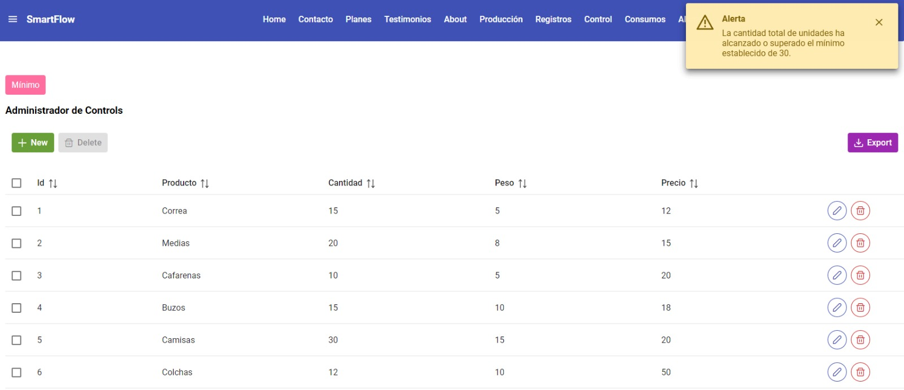 

* Consumos:
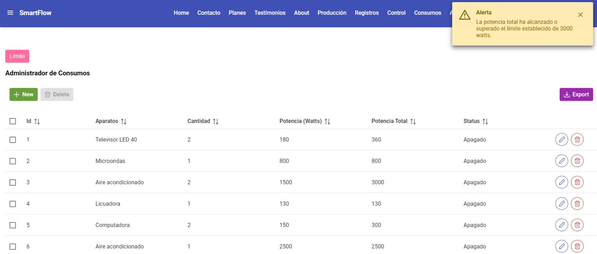 

* Back-end:
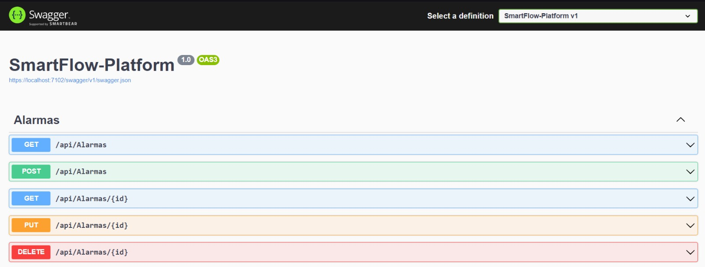 

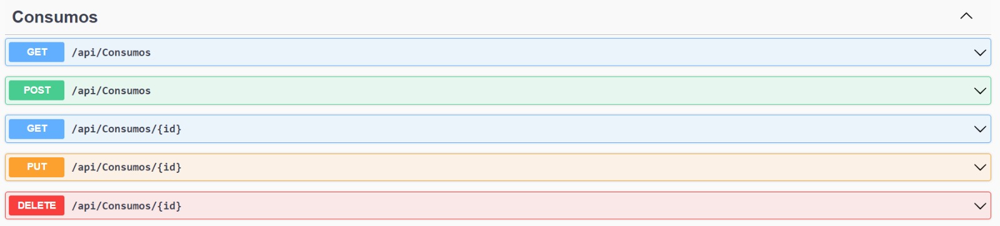 

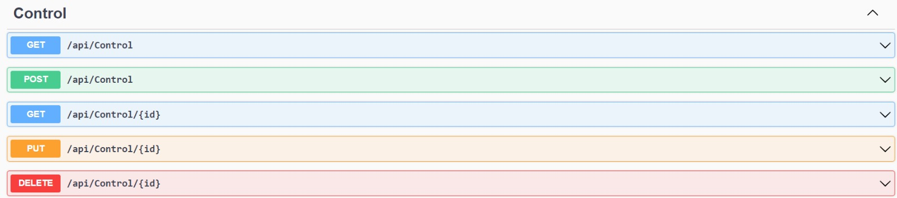 

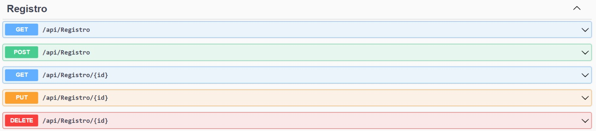 

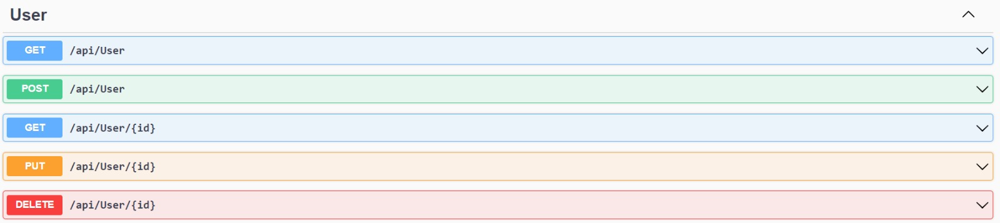 

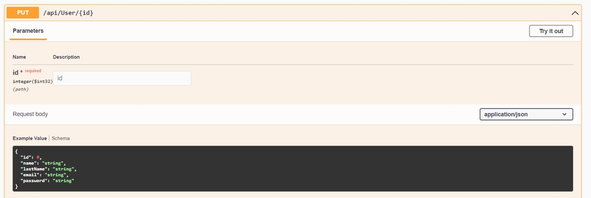 

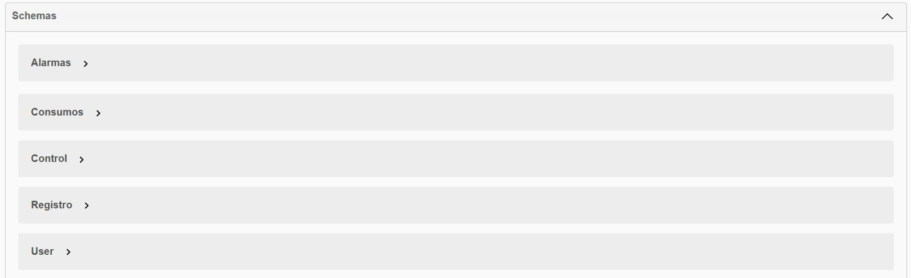 

<h5> 5.2.3.6.Services Documentation Evidence for Sprint Review.</h5>

En el sprint 3, se planificó concentrarse exclusivamente en el backend y, en parte, en mejorar la aplicación web. Esto incluyó conectar la base de datos con el backend y el frontend. Inicialmente, el trabajo se realizó de manera local y, posteriormente, se implementó en un host, que ahora está integrado en la aplicación web frontend desplegada. A continuación, se ofrece el enlace para acceder: 

<table style="border-collapse:collapse;border-spacing:0" class="tg"><thead><tr><th style="border-color:inherit;border-style:solid;border-width:1px;font-family:Arial, sans-serif;font-size:14px;font-weight:normal;overflow:hidden;padding:10px 5px;text-align:left;vertical-align:top;word-break:normal" colspan="2">Endpoint </th><th style="border-color:inherit;border-style:solid;border-width:1px;font-family:Arial, sans-serif;font-size:14px;font-weight:normal;overflow:hidden;padding:10px 5px;text-align:left;vertical-align:top;word-break:normal" colspan="4">Details</th></tr></thead>
<tbody><tr><td style="border-color:inherit;border-style:solid;border-width:1px;font-family:Arial, sans-serif;font-size:14px;overflow:hidden;padding:10px 5px;text-align:left;vertical-align:top;word-break:normal" colspan="2">Alarmas</td><td style="border-color:inherit;border-style:solid;border-width:1px;font-family:Arial, sans-serif;font-size:14px;overflow:hidden;padding:10px 5px;text-align:left;vertical-align:top;word-break:normal" colspan="4">Guardar la información de las alarmas como tipo, valor, umbral, fecha.</td></tr>
<tr><td style="border-color:black;border-style:solid;border-width:1px;font-family:Arial, sans-serif;font-size:14px;overflow:hidden;padding:10px 5px;text-align:left;vertical-align:top;word-break:normal" colspan="2">Consumos</td><td style="border-color:black;border-style:solid;border-width:1px;font-family:Arial, sans-serif;font-size:14px;overflow:hidden;padding:10px 5px;text-align:left;vertical-align:top;word-break:normal" colspan="4">Guardar la información para aparato, cantidad, watts.</td></tr>
<tr><td style="border-color:black;border-style:solid;border-width:1px;font-family:Arial, sans-serif;font-size:14px;overflow:hidden;padding:10px 5px;text-align:left;vertical-align:top;word-break:normal" colspan="2">Control</td><td style="border-color:black;border-style:solid;border-width:1px;font-family:Arial, sans-serif;font-size:14px;overflow:hidden;padding:10px 5px;text-align:left;vertical-align:top;word-break:normal" colspan="4">Guardar la información para producto, cantidad, peso ,precio.</td></tr>
<tr><td style="border-color:black;border-style:solid;border-width:1px;font-family:Arial, sans-serif;font-size:14px;overflow:hidden;padding:10px 5px;text-align:left;vertical-align:top;word-break:normal" colspan="2">Registros</td><td style="border-color:black;border-style:solid;border-width:1px;font-family:Arial, sans-serif;font-size:14px;overflow:hidden;padding:10px 5px;text-align:left;vertical-align:top;word-break:normal" colspan="4">Guardar la información para titulo, descripción, estado.</td></tr>
<tr><td style="border-color:black;border-style:solid;border-width:1px;font-family:Arial, sans-serif;font-size:14px;overflow:hidden;padding:10px 5px;text-align:left;vertical-align:top;word-break:normal" colspan="2">User</td><td style="border-color:black;border-style:solid;border-width:1px;font-family:Arial, sans-serif;font-size:14px;overflow:hidden;padding:10px 5px;text-align:left;vertical-align:top;word-break:normal" colspan="4">Guardar la información para nombre, correo, contraseña.</td></tr>
<tr><td style="border-color:inherit;border-style:solid;border-width:1px;font-family:Arial, sans-serif;font-size:14px;overflow:hidden;padding:10px 5px;text-align:left;vertical-align:top;word-break:normal">Repository</td><td style="border-color:inherit;border-style:solid;border-width:1px;font-family:Arial, sans-serif;font-size:14px;overflow:hidden;padding:10px 5px;text-align:left;vertical-align:top;word-break:normal">Branch</td><td style="border-color:inherit;border-style:solid;border-width:1px;font-family:Arial, sans-serif;font-size:14px;overflow:hidden;padding:10px 5px;text-align:left;vertical-align:top;word-break:normal">Commit Id</td><td style="border-color:inherit;border-style:solid;border-width:1px;font-family:Arial, sans-serif;font-size:14px;overflow:hidden;padding:10px 5px;text-align:left;vertical-align:top;word-break:normal">Commit message</td>
<td style="border-color:inherit;border-style:solid;border-width:1px;font-family:Arial, sans-serif;font-size:14px;overflow:hidden;padding:10px 5px;text-align:left;vertical-align:top;word-break:normal">Commit message body</td><td style="border-color:inherit;border-style:solid;border-width:1px;font-family:Arial, sans-serif;font-size:14px;overflow:hidden;padding:10px 5px;text-align:left;vertical-align:top;word-break:normal">Commited on (Date)</td></tr>
<tr><td style="border-color:inherit;border-style:solid;border-width:1px;font-family:Arial, sans-serif;font-size:14px;overflow:hidden;padding:10px 5px;text-align:left;vertical-align:top;word-break:normal" rowspan="5">https://github.com/SmartFlow-UPC/SmartFlow-platform</td><td style="border-color:inherit;border-style:solid;border-width:1px;font-family:Arial, sans-serif;font-size:14px;overflow:hidden;padding:10px 5px;text-align:left;vertical-align:top;word-break:normal">feature-alarmas</td><td style="border-color:inherit;border-style:solid;border-width:1px;font-family:Arial, sans-serif;font-size:14px;overflow:hidden;padding:10px 5px;text-align:left;vertical-align:top;word-break:normal">e46f660</td><td style="border-color:inherit;border-style:solid;border-width:1px;font-family:Arial, sans-serif;font-size:14px;overflow:hidden;padding:10px 5px;text-align:left;vertical-align:top;word-break:normal">commit alarmas</td>
<td style="border-color:inherit;border-style:solid;border-width:1px;font-family:Arial, sans-serif;font-size:14px;overflow:hidden;padding:10px 5px;text-align:left;vertical-align:top;word-break:normal">commit alarmas</td><td style="border-color:inherit;border-style:solid;border-width:1px;font-family:Arial, sans-serif;font-size:14px;overflow:hidden;padding:10px 5px;text-align:left;vertical-align:top;word-break:normal">01/11/224</td></tr>
<tr><td style="border-color:inherit;border-style:solid;border-width:1px;font-family:Arial, sans-serif;font-size:14px;overflow:hidden;padding:10px 5px;text-align:left;vertical-align:top;word-break:normal">feature-control</td><td style="border-color:inherit;border-style:solid;border-width:1px;font-family:Arial, sans-serif;font-size:14px;overflow:hidden;padding:10px 5px;text-align:left;vertical-align:top;word-break:normal">47039f1</td><td style="border-color:inherit;border-style:solid;border-width:1px;font-family:Arial, sans-serif;font-size:14px;overflow:hidden;padding:10px 5px;text-align:left;vertical-align:top;word-break:normal">commit control</td><td style="border-color:inherit;border-style:solid;border-width:1px;font-family:Arial, sans-serif;font-size:14px;overflow:hidden;padding:10px 5px;text-align:left;vertical-align:top;word-break:normal">commit control</td>
<td style="border-color:inherit;border-style:solid;border-width:1px;font-family:Arial, sans-serif;font-size:14px;overflow:hidden;padding:10px 5px;text-align:left;vertical-align:top;word-break:normal">01/11/224</td></tr>
<tr><td style="border-color:inherit;border-style:solid;border-width:1px;font-family:Arial, sans-serif;font-size:14px;overflow:hidden;padding:10px 5px;text-align:left;vertical-align:top;word-break:normal">feature-registro</td><td style="border-color:inherit;border-style:solid;border-width:1px;font-family:Arial, sans-serif;font-size:14px;overflow:hidden;padding:10px 5px;text-align:left;vertical-align:top;word-break:normal">60cddce</td><td style="border-color:inherit;border-style:solid;border-width:1px;font-family:Arial, sans-serif;font-size:14px;overflow:hidden;padding:10px 5px;text-align:left;vertical-align:top;word-break:normal">commit registro</td><td style="border-color:inherit;border-style:solid;border-width:1px;font-family:Arial, sans-serif;font-size:14px;overflow:hidden;padding:10px 5px;text-align:left;vertical-align:top;word-break:normal">commit registro</td>
<td style="border-color:inherit;border-style:solid;border-width:1px;font-family:Arial, sans-serif;font-size:14px;overflow:hidden;padding:10px 5px;text-align:left;vertical-align:top;word-break:normal">01/11/224</td></tr>
<tr><td style="border-color:inherit;border-style:solid;border-width:1px;font-family:Arial, sans-serif;font-size:14px;overflow:hidden;padding:10px 5px;text-align:left;vertical-align:top;word-break:normal">feature-extras</td><td style="border-color:inherit;border-style:solid;border-width:1px;font-family:Arial, sans-serif;font-size:14px;overflow:hidden;padding:10px 5px;text-align:left;vertical-align:top;word-break:normal">08eb1df</td><td style="border-color:inherit;border-style:solid;border-width:1px;font-family:Arial, sans-serif;font-size:14px;overflow:hidden;padding:10px 5px;text-align:left;vertical-align:top;word-break:normal">commit extras</td><td style="border-color:inherit;border-style:solid;border-width:1px;font-family:Arial, sans-serif;font-size:14px;overflow:hidden;padding:10px 5px;text-align:left;vertical-align:top;word-break:normal">commit extras</td>
<td style="border-color:inherit;border-style:solid;border-width:1px;font-family:Arial, sans-serif;font-size:14px;overflow:hidden;padding:10px 5px;text-align:left;vertical-align:top;word-break:normal">01/11/224</td></tr>
<tr><td style="border-color:inherit;border-style:solid;border-width:1px;font-family:Arial, sans-serif;font-size:14px;overflow:hidden;padding:10px 5px;text-align:left;vertical-align:top;word-break:normal">main</td><td style="border-color:inherit;border-style:solid;border-width:1px;font-family:Arial, sans-serif;font-size:14px;overflow:hidden;padding:10px 5px;text-align:left;vertical-align:top;word-break:normal">56f0bde</td><td style="border-color:inherit;border-style:solid;border-width:1px;font-family:Arial, sans-serif;font-size:14px;overflow:hidden;padding:10px 5px;text-align:left;vertical-align:top;word-break:normal">Merge pull request #3 from SmartFlow-UPC/feature-extras</td><td style="border-color:inherit;border-style:solid;border-width:1px;font-family:Arial, sans-serif;font-size:14px;overflow:hidden;padding:10px 5px;text-align:left;vertical-align:top;word-break:normal">Merge pull request #3 from SmartFlow-UPC/feature-extras</td>
<td style="border-color:inherit;border-style:solid;border-width:1px;font-family:Arial, sans-serif;font-size:14px;overflow:hidden;padding:10px 5px;text-align:left;vertical-align:top;word-break:normal">01/11/224</td></tr>
</tbody></table>

<h5> 5.2.3.7.Software Deployment Evidence for Sprint Review.</h5>

En la entrega del tercer sprint, se implementó una aplicación web completamente funcional, cumpliendo con las user stories correspondientes a este entregable. Además, se lanzó una versión parcial del backend.

Web Application:
 

Back-end:
 

<h5> 5.2.3.8.Team Collaboration Insights during Sprint.</h5>

| Alumno                            | Actividad                                                                                                         |
|-----------------------------------|-------------------------------------------------------------------------------------------------------------------|
|Giussepe Taquiri                   | Sprint Backlog 3  Execution Evidence for Sprint Review  Registro de Entrevistas                                   |
| Roy Hernan                        | Sprint Planning 3  Development Evidence for Sprint Review  Team Collaboration Insights during Sprint.             |
| Jhon Guerrero                     | Sprint Backlog 3  Services Documentation Evidence for Sprint Review  Evaluaciones según heurísticas               |
| Silva Tirado  Sebastian Valentino | Development Evidence for Sprint Review  Software Deployment Evidence for Sprint Review.  Video About the Product. |
| Williams Góngora                  | Sprint Planning 3  Testing Suite Evidence for Sprint Review  Diseño de Entrevistas                                |

<h4> 5.2.4. Sprint #4.</h4>

<h5> 5.2.4.1. Sprint Planning 4.</h5>

<table style="border-collapse:collapse;border-spacing:0" class="tg"><thead>
<tr><th style="border-color:black;border-style:solid;border-width:1px;font-family:Arial, sans-serif;font-size:14px;font-weight:normal;overflow:hidden;padding:10px 5px;text-align:left;vertical-align:top;word-break:normal">Sprint #</th><th style="border-color:black;border-style:solid;border-width:1px;font-family:Arial, sans-serif;font-size:14px;font-weight:normal;overflow:hidden;padding:10px 5px;text-align:left;vertical-align:top;word-break:normal">Date</th><th style="border-color:black;border-style:solid;border-width:1px;font-family:Arial, sans-serif;font-size:14px;font-weight:normal;overflow:hidden;padding:10px 5px;text-align:left;vertical-align:top;word-break:normal">Time</th>
<th style="border-color:black;border-style:solid;border-width:1px;font-family:Arial, sans-serif;font-size:14px;font-weight:normal;overflow:hidden;padding:10px 5px;text-align:left;vertical-align:top;word-break:normal">Location</th><th style="border-color:black;border-style:solid;border-width:1px;font-family:Arial, sans-serif;font-size:14px;font-weight:normal;overflow:hidden;padding:10px 5px;text-align:left;vertical-align:top;word-break:normal">Prepared By</th><th style="border-color:black;border-style:solid;border-width:1px;font-family:Arial, sans-serif;font-size:14px;font-weight:normal;overflow:hidden;padding:10px 5px;text-align:left;vertical-align:top;word-break:normal">Attendees</th></tr>
</thead>
<tbody>
<tr><td style="border-color:black;border-style:solid;border-width:1px;font-family:Arial, sans-serif;font-size:14px;overflow:hidden;padding:10px 5px;text-align:left;vertical-align:top;word-break:normal">4</td><td style="border-color:black;border-style:solid;border-width:1px;font-family:Arial, sans-serif;font-size:14px;overflow:hidden;padding:10px 5px;text-align:left;vertical-align:top;word-break:normal">13/11/2024</td><td style="border-color:black;border-style:solid;border-width:1px;font-family:Arial, sans-serif;font-size:14px;overflow:hidden;padding:10px 5px;text-align:left;vertical-align:top;word-break:normal">12:00 p.m.</td><td style="border-color:black;border-style:solid;border-width:1px;font-family:Arial, sans-serif;font-size:14px;overflow:hidden;padding:10px 5px;text-align:left;vertical-align:top;word-break:normal">Coordinación por WhatsApp</td>
<td style="border-color:black;border-style:solid;border-width:1px;font-family:Arial, sans-serif;font-size:14px;overflow:hidden;padding:10px 5px;text-align:left;vertical-align:top;word-break:normal">Sebastian Silva</td><td style="border-color:black;border-style:solid;border-width:1px;font-family:Arial, sans-serif;font-size:14px;overflow:hidden;padding:10px 5px;text-align:left;vertical-align:top;word-break:normal">Gongora Castillejos, Williams Jesus Taquir Calderon , Jhunior Giussepe De La Cruz Moreno, Roy Hernan Silva Tirado, Sebastian Valentino Guerrero Vasquez, Jhon Dann</td></tr>
<tr><td style="border-color:black;border-style:solid;border-width:1px;font-family:Arial, sans-serif;font-size:14px;overflow:hidden;padding:10px 5px;text-align:left;vertical-align:top;word-break:normal" colspan="4">Sprint 4 Goal</td><td style="border-color:black;border-style:solid;border-width:1px;font-family:Arial, sans-serif;font-size:14px;overflow:hidden;padding:10px 5px;text-align:left;vertical-align:top;word-break:normal">Sprint 4 Velocity    </td><td style="border-color:black;border-style:solid;border-width:1px;font-family:Arial, sans-serif;font-size:14px;overflow:hidden;padding:10px 5px;text-align:left;vertical-align:top;word-break:normal">Sum of Story Points   </td></tr>
<tr><td style="border-color:black;border-style:solid;border-width:1px;font-family:Arial, sans-serif;font-size:14px;overflow:hidden;padding:10px 5px;text-align:left;vertical-align:top;word-break:normal" colspan="4">Finalización del back-end.</td><td style="border-color:black;border-style:solid;border-width:1px;font-family:Arial, sans-serif;font-size:14px;overflow:hidden;padding:10px 5px;text-align:left;vertical-align:top;word-break:normal">35</td><td style="border-color:black;border-style:solid;border-width:1px;font-family:Arial, sans-serif;font-size:14px;overflow:hidden;padding:10px 5px;text-align:left;vertical-align:top;word-break:normal">35</td></tr></tbody></table>

<h5> 5.2.4.2.Sprint Backlog 4.</h5>

Link del trello: https://trello.com/invite/b/673bf92a011e6ba27a9c49cc/ATTIbcca0a56f0cd4613fae82a6d25436edc29B2F0FD/spring-backlog-4
<td>   </td>

En el cuarto sprint backlog, el equipo persistió avanzando con este último sprint finalizando el back end y conexión con el front end. Para asegurar la distribución de los user stories, se empleó un sprint board. A continuación la distribución.

|     # Sprint      | Sprint 4                                                         |                |                                                                 |                                                                                                                                                                                                                                                                          |                           |                            |                                                    |
|-------------------|------------------------------------------------------------------|----------------|-----------------------------------------------------------------|--------------------------------------------------------------------------------------------------------------------------------------------------------------------------------------------------------------------------------------------------------------------------|---------------------------|----------------------------|----------------------------------------------------|
|     User Story    |                                                                  | Work Item/Task |                                                                 |                                                                                                                                                                                                                                                                          |                           |                            |                                                    |
|     Id            |     Title                                                        |     Id         |     Title                                                       |     Descripción                                                                                                                                                                                                                                                          |     Estimación (Hours)    |     Assigned to            |     Status (In   -process / To - review / Done)    |
| US002             | Monitorear  consumo en tiempo  real                              | EP001          | Monitorear el consumo en tiempo real                            | Como operador de maquina, quiero ver el consumo en tiempo real de la  maquina que estoy operando                                                                                                                                                                         | 5                         |     Sebastian Silva        |     Done                                           |
| US003             | Visualizar graficos  comparativos                                | EP001          | Visualizar graficos comparativos                                | Como director financiero, quiero ver  graficos comparativos de consumo  vs produccion                                                                                                                                                                                    | 5                         | Williams Góngora           |     Done                                           |
| US004             | Filtrar datos de  consumo                                        | EP001          | Filtrara datos de consumo                                       | Como analista, quiero poder filtrar los datos de consumo de fecha,  maquina y tipo de recurso                                                                                                                                                                            | 3                         |     Sebastian Silva        |     Done                                           |
| US007             | Calcular costo por unidad producida                              | EP002          | Calcular costo por unidad producida                             | Como analista financiero, quiero calcular el costo de recursos por unidad producida                                                                                                                                                                                      | 3                         | Jhon Guerrero              |     Done                                           |
| US008             | Proyectar costos futuros                                         | EP002          | Proyectar costos futuros                                        | Como director financiero, quiero proyectar los costos futuros basados en tendencias actuales                                                                                                                                                                             | 5                         | Roy Hernan                 |     Done                                           |
| US009             | Comparar costos entre periodos                                   | EP002          | Comparar costos entre periodos                                  | Como gerente financiero, quiero comparar los costos entre diferentes periodos                                                                                                                                                                                            | 5                         |  Giussepe Taquiri          |     Done                                           |
| US013             | Gestionar notificaciones                                         | EP003          | Gestionar notificaciones                                        | Como usuario, quiero poder gestionar mis preferencias de notificacion para las alertas                                                                                                                                                                                   | 5                         | Sebastian Silva            | Done                                               |
| US015             | Responder a alertas                                              | EP003          | Responder a alertas                                             | Como tecnico, quiero poder responder a las alertas y marcarlas como atendidas                                                                                                                                                                                            | 5                         | Williams Gongora           | Done                                               |
| US016             | Registrar turnos de trabajo                                      | EP004          | Registrar turnos de trabajo                                     | Como supervisor, quiero poder registrar los turnos de trabajo de cada empleado                                                                                                                                                                                           | 3                         | Sebastian Silva            | Done                                               |
| US017             | Ver resumen de consumo por turno                                 | EP004          | Ver resumen de consumo por tuno                                 | Como gerente de produccion, quiero ver en resumen del consumo de recursos por turno y por empleado                                                                                                                                                                       | 3                         | Jhon Guerrero              | Done                                               |
| US019             | Comparar eficiencia entre turnos                                 | EP004          | Comparar eficiencia entre turnos                                | Como analista de recursos humanos, quiero comparar el consumo de  recursos entre diferentes turnos y  empleados                                                                                                                                                          | 5                         | Roy Hernan                 | Done                                               |
| US020             | Planificar turnos basados en  eficiencia                         | EP004          | Planificar turnos basados en eficiencia                         | Como jefe de produccion, quiero planificar los turnos basandome en la eficiencia historica                                                                                                                                                                               | 5                         | Giussepe Taquiri           | Done                                               |
| US021             | Implementacion seccion de contacto con el usuario                | EP005          | Implementacion seccion de contacto con el usuario               | Como visitante interesado, quiero poder llenar el formulario de contacto para recibir mas informacion sobre el producto                                                                                                                                                  | 5                         | Sebastian Siva             | Done                                               |
| US022             | Ver testimonios de clientes                                      | EP005          | Ver testimonio de clientes                                      | Como visitante, quiero ver testimonio de otros clientes para evaluar la efectividad del producto antes de tomar una decision                                                                                                                                             | 5                         | Williams Gongora           | Done                                               |
| US023             | Ver caracteristicas y beneficios del  producto                   | EP005          | Ver caracteristicas y beneficios del producto                   | Como usuario potencial, quiero poder visualizar tanto las caracteristicas como los beneficios de la plataforma en una sola pagina, para comprender de que manera las  funcionalidades pueden mejorar mi negocio y reducir costos                                         | 3                         | Sebastian Silva            | Done                                               |
| US024             | Ver diferentes planes de precios                                 | EP005          | Ver diferentes planes de precios                                | Como usuario, quiero ver una comparacion clara de los diferentes planes de precios disponibles para  seleccionar el que mejor se ajuste a  mis necesidades                                                                                                               | 3                         | Jhon Guerrero              | Done                                               |
| US025             | Animaciones interactivas para una Navegacion  fluida y atractiva | EP005          | Animaciones interactivas para una Navegacion fluida y atractiva | Como usuario que navega en el sitio web de SmartFlow, quiero  experimentar animaciones fluidas e interactivas, para que la navegacion sea atractiva visualmente y facil de  usar, mejorando asi mi experiencia al explorar las caracteristicas y beneficios del producto | 5                         | Roy Hernan                 | Done                                               |
| US026             | Acceder al dashboard despues de iniciar sesion                   | EP005          | Acceder al  dashboard despues de iniciar sesion                 | Como usuario autenticado, quiero acceder a mi dashboard personalizado despues de iniciar sesion para ver y gestionar mis datos de manera centralizada                                                                                                                    | 5                         | Giussepe Taquiri           | Done                                               |
| US027             | Sugerir configuraciones optimas                                  | EP006          | Sugerir configuraciones optimas                                 | Como ingeniero de procesos, quiero recibir sugerencias de configuracion optimas para las maquinas basadas en datos de consumo                                                                                                                                            | 5                         | Sebastian Silva            | Done                                               |
| US028             | Simular escenarios de consumo                                    | EP006          | Simular escenarios de consumo                                   | Como gerente de operaciones, quiero simular diferentes escenarios de produccion y ver su impacto en el consumo de recursos                                                                                                                                               | 5                         | Williams Gongora           | Done                                               |
| US029             | Generar informes de eficiencia                                   | EP006          | Generar informes de eficiencia                                  | Como director de operaciones, quiero generar informes de eficiencia en el uso de recursos                                                                                                                                                                                | 3                         | Jhon Guerrero              | Done                                               |
| US031             | Integrar con ERP                                                 | EP007          | Integrar con ERP                                                | Como gerente de IT, quiero integrar el sistema de monitoreo de recursos con nuestro ERP                                                                                                                                                                                  | 3                         | Roy Hernan                 | Done                                               |
| US032             | Conectar nuevos dispositivos loT                                 | EP007          | Conectar nuevos dispositivos loT                                | Como tecnico de mantenimiento, quiero poder conectar nuevos dispositivos loT al sistema de monitoreo                                                                                                                                                                     | 5                         | Giussepe Taquiri           | Done                                               |
| US033             | Exportar datos a BI                                              | EP007          | Exportar datos a BI                                             | Como analista de datos, quiero poder exportar datos de consumo a nuestra herramienta BI                                                                                                                                                                                  | 5                         | Jhon Guerrero              | Done                                               |
| US034             | Acceder a API para desarrolladores                               | EP007          | Acceder a API para desarrolladores                              | Como desarrollador externo, quiero acceder a una API para integrar datos de consumo en aplicaciones de terceros                                                                                                                                                          | 5                         | Giussepe Taquiri           | Done                                               |
| US035             | Sincronizar con sistema CMMS                                     | EP007          | Sincronizar con sistema CMMS                                    | Como jefe de mantenimiento, quiero sincronizar los datos de consumo y alertas con nuestro sistema CMMS                                                                                                                                                                   | 5                         | Sebastian Silva            | Done                                               |

<h5> 5.2.4.3.Development Evidence for Sprint Review.</h5>

<h6>Repositorio: <a href="https://github.com/SmartFlow-UPC/SmartFlow-platform" target="_blank" rel="noopener noreferrer">SmartFlow-UPC/SmartFlow-platform</a></h6>
<table style="border-collapse:collapse;border-spacing:0" class="tg">
  <thead>
    <tr>
     <th style="border: 1px solid black; font-family: Arial, sans-serif; font-size: 14px; padding: 10px 5px; text-align: left;">Repository</th>
      <th style="border: 1px solid black; font-family: Arial, sans-serif; font-size: 14px; padding: 10px 5px; text-align: left;">Branch</th>
      <th style="border: 1px solid black; font-family: Arial, sans-serif; font-size: 14px; padding: 10px 5px; text-align: left;">Commit ID</th>
      <th style="border: 1px solid black; font-family: Arial, sans-serif; font-size: 14px; padding: 10px 5px; text-align: left;">Commit Message</th>
      <th style="border: 1px solid black; font-family: Arial, sans-serif; font-size: 14px; padding: 10px 5px; text-align: left;">Commit Message Body</th>
      <th style="border: 1px solid black; font-family: Arial, sans-serif; font-size: 14px; padding: 10px 5px; text-align: left;">Committed on (Date)</th>
    </tr>
  </thead>
  <tbody>
    <tr>
      <td style="border: 1px solid black; font-family: Arial, sans-serif; font-size: 14px; padding: 10px 5px;" rowspan="12"><a href="https://github.com/SmartFlow-UPC/SmartFlow-platform" target="_blank" rel="noopener noreferrer">https://github.com/SmartFlow-UPC/SmartFlow-platform</a></td>
      <td style="border: 1px solid black; font-family: Arial, sans-serif; font-size: 14px; padding: 10px 5px;">main</td>
      <td style="border: 1px solid black; font-family: Arial, sans-serif; font-size: 14px; padding: 10px 5px;">295063a</td>
      <td style="border: 1px solid black; font-family: Arial, sans-serif; font-size: 14px; padding: 10px 5px;">Merge branch 'main' into feature-control</td>
      <td style="border: 1px solid black; font-family: Arial, sans-serif; font-size: 14px; padding: 10px 5px;">Merged main branch into feature-control to align recent changes</td>
      <td style="border: 1px solid black; font-family: Arial, sans-serif; font-size: 14px; padding: 10px 5px;">28/10/2024</td>
    </tr>
    <tr>
      <td style="border: 1px solid black; font-family: Arial, sans-serif; font-size: 14px; padding: 10px 5px;">revisión-consumo</td>
      <td style="border: 1px solid black; font-family: Arial, sans-serif; font-size: 14px; padding: 10px 5px;">c69a4a8</td>
      <td style="border: 1px solid black; font-family: Arial, sans-serif; font-size: 14px; padding: 10px 5px;">commit consumos</td>
      <td style="border: 1px solid black; font-family: Arial, sans-serif; font-size: 14px; padding: 10px 5px;">Improved data consumption tracking</td>
      <td style="border: 1px solid black; font-family: Arial, sans-serif; font-size: 14px; padding: 10px 5px;">18/11/2024</td>
    </tr>
    <tr> <td style="border: 1px solid black; font-family: Arial, sans-serif; font-size: 14px; padding: 10px 5px;">hotfix-alarmas</td>
      <td style="border: 1px solid black; font-family: Arial, sans-serif; font-size: 14px; padding: 10px 5px;">de024f1</td>
      <td style="border: 1px solid black; font-family: Arial, sans-serif; font-size: 14px; padding: 10px 5px;">commit Alarmasv2</td>
      <td style="border: 1px solid black; font-family: Arial, sans-serif; font-size: 14px; padding: 10px 5px;">Updated alarms module</td>
      <td style="border: 1px solid black; font-family: Arial, sans-serif; font-size: 14px; padding: 10px 5px;">18/11/2024</td>
    </tr>
    <tr> <td style="border: 1px solid black; font-family: Arial, sans-serif; font-size: 14px; padding: 10px 5px;">hotfix-registros</td>
      <td style="border: 1px solid black; font-family: Arial, sans-serif; font-size: 14px; padding: 10px 5px;">ff9d417</td>
      <td style="border: 1px solid black; font-family: Arial, sans-serif; font-size: 14px; padding: 10px 5px;">commit RegistrosV2</td>
      <td style="border: 1px solid black; font-family: Arial, sans-serif; font-size: 14px; padding: 10px 5px;">Enhanced registration workflows</td>
      <td style="border: 1px solid black; font-family: Arial, sans-serif; font-size: 14px; padding: 10px 5px;">18/11/2024</td>
    </tr>
    <tr>
      <td style="border: 1px solid black; font-family: Arial, sans-serif; font-size: 14px; padding: 10px 5px;">control de revisión</td>
      <td style="border: 1px solid black; font-family: Arial, sans-serif; font-size: 14px; padding: 10px 5px;">ecffabc</td>
      <td style="border: 1px solid black; font-family: Arial, sans-serif; font-size: 14px; padding: 10px 5px;">commit Controlv2</td>
      <td style="border: 1px solid black; font-family: Arial, sans-serif; font-size: 14px; padding: 10px 5px;">Refined control functions</td>
      <td style="border: 1px solid black; font-family: Arial, sans-serif; font-size: 14px; padding: 10px 5px;">18/11/2024</td>
    </tr>
    <tr> <td style="border: 1px solid black; font-family: Arial, sans-serif; font-size: 14px; padding: 10px 5px;">develop2</td>
      <td style="border: 1px solid black; font-family: Arial, sans-serif; font-size: 14px; padding: 10px 5px;">bdc6394</td>
      <td style="border: 1px solid black; font-family: Arial, sans-serif; font-size: 14px; padding: 10px 5px;">Merge pull request #1 from feature-control</td>
      <td style="border: 1px solid black; font-family: Arial, sans-serif; font-size: 14px; padding: 10px 5px;">Integrated new control features</td>
      <td style="border: 1px solid black; font-family: Arial, sans-serif; font-size: 14px; padding: 10px 5px;">18/11/2024</td>
    </tr>
    <tr> <td style="border: 1px solid black; font-family: Arial, sans-serif; font-size: 14px; padding: 10px 5px;">develop2</td>
      <td style="border: 1px solid black; font-family: Arial, sans-serif; font-size: 14px; padding: 10px 5px;">0027f88</td>
      <td style="border: 1px solid black; font-family: Arial, sans-serif; font-size: 14px; padding: 10px 5px;">Merge pull request #2 from feature-registro</td>
      <td style="border: 1px solid black; font-family: Arial, sans-serif; font-size: 14px; padding: 10px 5px;">Incorporated user registration updates</td>
      <td style="border: 1px solid black; font-family: Arial, sans-serif; font-size: 14px; padding: 10px 5px;">18/11/2024</td>
    </tr>
    <tr> <td style="border: 1px solid black; font-family: Arial, sans-serif; font-size: 14px; padding: 10px 5px;">develop2</td>
      <td style="border: 1px solid black; font-family: Arial, sans-serif; font-size: 14px; padding: 10px 5px;">56f0bde</td>
      <td style="border: 1px solid black; font-family: Arial, sans-serif; font-size: 14px; padding: 10px 5px;">Merge pull request #3 from feature-extras</td>
      <td style="border: 1px solid black; font-family: Arial, sans-serif; font-size: 14px; padding: 10px 5px;">Added extra features for performance</td>
      <td style="border: 1px solid black; font-family: Arial, sans-serif; font-size: 14px; padding: 10px 5px;">01/11/2024</td>
    </tr>
    <tr> <td style="border: 1px solid black; font-family: Arial, sans-serif; font-size: 14px; padding: 10px 5px;">develop2</td>
      <td style="border: 1px solid black; font-family: Arial, sans-serif; font-size: 14px; padding: 10px 5px;">1e4d7f8</td>
      <td style="border: 1px solid black; font-family: Arial, sans-serif; font-size: 14px; padding: 10px 5px;">Merge pull request #5 from hotfix-alarmas</td>
      <td style="border: 1px solid black; font-family: Arial, sans-serif; font-size: 14px; padding: 10px 5px;">Fixed alarm issues</td>
      <td style="border: 1px solid black; font-family: Arial, sans-serif; font-size: 14px; padding: 10px 5px;">18/11/2024</td>
    </tr>
    <tr> <td style="border: 1px solid black; font-family: Arial, sans-serif; font-size: 14px; padding: 10px 5px;">main</td>  <td style="border: 1px solid black; font-family: Arial, sans-serif; font-size: 14px; padding: 10px 5px;">ef82015</td> <td style="border: 1px solid black; font-family: Arial, sans-serif; font-size: 14px; padding: 10px 5px;">Merge pull request #8 from develop2</td>  <td style="border: 1px solid black; font-family: Arial, sans-serif; font-size: 14px; padding: 10px 5px;">Finalized latest development changes</td>
      <td style="border: 1px solid black; font-family: Arial, sans-serif; font-size: 14px; padding: 10px 5px;">18/11/2024</td>
    </tr> </tbody> </table>

<h5> 5.2.4.4.Testing Suite Evidence for Sprint Review.</h5>

<table style="border-collapse:collapse;border-spacing:0" class="tg">
  <thead>
    <tr>
      <th style="border: 1px solid black; font-family: Arial, sans-serif; font-size: 14px; padding: 10px 5px; text-align: left;">Repository</th>
      <th style="border: 1px solid black; font-family: Arial, sans-serif; font-size: 14px; padding: 10px 5px; text-align: left;">Branch</th>
      <th style="border: 1px solid black; font-family: Arial, sans-serif; font-size: 14px; padding: 10px 5px; text-align: left;">Commit ID</th>
      <th style="border: 1px solid black; font-family: Arial, sans-serif; font-size: 14px; padding: 10px 5px; text-align: left;">Commit Message</th>
      <th style="border: 1px solid black; font-family: Arial, sans-serif; font-size: 14px; padding: 10px 5px; text-align: left;">Commit Message Body</th>
      <th style="border: 1px solid black; font-family: Arial, sans-serif; font-size: 14px; padding: 10px 5px; text-align: left;">Committed on (Date)</th>
    </tr>
  </thead>
  <tbody>
    <tr>
      <td style="border: 1px solid black; font-family: Arial, sans-serif; font-size: 14px; padding: 10px 5px;" rowspan="5"><a href="https://github.com/SmartFlow-UPC/SmartFlow-platform" target="_blank" rel="noopener noreferrer">https://github.com/SmartFlow-UPC/SmartFlow-platform</a></td>
      <td style="border: 1px solid black; font-family: Arial, sans-serif; font-size: 14px; padding: 10px 5px;">main</td>
      <td style="border: 1px solid black; font-family: Arial, sans-serif; font-size: 14px; padding: 10px 5px;">02cf82b</td>
      <td style="border: 1px solid black; font-family: Arial, sans-serif; font-size: 14px; padding: 10px 5px;">Merge pull request #5 from SmartFlow-UPC/feature-control</td>
      <td style="border: 1px solid black; font-family: Arial, sans-serif; font-size: 14px; padding: 10px 5px;">Merged feature-control branch into main to incorporate recent testing updates</td>
      <td style="border: 1px solid black; font-family: Arial, sans-serif; font-size: 14px; padding: 10px 5px;">29/10/2024</td>
    </tr>
    <tr>
      <td style="border: 1px solid black; font-family: Arial, sans-serif; font-size: 14px; padding: 10px 5px;">develop2</td>
      <td style="border: 1px solid black; font-family: Arial, sans-serif; font-size: 14px; padding: 10px 5px;">56f0bde</td>
      <td style="border: 1px solid black; font-family: Arial, sans-serif; font-size: 14px; padding: 10px 5px;">Merge pull request #3 from feature-extras</td>
      <td style="border: 1px solid black; font-family: Arial, sans-serif; font-size: 14px; padding: 10px 5px;">Added additional testing features for enhanced performance validation</td>
      <td style="border: 1px solid black; font-family: Arial, sans-serif; font-size: 14px; padding: 10px 5px;">01/11/2024</td>
    </tr>
    <tr>
      <td style="border: 1px solid black; font-family: Arial, sans-serif; font-size: 14px; padding: 10px 5px;">main</td>
      <td style="border: 1px solid black; font-family: Arial, sans-serif; font-size: 14px; padding: 10px 5px;">295063a</td>
      <td style="border: 1px solid black; font-family: Arial, sans-serif; font-size: 14px; padding: 10px 5px;">Merge branch 'main' into feature-control</td>
      <td style="border: 1px solid black; font-family: Arial, sans-serif; font-size: 14px; padding: 10px 5px;">Ensured alignment between main and feature-control branches for consistent testing</td>
      <td style="border: 1px solid black; font-family: Arial, sans-serif; font-size: 14px; padding: 10px 5px;">28/10/2024</td>
    </tr>
    <tr>
      <td style="border: 1px solid black; font-family: Arial, sans-serif; font-size: 14px; padding: 10px 5px;">hotfix-alarmas</td>
      <td style="border: 1px solid black; font-family: Arial, sans-serif; font-size: 14px; padding: 10px 5px;">de024f1</td>
      <td style="border: 1px solid black; font-family: Arial, sans-serif; font-size: 14px; padding: 10px 5px;">commit Alarmasv2</td>
      <td style="border: 1px solid black; font-family: Arial, sans-serif; font-size: 14px; padding: 10px 5px;">Updated alarms module to refine test scenarios</td>
      <td style="border: 1px solid black; font-family: Arial, sans-serif; font-size: 14px; padding: 10px 5px;">18/11/2024</td>
    </tr>
    <tr>
      <td style="border: 1px solid black; font-family: Arial, sans-serif; font-size: 14px; padding: 10px 5px;">develop2</td>
      <td style="border: 1px solid black; font-family: Arial, sans-serif; font-size: 14px; padding: 10px 5px;">ef82015</td>
      <td style="border: 1px solid black; font-family: Arial, sans-serif; font-size: 14px; padding: 10px 5px;">Merge pull request #8 from develop2</td>
      <td style="border: 1px solid black; font-family: Arial, sans-serif; font-size: 14px; padding: 10px 5px;">Completed final testing updates in the develop2 branch and merged to main</td>
      <td style="border: 1px solid black; font-family: Arial, sans-serif; font-size: 14px; padding: 10px 5px;">18/11/2024</td>
    </tr>
  </tbody>
</table>

<h5> 5.2.4.5.Execution Evidence for Sprint Review.</h5>

En este Sprint #4, hemos culminado el desarrollo del backend, estableciendo una conexión sólida con la base de datos y optimizando el rendimiento general de la aplicación. Con la integración completa de las secciones de consumo, control y producción, estamos preparados para realizar las últimas pruebas y ajustes antes de la entrega final del proyecto.

* Back-end:

<h5> 5.2.4.6.Services Documentation Evidence for Sprint Review.</h5>

En este Sprint #4, hemos finalizado la integración completa del backend con la aplicación web. Tras conectar la base de datos y optimizar el rendimiento, hemos desplegado la aplicación en un entorno de producción. Ahora se puede acceder a todas las funcionalidades de la aplicación.

<table><thead>
  <tr>
    <th colspan="2">Endpoint </th>
    <th colspan="4">Details</th>
  </tr></thead>
<tbody>
  <tr>
    <td colspan="2">Alarmas</td>
    <td colspan="4">Guardar la información de las alarmas como tipo, valor, umbral, fecha.</td>
  </tr>
  <tr>
    <td colspan="2">Consumos</td>
    <td colspan="4">Guardar la información para aparato, cantidad, watts.</td>
  </tr>
  <tr>
    <td colspan="2">Control</td>
    <td colspan="4">Guardar la información para producto, cantidad, peso ,precio.</td>
  </tr>
  <tr>
    <td colspan="2">Registros</td>
    <td colspan="4">Guardar la información para titulo, descripción, estado.</td>
  </tr>
  <tr>
    <td colspan="2">User</td>
    <td colspan="4">Guardar la información para nombre, correo, contraseña.</td>
  </tr>
  <tr>
    <td>Repository</td>
    <td>Branch</td>
    <td>Commit Id</td>
    <td>Commit message</td>
    <td>Commit message body</td>
    <td>Commited on (Date)</td>
  </tr>
  <tr>
    <td rowspan="13">                https://github.com/SmartFlow-UPC/SmartFlow-platform</td>
    <td>hotfix-alarmas</td>
    <td>de024f1</td>
    <td>commit Alarmasv2</td>
    <td>commit Alarmasv2</td>
    <td>18/11/2024</td>
  </tr>
  <tr>
    <td>hotfix-control</td>
    <td>ecffabc</td>
    <td>commit Controlv2</td>
    <td>commit Controlv2</td>
    <td>18/11/2024</td>
  </tr>
  <tr>
    <td>hotfix-registro</td>
    <td>ff9d417</td>
    <td>commit RegistrosV2</td>
    <td>commit RegistrosV2</td>
    <td>18/11/2024</td>
  </tr>
  <tr>
    <td>hotfix-consumos</td>
    <td>c99c912</td>
    <td>commit ConsumosV2</td>
    <td>commit ConsumosV2</td>
    <td>18/11/2024</td>
  </tr>
  <tr>
    <td>develop2</td>
    <td>bdc6394</td>
    <td>Merge pull request #1 from SmartFlow-UPC/feature-control</td>
    <td>Merge pull request #1 from SmartFlow-UPC/feature-control</td>
    <td>18/11/2024</td>
  </tr>
  <tr>
    <td>develop2</td>
    <td>0027f88</td>
    <td>Merge pull request #2 from SmartFlow-UPC/feature-registro</td>
    <td>Merge pull request #2 from SmartFlow-UPC/feature-registro</td>
    <td>18/11/2024</td>
  </tr>
  <tr>
    <td>develop2</td>
    <td>56f0bde</td>
    <td>Merge pull request #3 from SmartFlow-UPC/feature-extras</td>
    <td>Merge pull request #3 from SmartFlow-UPC/feature-extras</td>
    <td>18/11/2024</td>
  </tr>
  <tr>
    <td>develop2</td>
    <td>1e4d7f8</td>
    <td>Merge pull request #5 from SmartFlow-UPC/hotfix-alarmas</td>
    <td>Merge pull request #5 from SmartFlow-UPC/hotfix-alarmas</td>
    <td>18/11/2024</td>
  </tr>
  <tr>
    <td>develop2</td>
    <td>24e3f66</td>
    <td>commit errores</td>
    <td>commit errores</td>
    <td>18/11/2024</td>
  </tr>
  <tr>
    <td>develop2</td>
    <td>c69a4a8</td>
    <td>commit consumos</td>
    <td>commit errores</td>
    <td>18/11/2024</td>
  </tr>
  <tr>
    <td>develop2</td>
    <td>7d826ac</td>
    <td>Commit control</td>
    <td>Commit control</td>
    <td>18/11/2024</td>
  </tr>
  <tr>
    <td>develop2</td>
    <td>7722604</td>
    <td>commit Registro</td>
    <td>commit Registro</td>
    <td>18/11/2024</td>
  </tr>
  <tr>
    <td>main</td>
    <td>ef82015</td>
    <td>Merge pull request #8 from SmartFlow-UPC/develop2</td>
    <td>Merge pull request #8 from SmartFlow-UPC/develop2</td>
    <td>18/11/2024</td>
  </tr>
</tbody></table>

<h5> 5.2.4.7.Software Deployment Evidence for Sprint Review.</h5>

En la entrega del cuarto sprint, se finalizó el back end y conexión al front end, cumpliendo con las user stories correspondientes. ADemás de poder deployarlos. 

Back-end:

<h5> 5.2.4.8.Team Collaboration Insights during Sprint.</h5>

| Alumno | Actividad |
|-----------------------------------|---------------------------------------------------------------------------------------------------------------------|
| De La Cruz Moreno, Roy Hernan | Sprint Planning 4 - Development Evidence for Sprint Review - Team Collaboration Insights during Sprint.             |
| Góngora Castillejos, Williams Jesus | Sprint Planning 4 - Testing Suite Evidence for Sprint Review |
| Guerrero Vasquez, Jhon Danny | Sprint Backlog 4 - Services Documentation Evidence for Sprint Review |
| Silva Tirado, Sebastian Valentino | Development Evidence for Sprint Review - Software Deployment Evidence for Sprint Review. - Video About-the-Product. |
| Taquir Calderon , Jhunior Giussepe | Sprint Backlog 4 - Execution Evidence for Sprint Review |

<h3> 5.3. Validation Interviews.</h3>

En la sección "Validation Interviews" de nuestro proyecto, nos concentramos en mejorar la página web diseñada para los usuarios estén más comprometidos con su físico y salud. Esta fase esencial del proyecto involucra un diálogo activo con nuestros principales usuarios: dieta balancada y ejercicios. Mediante entrevistas estructuradas, buscamos captar sus opiniones y sugerencias. Esto asegura que la web no solo cumpla con los requisitos técnicos, sino que también se alinee con las dinámicas operativas y las expectativas del personal de planta. A continuación, se detallan los objetivos de usuario necesarios para realizar las entrevistas:

<h4> 5.3.1. Diseño de Entrevistas.</h4>

En esta sección se especifican los objetivos de usuario que guiarán nuestras entrevistas, los cuales son fundamentales para asegurar que la app de dietas y ejercicios responda a las necesidades reales de sus usuarios. A continuación, se presentan los user goals:

**User Goal: Iniciar sesión**  
**User persona:** Usuarios generales.  
**Explicación del flujo:** El usuario accederá a la aplicación e introducirá su correo electrónico y contraseña en el formulario de inicio de sesión. Si las credenciales son correctas, será redirigido al dashboard principal. Si no lo son, se le pedirá que reintroduzca los datos.

**User Goal: Navegar por el dashboard**  
**User persona:** Usuarios generales.  
**Explicación del flujo:** Después de iniciar sesión, el usuario llegará al dashboard, donde podrá acceder a diferentes secciones, como actividades físicas, plan de dieta, nutrición y su perfil personal.

**User Goal: Actividades**  
**User persona:** Usuarios interesados en fitness.  
**Explicación del flujo:** Desde el dashboard, el usuario seleccionará la opción "Actividades" para acceder a su plan de ejercicios personalizado. Podrá ver las rutinas, marcarlas como completadas y recibir recomendaciones según su progreso.

**User Goal: Dieta y nutrición**  
**User persona:** Usuarios interesados en mejorar su alimentación.  
**Explicación del flujo:** El usuario podrá acceder a la sección de "Dieta y Nutrición", donde encontrará su plan alimenticio personalizado. Además, podrá registrar sus comidas diarias, recibir alertas sobre sus hábitos alimenticios y hacer ajustes en base a sus necesidades nutricionales.

**User Goal: Mi perfil**  
**User persona:** Usuarios generales.  
**Explicación del flujo:** El usuario puede acceder a su perfil a través de la barra superior de la app. Allí, podrá ver y modificar su información personal, sus preferencias y ajustar las configuraciones de notificaciones y objetivos de salud.

<h4> 5.3.2. Registro de Entrevistas.</h4>

<table><thead>
  <tr>
    <th colspan="3">Segmento objetivo hogares: Monitoreo de agua y luz .
   </th>
  </tr></thead>
<tbody>
  <tr>
    <td colspan="3">    Entrevista 1:   </td>
  </tr>
  <tr>
    <td>&nbsp;&nbsp;&nbsp; Screenshot:&nbsp;&nbsp;&nbsp;</td>
    <td>    Datos personales del entrevistado   </td>
    <td>&nbsp;&nbsp;&nbsp; URL del&nbsp;&nbsp;&nbsp;video en OneDrive: &nbsp;&nbsp;&nbsp;</td>
  </tr>
  <tr>
	<td>  </td>
    <td>Entrevistado N°1: Rony Frank Colos Alarcon  Sexo: Masculino Edad: 19 Domicilio: Cieneguilla </td>
    <td>Link: <a href="https://drive.google.com/file/d/1tu1CtYfO2JTbbFmf9GPllq-ccyaH_PBs/view?usp=sharing" target="_blank" rel="noopener noreferrer">Entrevista #1</a></td>
  </tr>
  <tr>
    <td colspan="3">&nbsp;&nbsp;&nbsp; Resumen&nbsp;&nbsp;&nbsp;de la entrevista:&nbsp;&nbsp;&nbsp;</td>
  </tr>
  <tr>
    <td colspan="3">En una entrevista con el estudiante Rony Frank Colos Alarcón, nos comentó que no tiene observaciones importantes para mejorar la aplicación, salvo en el aspecto relacionado con la posibilidad de apagar dispositivos de manera remota. Aunque esta función podría ser útil en entornos personales, considera que no sería muy práctica en un entorno empresarial, ya que podría ocasionar daños si se apagan equipos de forma inesperada
  </tr>
  <tr>
    <td colspan="3">    Entrevista 2:    </td>
  </tr>
  <tr>
    <td>    Screenshot:   </td>
    <td>    Datos personales del entrevistado   </td>
    <td>    URL del   video en OneDrive:    </td>
  </tr>
  <tr>
    <td>   </td>
    <td>Entrevistado N°2: Estrella Ticona Sexo: Femenino Edad: 20 Domicilio: Rimac</td>
    <td>Link: <a href="https://upcedupe-my.sharepoint.com/:v:/g/personal/u20211g296_upc_edu_pe/EetHhN1mEgVJr8N3DmPcLn0BnCYK1kMQmRnpW3sou3N2dQ?e=sYqgsV&nav=eyJyZWZlcnJhbEluZm8iOnsicmVmZXJyYWxBcHAiOiJTdHJlYW1XZWJBcHAiLCJyZWZlcnJhbFZpZXciOiJTaGFyZURpYWxvZy1MaW5rIiwicmVmZXJyYWxBcHBQbGF0Zm9ybSI6IldlYiIsInJlZmVycmFsTW9kZSI6InZpZXcifX0%3D" target="_blank" rel="noopener noreferrer">Entrevista #2</a></td>
  </tr>
  <tr>
    <td colspan="3">    Resumen   de la entrevista:   </td>
  </tr>
  <tr>
    <td colspan="3">La joven Estrella le agradó como ha evolucionado la aplicación y con las nuevas funcionalidades implementadas, menciona que podría agregarse más estilos o mejorar las miosmas pestañas que ya está. </td>
  </tr>
  <tr>
    <td colspan="3">    Entrevista 3:    </td>
  </tr>
  <tr>
    <td>    Screenshot:   </td>
    <td>&nbsp;&nbsp;&nbsp; Datos&nbsp;&nbsp;&nbsp;personales del entrevistado&nbsp;&nbsp;&nbsp;</td>
    <td>    URL del   video en OneDrive:    </td>
  </tr>
  <tr>
    <td> 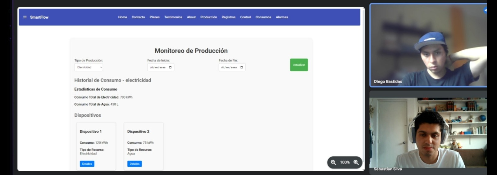 </td>
    <td>Entrevistado N°3: Diego Bastidas Sexo: Masculino Edad: 22 Domicilio: Comas </td>
    <td>Link: <a href="https://upcedupe-my.sharepoint.com/:v:/g/personal/u20211g296_upc_edu_pe/EYVfBXVsZSpBv65-mq2tu0oB5SQfymZWFaBPBybt5PHYcA?nav=eyJyZWZlcnJhbEluZm8iOnsicmVmZXJyYWxBcHAiOiJPbmVEcml2ZUZvckJ1c2luZXNzIiwicmVmZXJyYWxBcHBQbGF0Zm9ybSI6IldlYiIsInJlZmVycmFsTW9kZSI6InZpZXciLCJyZWZlcnJhbFZpZXciOiJNeUZpbGVzTGlua0NvcHkifX0&e=6R1b5P" target="_blank" rel="noopener noreferrer">Entrevista #3</a></td>
  </tr>
  <tr>
    <td colspan="3">    Resumen   de la entrevista:   </td>
  </tr>
  <tr>
    <td colspan="3">El joven Diego le interesó la página web por sus funcionalidades de control de luz y agua, al poder promediarlo y tener un recuento de las fechas establecidas, de poder colocar límites y en dado el caso se llegue a apgar si es que se excede y recomienda agregar uno para el agua ya que solo hay para luz hasta el momento.</td>
</tbody></table>

<table><thead>
  <tr>
    <th colspan="3">Segmento objetivo negocios: Monitoreo materiales, productividad.
</th>
  </tr></thead>
<tbody>
  <tr>
    <td colspan="3">    Entrevista 1:   </td>
  </tr>
  <tr>
    <td>&nbsp;&nbsp;&nbsp; Screenshot:&nbsp;&nbsp;&nbsp;</td>
    <td>    Datos personales del entrevistado   </td>
    <td>&nbsp;&nbsp;&nbsp; URL del&nbsp;&nbsp;&nbsp;video en OneDrive: &nbsp;&nbsp;&nbsp;</td>
  </tr>
  <tr>
    <td>  </td>
    <td>Entrevistado N°1: Anthoanet Osores Sexo: Femenino  Edad: 19 Domicilio: Lince </td>
    <td>Link: <a href= "https://upcedupe-my.sharepoint.com/:v:/g/personal/u20221c576_upc_edu_pe/EUlXwo9oOTdIl22btgPCtLMBszSvcWWvDqSm7AmpJ7Pm_Q?nav=eyJyZWZlcnJhbEluZm8iOnsicmVmZXJyYWxBcHAiOiJPbmVEcml2ZUZvckJ1c2luZXNzIiwicmVmZXJyYWxBcHBQbGF0Zm9ybSI6IldlYiIsInJlZmVycmFsTW9kZSI6InZpZXciLCJyZWZlcnJhbFZpZXciOiJNeUZpbGVzTGlua0NvcHkifX0&e=wWaR06" target="_blank" rel="noopener noreferrer">Entrevista #1</a></td>
  </tr>
  <tr>
    <td colspan="3">&nbsp;&nbsp;&nbsp; Resumen&nbsp;&nbsp;&nbsp;de la entrevista:&nbsp;&nbsp;&nbsp;</td>
  </tr>
  <tr>
    <td colspan="3">La señorita Anthoanet expresó su interés en la plataforma por sus opciones de control y monitoreo del uso de luz y agua. Le parece útil poder ver el historial de consumo y establecer fechas para revisar promedios, además de contar con límites que permitan gestionar el consumo de luz y aplicar apagados automáticos si se supera el límite. Recomienda que esta función de control también esté disponible para el agua, ya que actualmente se aplica solo al consumo de luz.</td>
  </tr>
  <tr>
    <td colspan="3">    Entrevista 2:    </td>
  </tr>
  <tr>
    <td>    Screenshot:   </td>
    <td>    Datos personales del entrevistado   </td>
    <td>    URL del   video en OneDrive:    </td>
  </tr>
  <tr>
    <td> </td>
    <td>Entrevistado N°2: Luis Espiritu Sexo: Masculino Edad: 27 Domicilio: Ate</td>
    <td>Link: <a href="https://upcedupe-my.sharepoint.com/:v:/g/personal/u20221c186_upc_edu_pe/EcLgtMcAJaxJvKueUQvXNmEBFdoOU_h35J2ueHNExa4eRQ?nav=eyJyZWZlcnJhbEluZm8iOnsicmVmZXJyYWxBcHAiOiJTdHJlYW1XZWJBcHAiLCJyZWZlcnJhbFZpZXciOiJTaGFyZURpYWxvZy1MaW5rIiwicmVmZXJyYWxBcHBQbGF0Zm9ybSI6IldlYiIsInJlZmVycmFsTW9kZSI6InZpZXcifX0%3D&e=zDyH7F" target="_blank" rel="noopener noreferrer">Entrevista #2</a></td>
  </tr>
  <tr>
    <td colspan="3">    Resumen   de la entrevista:   </td>
  </tr>
  <tr>
    <td colspan="3">Luis, un economista de 27 años, enfrenta el desafío de no poder controlar eficazmente el consumo y costo de sus recursos hídricos y eléctricos. Le resulta frustrante descubrir los ajustes en su presupuesto solo al recibir la factura al termino del mes. Por ello, desea una aplicación que le permita monitorear y gestionar su consumo en tiempo real. Además, considera esencial recibir alertas cuando el consumo exceda los límites establecidos, para poder actuar de manera preventiva y evitar sobrecostos inesperados.</td>
  </tr>
  <tr>
    <td colspan="3">    Entrevista 3:    </td>
  </tr>
  <tr>
    <td>    Screenshot:   </td>
    <td>&nbsp;&nbsp;&nbsp; Datos&nbsp;&nbsp;&nbsp;personales del entrevistado&nbsp;&nbsp;&nbsp;</td>
    <td>    URL del   video en OneDrive:    </td>
  </tr>
  <tr>
    <td> </td>
    <td>Entrevistado N°3: Sebastian Escobar Sexo:  Masculino Edad: 20 Domicilio: Santa Anita</td>
    <td>Link: <a href="https://upcedupe-my.sharepoint.com/:v:/g/personal/u20211g296_upc_edu_pe/ETwGMP5dnbFLilrDYOlHPk4BYFE2MYcn4d5hkpHQBPgUKA?nav=eyJyZWZlcnJhbEluZm8iOnsicmVmZXJyYWxBcHAiOiJPbmVEcml2ZUZvckJ1c2luZXNzIiwicmVmZXJyYWxBcHBQbGF0Zm9ybSI6IldlYiIsInJlZmVycmFsTW9kZSI6InZpZXciLCJyZWZlcnJhbFZpZXciOiJNeUZpbGVzTGlua0NvcHkifX0&e=AlrD7X" target="_blank" rel="noopener noreferrer">Entrevista #3</a></td>
  </tr>
  <tr>
    <td colspan="3">    Resumen   de la entrevista:   </td>
  </tr>
  <tr>
    <td colspan="3">El joven Sebastian le gustó la innovación un poco fuera de lo normal al poder ver los consumos de servicios y la producción al recibir una alerta cuando se llegue al mínimo establecido previamente. Recomienda actualizar con promedio de agua y un poco más de diseño.</td>
  </tr>
</tbody></table>

<h4> 5.3.3. Evaluaciones según heurísticas.</h4>

<h4>SITE o APP A EVALUAR:</h4>

SmartFlow

Objetivo: Verificar que la aplicación SmartFlow esté alineada con los objetivos estratégicos, proporcionando las herramientas y funcionalidades necesarias para optimizar la producción y el control de la energía. Esta evaluación permitirá identificar áreas de mejora y garantizar que SmartFlow sea una solución eficaz y eficiente para nuestros clientes.

Método: Se llevará a cabo un análisis detallado de la aplicación SmartFlow utilizando el método de evaluación heurística de Nielsen, con el fin de identificar cualquier desviación de los estándares de usabilidad y garantizar que la plataforma cumpla con las expectativas de nuestros clientes.

<h4>TAREAS A EVALUAR:</h4>

El alcance de esta evaluación incluye la revisión de la usabilidad de las siguientes tareas:

1. Registro de un usuario nuevo
2. Home
3. Producción 
4. Agregar registros
5. Mínimo de controles
6. Límite de consumos
7. Historial alarmas

No están incluidas en esta versión de la evaluación las siguientes tareas:

1. Cambio de idioma
2. Actualización en producción con consumo
3. Historial de consumos
4. Perfil

<h4>ESCALA DE SEVERIDAD:</h4>

Los errores serán puntuados tomando en cuenta la siguiente escala de severidad.

<table style="border-collapse:collapse;border-spacing:0" class="tg"><thead><tr><th style="border-color:black;border-style:solid;border-width:1px;font-family:Arial, sans-serif;font-size:14px;font-weight:normal;overflow:hidden;padding:10px 5px;text-align:left;vertical-align:top;word-break:normal">Nivel</th><th style="border-color:black;border-style:solid;border-width:1px;font-family:Arial, sans-serif;font-size:14px;font-weight:normal;overflow:hidden;padding:10px 5px;text-align:left;vertical-align:top;word-break:normal">Descripción</th></tr></thead>
<tbody><tr><td style="border-color:black;border-style:solid;border-width:1px;font-family:Arial, sans-serif;font-size:14px;overflow:hidden;padding:10px 5px;text-align:left;vertical-align:top;word-break:normal">1</td><td style="border-color:black;border-style:solid;border-width:1px;font-family:Arial, sans-serif;font-size:14px;overflow:hidden;padding:10px 5px;text-align:left;vertical-align:top;word-break:normal">Problema superficial: puede ser fácilmente superador por el usuario ó&nbsp;&nbsp;&nbsp;ocurre con muy poco frecuencia. No necesita ser arreglado a no ser que exista&nbsp;&nbsp;&nbsp;disponibilidad de tiempo</td></tr>
<tr><td style="border-color:black;border-style:solid;border-width:1px;font-family:Arial, sans-serif;font-size:14px;overflow:hidden;padding:10px 5px;text-align:left;vertical-align:top;word-break:normal">2</td><td style="border-color:black;border-style:solid;border-width:1px;font-family:Arial, sans-serif;font-size:14px;overflow:hidden;padding:10px 5px;text-align:left;vertical-align:top;word-break:normal">Problema menor: puede ocurrir un poco más frecuentemente o es un poco más&nbsp;&nbsp;&nbsp;difícil de superar para el usuario. Se le debería asignar una prioridad baja&nbsp;&nbsp;&nbsp;resolverlo de cara al siguiente reléase</td></tr>
<tr><td style="border-color:black;border-style:solid;border-width:1px;font-family:Arial, sans-serif;font-size:14px;overflow:hidden;padding:10px 5px;text-align:left;vertical-align:top;word-break:normal">3</td><td style="border-color:black;border-style:solid;border-width:1px;font-family:Arial, sans-serif;font-size:14px;overflow:hidden;padding:10px 5px;text-align:left;vertical-align:top;word-break:normal">Problema mayor: ocurre frecuentemente o los usuarios no son capaces de&nbsp;&nbsp;&nbsp;resolverlos. Es importante que sean corregidos y se les debe asignar una&nbsp;&nbsp;&nbsp;prioridad alta.</td></tr>
<tr><td style="border-color:black;border-style:solid;border-width:1px;font-family:Arial, sans-serif;font-size:14px;overflow:hidden;padding:10px 5px;text-align:left;vertical-align:top;word-break:normal">4</td><td style="border-color:black;border-style:solid;border-width:1px;font-family:Arial, sans-serif;font-size:14px;overflow:hidden;padding:10px 5px;text-align:left;vertical-align:top;word-break:normal">Problema muy grave: un error de gran impacto que impide al usuario&nbsp;&nbsp;&nbsp;continuar con el uso de la herramienta. Es imperativo que sea corregido antes&nbsp;&nbsp;&nbsp;del lanzamiento.</td></tr></tbody></table>

<h4>TABLA RESUMEN:</h4>

<table style="border-collapse:collapse;border-spacing:0" class="tg"><thead>
<tr><th style="border-color:inherit;border-style:solid;border-width:1px;font-family:Arial, sans-serif;font-size:14px;font-weight:normal;overflow:hidden;padding:10px 5px;text-align:left;vertical-align:top;word-break:normal">#</th><th style="border-color:inherit;border-style:solid;border-width:1px;font-family:Arial, sans-serif;font-size:14px;font-weight:normal;overflow:hidden;padding:10px 5px;text-align:left;vertical-align:top;word-break:normal">Problema</th><th style="border-color:inherit;border-style:solid;border-width:1px;font-family:Arial, sans-serif;font-size:14px;font-weight:normal;overflow:hidden;padding:10px 5px;text-align:left;vertical-align:top;word-break:normal">Escala de severidad </th>
<th style="border-color:inherit;border-style:solid;border-width:1px;font-family:Arial, sans-serif;font-size:14px;font-weight:normal;overflow:hidden;padding:10px 5px;text-align:left;vertical-align:top;word-break:normal">Heurística/Principio violada(o)</th></tr>
</thead>
<tbody><tr><td style="border-color:inherit;border-style:solid;border-width:1px;font-family:Arial, sans-serif;font-size:14px;overflow:hidden;padding:10px 5px;text-align:left;vertical-align:top;word-break:normal">1</td><td style="border-color:inherit;border-style:solid;border-width:1px;font-family:Arial, sans-serif;font-size:14px;overflow:hidden;padding:10px 5px;text-align:left;vertical-align:top;word-break:normal">Falta de diseño y guardar la información al registrar un nuevo usuario</td><td style="border-color:inherit;border-style:solid;border-width:1px;font-family:Arial, sans-serif;font-size:14px;overflow:hidden;padding:10px 5px;text-align:left;vertical-align:top;word-break:normal">1</td><td style="border-color:inherit;border-style:solid;border-width:1px;font-family:Arial, sans-serif;font-size:14px;overflow:hidden;padding:10px 5px;text-align:left;vertical-align:top;word-break:normal">Visibilidad del estado del sistema</td></tr>
<tr><td style="border-color:inherit;border-style:solid;border-width:1px;font-family:Arial, sans-serif;font-size:14px;overflow:hidden;padding:10px 5px;text-align:left;vertical-align:top;word-break:normal">2</td><td style="border-color:inherit;border-style:solid;border-width:1px;font-family:Arial, sans-serif;font-size:14px;overflow:hidden;padding:10px 5px;text-align:left;vertical-align:top;word-break:normal">Pestañas homes simples</td><td style="border-color:inherit;border-style:solid;border-width:1px;font-family:Arial, sans-serif;font-size:14px;overflow:hidden;padding:10px 5px;text-align:left;vertical-align:top;word-break:normal">1</td><td style="border-color:inherit;border-style:solid;border-width:1px;font-family:Arial, sans-serif;font-size:14px;overflow:hidden;padding:10px 5px;text-align:left;vertical-align:top;word-break:normal">Flexibilidad y eficiencia de uso</td></tr>
<tr><td style="border-color:inherit;border-style:solid;border-width:1px;font-family:Arial, sans-serif;font-size:14px;overflow:hidden;padding:10px 5px;text-align:left;vertical-align:top;word-break:normal">3</td><td style="border-color:inherit;border-style:solid;border-width:1px;font-family:Arial, sans-serif;font-size:14px;overflow:hidden;padding:10px 5px;text-align:left;vertical-align:top;word-break:normal">Falta de agregar dispositivos en pestaña producción</td><td style="border-color:inherit;border-style:solid;border-width:1px;font-family:Arial, sans-serif;font-size:14px;overflow:hidden;padding:10px 5px;text-align:left;vertical-align:top;word-break:normal">3</td><td style="border-color:inherit;border-style:solid;border-width:1px;font-family:Arial, sans-serif;font-size:14px;overflow:hidden;padding:10px 5px;text-align:left;vertical-align:top;word-break:normal">Visibilidad del estado del sistema</td></tr>
<tr><td style="border-color:inherit;border-style:solid;border-width:1px;font-family:Arial, sans-serif;font-size:14px;overflow:hidden;padding:10px 5px;text-align:left;vertical-align:top;word-break:normal">4</td><td style="border-color:inherit;border-style:solid;border-width:1px;font-family:Arial, sans-serif;font-size:14px;overflow:hidden;padding:10px 5px;text-align:left;vertical-align:top;word-break:normal">Falta promedio de consumos en la pestaña registros</td><td style="border-color:inherit;border-style:solid;border-width:1px;font-family:Arial, sans-serif;font-size:14px;overflow:hidden;padding:10px 5px;text-align:left;vertical-align:top;word-break:normal">3</td><td style="border-color:inherit;border-style:solid;border-width:1px;font-family:Arial, sans-serif;font-size:14px;overflow:hidden;padding:10px 5px;text-align:left;vertical-align:top;word-break:normal">Flexibilidad y eficiencia de uso</td></tr>
<tr><td style="border-color:inherit;border-style:solid;border-width:1px;font-family:Arial, sans-serif;font-size:14px;overflow:hidden;padding:10px 5px;text-align:left;vertical-align:top;word-break:normal">5</td><td style="border-color:inherit;border-style:solid;border-width:1px;font-family:Arial, sans-serif;font-size:14px;overflow:hidden;padding:10px 5px;text-align:left;vertical-align:top;word-break:normal">Función adicional en pestaña controles</td><td style="border-color:inherit;border-style:solid;border-width:1px;font-family:Arial, sans-serif;font-size:14px;overflow:hidden;padding:10px 5px;text-align:left;vertical-align:top;word-break:normal">2</td><td style="border-color:inherit;border-style:solid;border-width:1px;font-family:Arial, sans-serif;font-size:14px;overflow:hidden;padding:10px 5px;text-align:left;vertical-align:top;word-break:normal">Estética y diseño minimalista</td></tr>
<tr><td style="border-color:inherit;border-style:solid;border-width:1px;font-family:Arial, sans-serif;font-size:14px;overflow:hidden;padding:10px 5px;text-align:left;vertical-align:top;word-break:normal">6</td><td style="border-color:inherit;border-style:solid;border-width:1px;font-family:Arial, sans-serif;font-size:14px;overflow:hidden;padding:10px 5px;text-align:left;vertical-align:top;word-break:normal">Función adicional en pestaña consumos</td><td style="border-color:inherit;border-style:solid;border-width:1px;font-family:Arial, sans-serif;font-size:14px;overflow:hidden;padding:10px 5px;text-align:left;vertical-align:top;word-break:normal">2</td><td style="border-color:inherit;border-style:solid;border-width:1px;font-family:Arial, sans-serif;font-size:14px;overflow:hidden;padding:10px 5px;text-align:left;vertical-align:top;word-break:normal">Flexibilidad y eficiencia de uso</td></tr>
<tr><td style="border-color:inherit;border-style:solid;border-width:1px;font-family:Arial, sans-serif;font-size:14px;overflow:hidden;padding:10px 5px;text-align:left;vertical-align:top;word-break:normal">7</td><td style="border-color:inherit;border-style:solid;border-width:1px;font-family:Arial, sans-serif;font-size:14px;overflow:hidden;padding:10px 5px;text-align:left;vertical-align:top;word-break:normal">No se guarda el historial de alarmas o alertas.</td><td style="border-color:inherit;border-style:solid;border-width:1px;font-family:Arial, sans-serif;font-size:14px;overflow:hidden;padding:10px 5px;text-align:left;vertical-align:top;word-break:normal">3</td><td style="border-color:inherit;border-style:solid;border-width:1px;font-family:Arial, sans-serif;font-size:14px;overflow:hidden;padding:10px 5px;text-align:left;vertical-align:top;word-break:normal">Visibilidad del estado del sistema</td></tr></tbody></table>

<h4>DESCRIPCIÓN DE PROBLEMAS:</h4>
 
* PROBLEMA #1:  Falta de diseño y guardar la información al registrar un nuevo usuario
- Severidad: 1
Heurística violada: Visibilidad del estado del sistema
- Problema:
Al registrar a un nuevo usuario se guarda en el sistema pero no en el programa, no en la API, solo se llega a guardar momentaneamente.

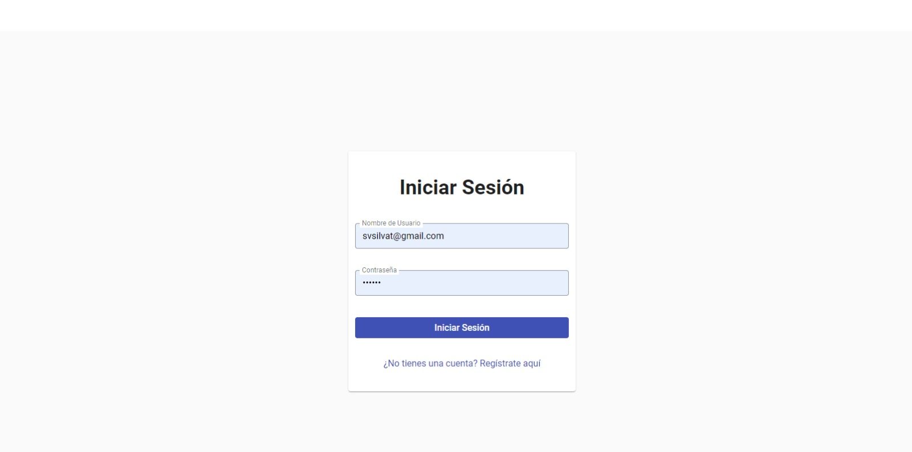 

- Recomendación:
Actualiar el aparatado de register y login para que use la API y almacene la información previamente registrada. Adicionando estilos y se vea mejor estéticamente.

---

* PROBLEMA #2: Pestañas homes simples
- Severidad: 1
Heurística violada: Flexibilidad y eficiencia de uso
- Problema:
Al entrar al programa aparece varias pestañas acerca de la aplicación, en algunos casos es redundante o no del todo efectivo.

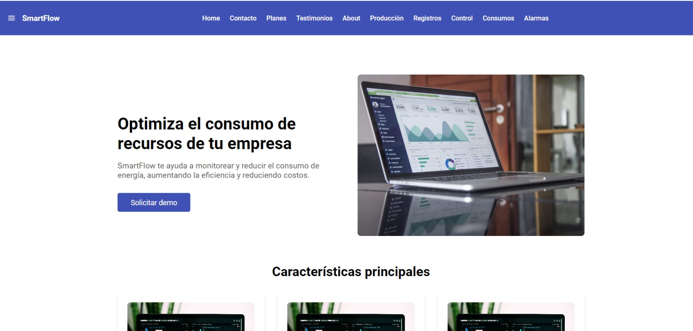 

- Recomendación:
Reemplazar esas pestañas o actualizandolas con alguna función adicional y tenga más relevancia.

---

* PROBLEMA #3: Falta de agregar dispositivos en pestaña producción
* Severidad: 3
Heurística violada: Visibilidad del estado del sistema
- Problema:
Se llega a hacer el filtro de consumos prestablecidos de agua y luz, mas no se puede agregar dispostivios par que se actualice el filtro.

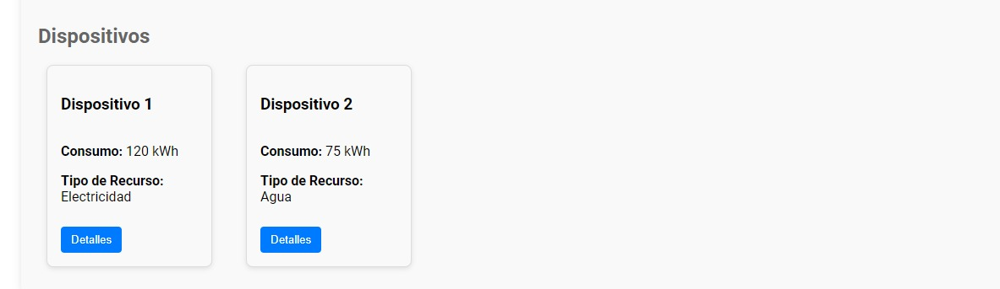 

- Recomendación:
Agregar un botón con la funcionalidad de agregas dispositvos o se agreguen de la siguiente pestaña que cumple esa funcionalidad, acoplarlo.

---

* PROBLEMA #4: Falta promedio de consumos en la pestaña registros

- Severidad: 3
Heurística violada: Flexibilidad y eficiencia de uso
- Problema:
Hace falta una funcionalidad adicional en registros, ya que solo registra los consumos por meses.

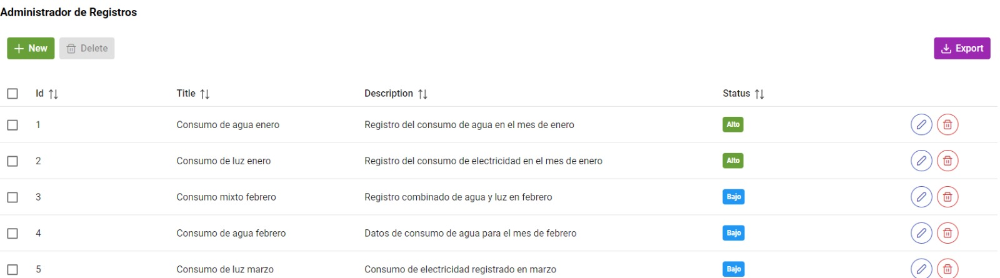 

- Recomendación:
Implementar un promedio total o suma para la pestaña y sea más relevante.
 
---
 
 * PROBLEMA #5: Función adicional en pestaña controles
- Severidad: 2
Heurística violada: Estética y diseño minimalista
- Problema:
Se cruza la función mínimo con la producción y aparece la alerta cuando se actualiza la pestaña, no instantaneo.

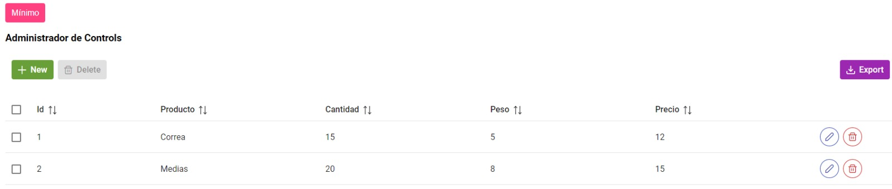 

- Recomendación:
Convalidar el botón mínimo con el API para que llegue a guardarse y no tenga que recargarse para que se active la alerta.
 
---
 
 * PROBLEMA #6: Función adicional en pestaña consumos
- Severidad: 2
Heurística violada: Flexibilidad y eficiencia de uso
- Problema:
Surge cuando se establece el límite pero se guarda momentaneamente, mas no en el sistema porque al cambiar de pestaña se restablece y al actualizar aparece muchas notificaciones.

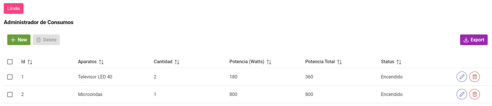 

- Recomendación:
Enlazar el API con el botón límite y se guarde en el programa para que no se reestablezca.
 
---
 
 * PROBLEMA #7: No se guarda el historial de alarmas o alertas.
- Severidad: 3
Heurística violada: Visibilidad del estado del sistema
- Problema:
Por cada alerta o notificación que aparece no se actualiza en la pestaña de alarmas.

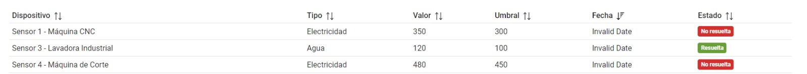 

- Recomendación:
Actualizar el programa para que por cada alerta se guarde automaticamente en la pestaña y sea más efectivo.
 

<h3> 5.4. Video About-the-Product</h3>

A continuación, te presentamos el video 'Acerca del producto', donde podrás conocer a fondo el propósito, las ventajas y las principales características de nuestra aplicación. Además, incluimos testimonios reales de nuestros usuarios que respaldan la calidad de nuestro software.

<table style="border-collapse:collapse;border-spacing:0" class="tg"><thead><tr><th style="border-color:black;border-style:solid;border-width:1px;font-family:Arial, sans-serif;font-size:14px;font-weight:normal;overflow:hidden;padding:10px 5px;text-align:left;vertical-align:top;word-break:normal">Sección</th><th style="border-color:black;border-style:solid;border-width:1px;font-family:Arial, sans-serif;font-size:14px;font-weight:normal;overflow:hidden;padding:10px 5px;text-align:left;vertical-align:top;word-break:normal">Características del video</th><th style="border-color:black;border-style:solid;border-width:1px;font-family:Arial, sans-serif;font-size:14px;font-weight:normal;overflow:hidden;padding:10px 5px;text-align:left;vertical-align:top;word-break:normal">Sobre el contenido</th><th style="border-color:black;border-style:solid;border-width:1px;font-family:Arial, sans-serif;font-size:14px;font-weight:normal;overflow:hidden;padding:10px 5px;text-align:left;vertical-align:top;word-break:normal">Integración y entrega</th></tr></thead>
<tbody>
<tr><td style="border-color:black;border-style:solid;border-width:1px;font-family:Arial, sans-serif;font-size:14px;overflow:hidden;padding:10px 5px;text-align:left;vertical-align:top;word-break:normal">About The Product</td><td style="border-color:black;border-style:solid;border-width:1px;font-family:Arial, sans-serif;font-size:14px;overflow:hidden;padding:10px 5px;text-align:left;vertical-align:top;word-break:normal">       Cantidad de videos: 1        Nomenclatura: upc-pre-202402-si730-sw51-pesoftware-about-the-product-sprint-3        Formato: .mp4        Duración: 9:21 min     </td><td style="border-color:black;border-style:solid;border-width:1px;font-family:Arial, sans-serif;font-size:14px;overflow:hidden;padding:10px 5px;text-align:left;vertical-align:top;word-break:normal">       Video relacionado acerca de las funcionalidades y descripciones del producto.     </td>
<td style="border-color:black;border-style:solid;border-width:1px;font-family:Arial, sans-serif;font-size:14px;overflow:hidden;padding:10px 5px;text-align:left;vertical-align:top;word-break:normal">       Screenshot:         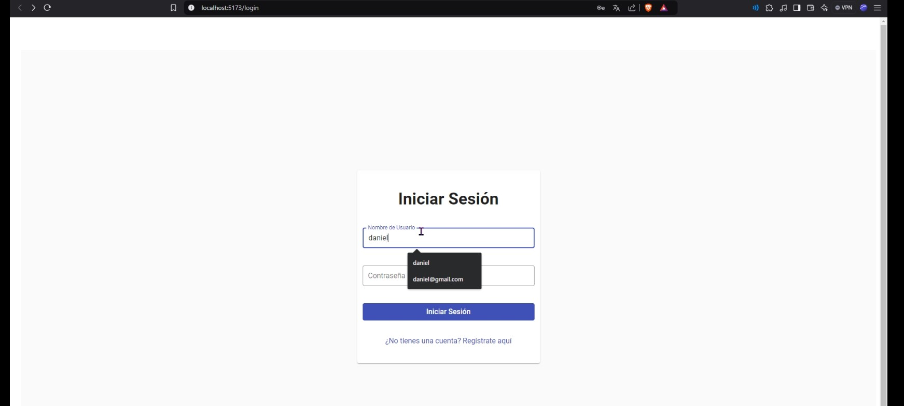        Link: https://upcedupe-my.sharepoint.com/:v:/g/personal/u20211g296_upc_edu_pe/EeRmsA6AfMFEjd78WjqkV68BEWrXIpJVIfswG5Sp4lNchA?nav=eyJyZWZlcnJhbEluZm8iOnsicmVmZXJyYWxBcHAiOiJPbmVEcml2ZUZvckJ1c2luZXNzIiwicmVmZXJyYWxBcHBQbGF0Zm9ybSI6IldlYiIsInJlZmVycmFsTW9kZSI6InZpZXciLCJyZWZlcnJhbFZpZXciOiJNeUZpbGVzTGlua0NvcHkifX0&amp;e=kVAznC</td></tr>
</tbody></table>

# 6. Conclusiones

**TB1** 
En este primer entregable, el equipo SmartFlow ha cumplido con los objetivos establecidos, desarrollando un informe exhaustivo que refleja los avances del proyecto y creando una landing page funcional y estéticamente agradable. A través de un enfoque meticuloso y bien estructurado, se ha logrado comunicar de manera clara los beneficios del producto a los usuarios, estableciendo una base sólida para el desarrollo futuro del proyecto. Este paso inicial asegura que la estructura y visión de SmartFlow se transmitan con precisión, facilitando la progresión hacia fases más complejas.

**TP1** 
El segundo entregable del proyecto SmartFlow marcó un progreso significativo en la implementación técnica del producto. Durante el Sprint #2, se desarrolló una aplicación web utilizando Angular y WebStorm, complementada con una FAKE API creada con JSON Server para simular la interacción con datos reales. Este avance no solo consolidó las funcionalidades básicas del sistema, sino que también garantizó que la aplicación fuese robusta y escalable para futuras iteraciones. La integración efectiva de tecnologías modernas y una arquitectura bien organizada fueron factores decisivos para alcanzar los objetivos de este sprint.

**TB2** 
El Sprint #3 ha sido fundamental para llevar el proyecto SmartFlow a un nuevo nivel. La finalización del front-end y la primera versión del back-end proporcionan una sólida base para las siguientes etapas de desarrollo. Con un producto mínimo viable en funcionamiento, el equipo podrá centrarse en refinar las funcionalidades existentes, agregar nuevas características y optimizar el rendimiento del sistema. Los resultados obtenidos en este sprint son muy prometedores y auguran un futuro brillante para el proyecto SmartFlow.

**TF1** 
Con la finalización del Sprint #4 y la entrega exitosa del proyecto SmartFlow, hemos alcanzado un hito significativo en nuestro desarrollo como desarrolladores. Este proyecto, construido con la tecnología C#, nos ha brindado la oportunidad de profundizar nuestros conocimientos en programación orientada a objetos, diseño de interfaces de usuario y arquitectura de software. Además, hemos fortalecido nuestras habilidades en el uso de herramientas y frameworks de desarrollo de .NET. La colaboración en equipo, la resolución de problemas y la adaptación a los cambios constantes han sido fundamentales para el éxito de SmartFlow. Esta experiencia nos ha preparado para enfrentar desafíos más complejos en el futuro y nos ha demostrado el poder de la tecnología C# para crear soluciones innovadoras.

# 7. Bibliografía

Comisión Nacional de Energía de Chile. (2022). Anuario CNE 2022. Centro de Información Energética.
 
 https://www.cne.cl/nuestros-servicios/reportes/informacion-y-estadisticas/
 

Ibáñez, P., González Rugamas, R., Kohli, S., & Kuehl, E. (2022).     Cómo hacer frente a los aumentos de precios en un mercado inflacionario. McKinsey. 
 
https://www.mckinsey.com/capabilities/operations/our-insights/how-to-deal-with-price-increases-in-this-inflationary-market/es-es 
 

Instituto Nacional de Estadística de España. (2022). Nota de Prensa: Encuesta de Consumos Energéticos. Año 2022. Instituto Nacional de Estadística.
 
 https://ine.es/dyngs/Prensa/es/ECE2022.htm 
 

Ministerio de Energía y Minas del Perú. (2022). Anuario Estadístico de Electricidad 2022. Plataforma del Estado Peruano.
 
 https://cdn.www.gob.pe/uploads/document/file/5277829/4742711-anuario-estadistico-2022.pdf?v=1697225335 
 

Thiengo, D. (2023). Eficiência energética: Vantagens, aplicação e avaliação - Guia completo. Squairio.
 
 https://blog.squair.io/es/sabes-cu%C3%A1les-los-principales-objetivos-de-la-eficiencia-energ%C3%A9tica-c%C3%B3mo-evaluar-y-aplicar 
 

# 8. Anexo

## Anexo N°1: Número de clientes finales por sectores

 *Imagen :Número de clientes finales por sectores*
Recuperado de: https://cdn.www.gob.pe/uploads/document/file/5277829/4742711-anuario-estadistico-2022.pdf?v=1697225335

| Descripcion | Enlace |
|---------------------------------|-----------------------------------------------------------------------------------------------------------------------------------------------------------------------------------------------------------------------------------------------------------------------------------------------------------------------------|
| **URL del Repositorio** | https://github.com/SmartFlow-UPC |
| **Repositorio Landing Page** | https://github.com/SmartFlow-UPC/smartflow.github.io |
| **Repositorio Web Application** | https://github.com/SmartFlow-UPC/SmartFlow-App-Web |
| **Repositorio Back-end** | https://github.com/SmartFlow-UPC/SmartFlow-platform |
| **Development Landing** | https://smartflow-upc.github.io/smartflow.github.io/ |
| **Development Web Application** | |
| **Development Back-end** | |
| **About The Product** | https://upcedupe-my.sharepoint.com/:v:/g/personal/u20211g296_upc_edu_pe/EeRmsA6AfMFEjd78WjqkV68BEWrXIpJVIfswG5Sp4lNchA?nav=eyJyZWZlcnJhbEluZm8iOnsicmVmZXJyYWxBcHAiOiJPbmVEcml2ZUZvckJ1c2luZXNzIiwicmVmZXJyYWxBcHBQbGF0Zm9ybSI6IldlYiIsInJlZmVycmFsTW9kZSI6InZpZXciLCJyZWZlcnJhbFZpZXciOiJNeUZpbGVzTGlua0NvcHkifX0&e=kVAznC |
| **About The Team** | |
| **Video Exposición TB1** | https://upcedupe-my.sharepoint.com/:v:/g/personal/u20211g296_upc_edu_pe/ETieMcfZbv5FncVLgWw-XvIBIBc4Vzx-DZGmO_KETFp6Ag?nav=eyJyZWZlcnJhbEluZm8iOnsicmVmZXJyYWxBcHAiOiJPbmVEcml2ZUZvckJ1c2luZXNzIiwicmVmZXJyYWxBcHBQbGF0Zm9ybSI6IldlYiIsInJlZmVycmFsTW9kZSI6InZpZXciLCJyZWZlcnJhbFZpZXciOiJNeUZpbGVzTGlua0NvcHkifX0&e=mV5xjK |
| **Video Exposición TP1** | https://upcedupe-my.sharepoint.com/:v:/g/personal/u20211g296_upc_edu_pe/EWCeLBysn21Dj19wV0eNZaYB0LmFEm7eEBmmRPCwxXcx6g?nav=eyJyZWZlcnJhbEluZm8iOnsicmVmZXJyYWxBcHAiOiJPbmVEcml2ZUZvckJ1c2luZXNzIiwicmVmZXJyYWxBcHBQbGF0Zm9ybSI6IldlYiIsInJlZmVycmFsTW9kZSI6InZpZXciLCJyZWZlcnJhbFZpZXciOiJNeUZpbGVzTGlua0NvcHkifX0&e=3xvbE7 |
| **Video Exposición TB2** | https://upcedupe-my.sharepoint.com/:v:/g/personal/u20211g296_upc_edu_pe/EdoLPABWdfVHkBEGRvMn_LIBscgcARNbYA5-eVZJpUpErQ?nav=eyJyZWZlcnJhbEluZm8iOnsicmVmZXJyYWxBcHAiOiJPbmVEcml2ZUZvckJ1c2luZXNzIiwicmVmZXJyYWxBcHBQbGF0Zm9ybSI6IldlYiIsInJlZmVycmFsTW9kZSI6InZpZXciLCJyZWZlcnJhbFZpZXciOiJNeUZpbGVzTGlua0NvcHkifX0&e=y6BCeV |
| **Video Exposición TF1** | |
| **Diapositivas TF1** | https://www.canva.com/design/DAGP6trFurc/pn4cYCiEMuXqh1UNgfjkiQ/edit?utm_content=DAGP6trFurc&utm_campaign=designshare&utm_medium=link2&utm_source=sharebutton |
| **Url Figma SmartFlow** | https://www.figma.com/design/8mXQy6OqvddLIzoc5O7Q17/Untitled?node-id=0-1&t=2hhP7dX3Dbz8CFci-1 |
| **Url Trello** | https://trello.com/invite/accept-board |
